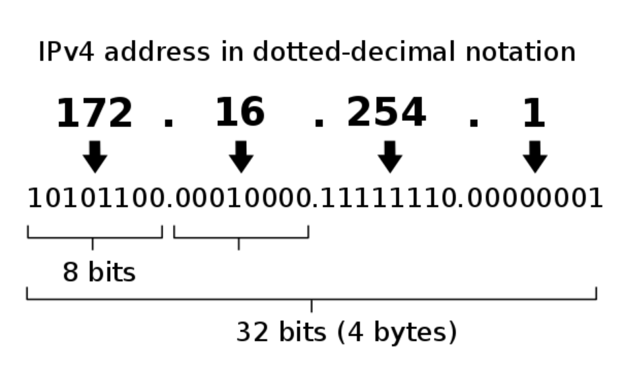
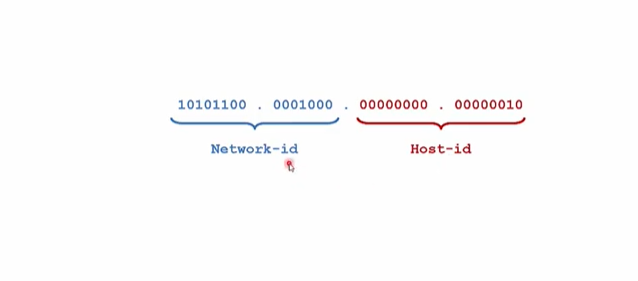
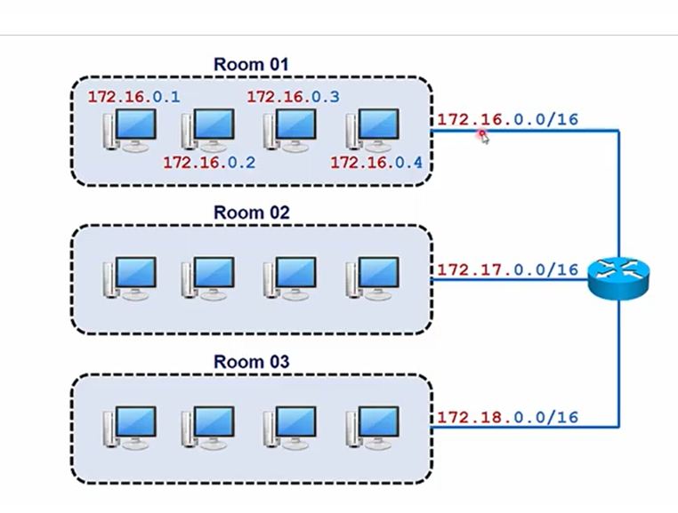
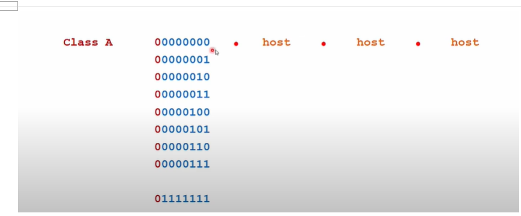
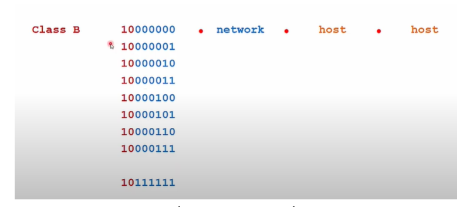
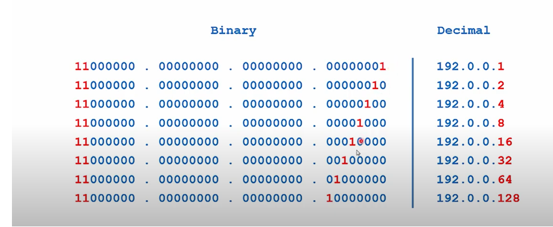
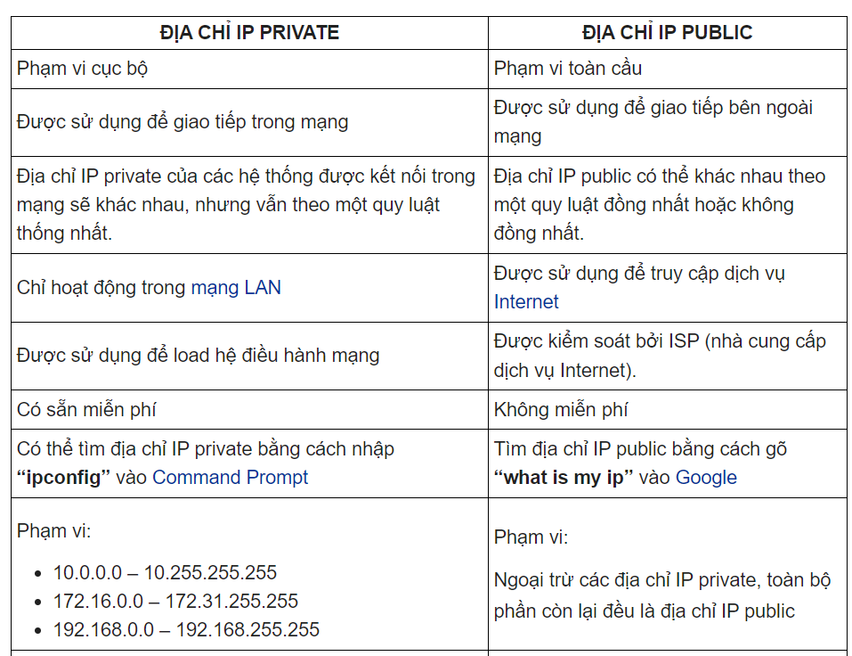

# **Phân tích tìm hiểu địa chỉ IPV4**
## **Khái niệm**
* IPv4 (Internet Protocol version 4) là một giao thức mạng được sử dụng để định vị và định danh các thiết bị trên mạng Internet. Địa chỉ IPv4 là một chuỗi gồm 32 bit, được biểu diễn dưới dạng các số nguyên từ 0 đến 255, được phân tách bởi dấu chấm (ví dụ: 192.168.1.1).

* Địa chỉ IPV4 được chia thành 2 phần:
  * 
    * Network-id: phân biệt mạng này với mạng khác
    * Host-id: định danh từng thiết bị trong hệ thống mạng
    * 
## **Phân loại địa chỉ IPV4**
### **Lớp A**
* Được sử dụng cho các mạng lớn, có địa chỉ mạng bắt đầu từ 1.0.0.0 đến 126.0.0.0.
* Địa chỉ IP của lớp A được chia thành 2 phần: một phần cho địa chỉ mạng và phần còn lại cho địa chỉ máy.
  
* Bit đầu tiên của địa chỉ lớp A luôn 
được chọn là 0.
   
  
    

### **Lớp B**
* Lớp B của địa chỉ Ipv4 sử dụng 2 obtet đầu làm phần mạng và 2 obtet sau làm phần host.Dải địa chỉ mạng lớp B chạy từ 128.0.0.0 đến 191.255.0.0.

* Hai bit đầu tiên của lớp B luôn là 1 và 0.

### **Lớp C**
* Lớp C của địa chỉ Ipv4 dùng 3 octet đầu làm phần mạng và 1 octet sau làm phần host. Dải mạng lớp C chạy từ 192.0.0.0 -> 223.255.255.0. Như vậy sẽ có 221 mạng trong lớp C.

  

* Địa chỉ lớp C luôn có 3 bit đầu là 110.
  
### **Lớp D**
* Lớp D được sử dụng làm các địa chỉ multicast và dải địa chỉ lớp D từ 224.0.0.0 -> 239.255.255.255.
* Địa chỉ multicast trong IPv4 được sử dụng để truyền tải dữ liệu đa điểm trên mạng.được dùng để gửi dữ liệu đến một nhóm các thiết bị mạng.

* Địa chỉ multicast được sử dụng trong nhiều ứng dụng mạng, chẳng hạn như truyền tải video trực tiếp, âm thanh, và các dịch vụ như IPTV và VoIP.

### **Lớp E**
* Lớp E gồm các giải số từ 240.0.0.0 trở đi và được sử dụng cho mục đích dự phòng.

## **Hạn chế của IPV4**

* Hạn chế lớn nhất của Ipv4 là cấu trúc thiết kế của nó không có bất cứ cách thức bảo mật nào cả. Ipv4 cũng hoàn toàn không có phương tiện mã hóa dữ liệu.
* Việc thiếu hụt không gian địa chỉ cũng là 1 trong những hạn chế rất lớn của Ipv4. Để đánh địa chỉ, phiên bản Ipv4 chỉ sử dụng 32bit, do đó không gian của nó chỉ có khoảng 236 địa chỉ.

## **Phương pháp chuyển đổi từ prefix sang địa chỉ subnet**

## **Phương pháp chia địa chỉ IPV4 từ nhị phân sang thập phân**

## **Phương pháp chia địa chỉ IPV4 từ thập phân sang nhị phân**

## **Địa chỉ IP Public và IP Private**
### **Địa chỉ IP Public**
* Địa chỉ IP public của hệ thống là địa chỉ IP được sử dụng để giao tiếp bên ngoài mạng. Địa chỉ IP public về cơ bản được gán bởi ISP (Nhà cung cấp dịch vụ Internet).

### **Địa chỉ IP Private**
* Địa chỉ IP private của hệ thống là địa chỉ IP được sử dụng để giao tiếp trong cùng một mạng. Thông tin hoặc dữ liệu IP private có thể được gửi hoặc nhận trong cùng một mạng.

### **Khác biệt giữa IP Public và IP Private**

# **Tài liệu tham khảo**
<https://bizflycloud.vn/tin-tuc/ipv4-la-gi-20210607115922143.htm#:~:text=%C4%90%E1%BB%8Ba%20ch%E1%BB%89%20Ipv4%20l%C3%A0%201,ng%C4%83n%20c%C3%A1c%20octet%20v%E1%BB%9Bi%20nhau.>

<https://www.youtube.com/watch?v=Z_syAVeMCSA>
<https://www.youtube.com/watch?v=N4xJYVPdtaA>
<https://www.youtube.com/watch?v=bexW8QYDKz0>
<https://www.youtube.com/watch?v=_LlVcy19Ojs&t=101s>
<https://www.youtube.com/watch?v=rz3bae9FOvE>

<https://quantrimang.com/cong-nghe/so-sanh-dia-chi-ip-public-va-private-183479>

