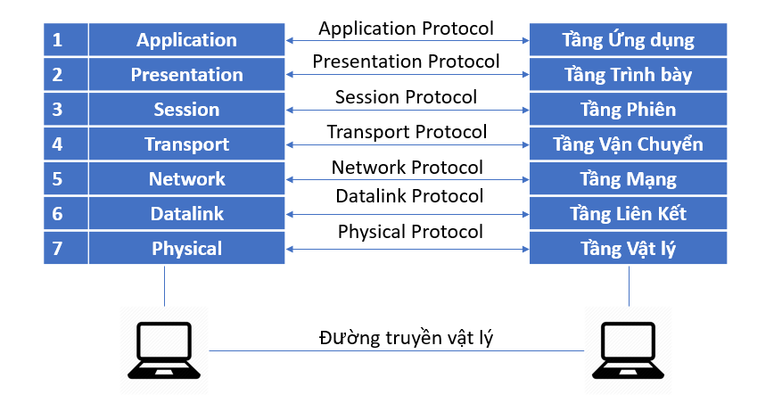
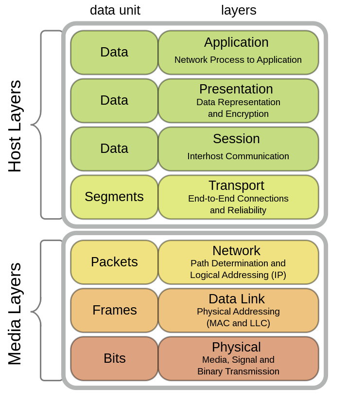

# 1. Mô hình OSI là gì
Mô hình OSI là một mô hình tham chiếu mạng do ISO (Tổ chức Tiêu chuẩn hóa Quốc tế) phát triển, chia giao tiếp mạng thành 7 tầng, giúp tiêu chuẩn hóa cách thiết bị giao tiếp trong một hệ thống mạng.Mỗi tầng giải quyết một vấn đề hẹp của tiến trình truyền thông . Mô hình này có nhiệm vụ thiết lập kết nối truyền thông và thiết kế giao thức mạng giữa các máy tính 

## 2. Các tầng của mô hình OSI
Mô hình OSI bao gồm 7 tầng
Tầng 1 đến 4 có nhiệm vụ di chuyển dữ liệu
Từ tầng 5 – 7 thực hiện nhiệm vụ chuyển tiếp dữ liệu và các nhiệm vụ đặc thù khác 

## 2.1 Tầng vật lý (Physical Layer)
- Tầng vật lý định nghĩa tất cả các đặc tả về điện và vật lý cho các thiết bị, bao gồm các thiết bị phần cứng thực hiện chức năng truyền tải dữ liệu như Router, cáp , phích cắm, nguồn điện
- Có nhiệm vụ ứng đối với các đòi hỏi về dịch vụ từ tầng liên kết dữ liệu, thiết lập hoặc ngắt kết nối điện với một phương tiện truyền thông
- Tầng vật lý tham gia vào quá trình mà ở đó các dữ liệu được chia sẻ hiệu quả giữa nhiều người dùng với nhiệm vụ điều khiển lưu lượng , giải quyết tranh chấp tài nguyên 

## 2.2 Tầng liên kết dữ liệu ( Data Link )
Đây là nơi các thiết bị chuyển mạch (switches) và các cầu nối (bridge) hoạt động, chức năng chủ yếu của tầng liên kết dữ liệu là thực hiện thiết lập các liên kết, duy trì và hủy bỏ các liên kết dữ liệu. Kiểm soát lỗi và kiểm soát lưu lượng , nó giống với tầng mạng có nhiệm vụ
- Gửi thông tin từ nơi này đến nơi khác
- Hỗ trợ dữ liệu truyền đi giữa các thiết bị trong cùng một mạng
- Phát hiện và sửa chữa các lỗi trong tầng vật lý ( nếu có )

## 2.3 Tầng mạng ( Network)
- Tầng mạng có nhiệm vụ đáp ứng các yêu cầu của tầng giao vận cũng như đưa ra yêu cầu với tầng liên kết dữ liệu bên dưới,chọn đường đi (routing) cho các gói tin nguồn tới đích có thể trong cùng một mạng hoặc khác mạng nhau
- Đánh địa chỉ cho các gói tin , dịch địa chỉ logic sang địa chỉ vật lý
- Cung cấp thuật toán dò đường cho router, xác định đường truyền vật lý tốt nhất cho dữ liệu
- Giúp truyền dữ liệu giữa các máy tính nếu ở 2 mạng khác nhau 

## 2.4 Tầng giao vận ( Transport )
- Tầng giao vận chịu trách nhiệm lập kết nối giữa 2 máy tính với nhau 
- Có thể theo dõi và truyền lại những gói tin thất bại 
- Nhận dữ liệu từ tầng phiên và truyển xuống Network đồng thời nhận dữ liệu đã xử lý truyền lại cho tầng phiên 
- Chịu trách nhiệm kiểm soát và sửa lỗi , điều khiển lưu lượng dữ liệu ,đảm bảo dữ liệu truyền đi trọn vẹn , chính xác và không gây quá tải cho bên nhận

## 2.5 Tầng phiên (Session)
Tầng phiên cho phép người sử dụng trên các máy khác nhau thiết lập, duy trì và đồng bộ phiên truyền thông giữa họ với nhau. Nói cách khác tầng phiên thiết lập “các giao dịch” giữa các thực thể đầu cuối.
- Cung cấp các nhu cầu dịch vụ cho tầng diễn hoạt 
- Cung cấp liên kết giữa 2 đầu cuối sử dụng dịch vụ phiên sao cho trao đổi dữ liệu một cách đồng bộ và sau khi kết thúc thì giải phóng liên kết 
- Hỗ trợ hoạt động đơn công (single), bán song công (half-duplex) hoặc song công (duplex)

## 2.6 Tầng diễn hoạt (Presentation)
Cung cấp một giao diện tiêu chuẩn cho tầng ứng dụng, tầng này có nhiệm vụ phiên dịch , nén , giải nén , giải mã , mã hóa dữ liệu 
- Phiên dịch dữ liệu để tầng ứng dụng hiểu
- Mã hóa dữ liệu gửi đi và giải mã dữ liệu nhận được
- Nén dữ liệu trước khi truyền xuống tầng dưới

## 2.7 Tầng ứng dụng (Application)
Tầng ứng dụng là tầng gần với người sử dụng nhất. Nó cung cấp phương tiện cho người dùng truy nhập các thông tin và dữ liệu trên mạng thông qua chương trình ứng dụng. Tầng này là giao diện chính để người dùng tương tác với chương trình ứng dụng, và qua đó với mạng

**Bảng tóm tắt chức năng các tầng**
| Tầng | Tên tầng     | Khái niệm / Đặc điểm                                 | Chức năng chính                                                 |
| ---- | ------------ | ---------------------------------------------------- | --------------------------------------------------------------- |
| 7    | Application  | Giao tiếp với ứng dụng người dùng                    | Giao diện người dùng, hỗ trợ dịch vụ email, trình duyệt, FTP... |
| 6    | Presentation | Chuyển đổi định dạng dữ liệu                         | Mã hóa/giải mã, nén/giải nén dữ liệu                            |
| 5    | Session      | Quản lý phiên kết nối                                | Thiết lập, duy trì, và kết thúc phiên                           |
| 4    | Transport    | Truyền dữ liệu end-to-end                            | Đảm bảo dữ liệu đầy đủ, đúng thứ tự (TCP, UDP)                  |
| 3    | Network      | Định tuyến, địa chỉ IP                               | Tìm đường đi tốt nhất qua mạng (router)                         |
| 2    | Data Link    | Truyền dữ liệu giữa hai thiết bị trong cùng mạng LAN | Phát hiện và sửa lỗi khung dữ liệu, MAC Address                 |
| 1    | Physical     | Tầng vật lý: cáp, tín hiệu điện                      | Truyền bit qua cáp vật lý (0 và 1)                              |

### 3. Workflow khi A gửi dữ liệu cho B theo OSI
Giả sử A gửi email cho B:
- Tầng 1 (Application): A soạn email và gửi.
- Tầng 2 (Presentation): Dữ liệu được mã hóa (SSL, TLS nếu có).
- Tầng 3 (Session): Phiên giao tiếp giữa A và B được thiết lập.
- Tầng 4 (Transport): Dữ liệu được chia thành segment. TCP đảm bảo không mất dữ liệu.
- Tầng 5 (Network): Gắn địa chỉ IP của B, định tuyến.
- Tầng 6 (Data Link): Gắn địa chỉ MAC, đóng gói khung dữ liệu.
- Tầng 7 (Physical): Bit được truyền qua dây/cáp mạng.
Bên phía B nhận dữ liệu và xử lý ngược lại từ tầng 7 → 1.
 
 ** Danh mục tài liệu tham khảo **

[1] [https://www.totolink.vn/article/136-mo-hinh-osi-la-gi-chuc-nang-cua-cac-tang-giao-thuc-trong-mo-hinh-osi.html](https://www.totolink.vn/article/136-mo-hinh-osi-la-gi-chuc-nang-cua-cac-tang-giao-thuc-trong-mo-hinh-osi.html)

[2] [https://vi.wikipedia.org/wiki/M%C3%B4_h%C3%ACnh_OSI](https://vi.wikipedia.org/wiki/M%C3%B4_h%C3%ACnh_OSI)

[3] [https://fpttelecom.com/blog/mo-hinh-osi/](https://fpttelecom.com/blog/mo-hinh-osi/)

[4] [https://suncloud.vn/mo-hinh-osi](https://suncloud.vn/mo-hinh-osi)

[5][https://www.digistar.vn/quy-trinh-truyen-goi-tin-trong-mo-hinh-osi/](https://www.digistar.vn/quy-trinh-truyen-goi-tin-trong-mo-hinh-osi/)
