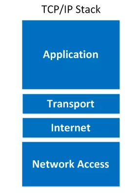

# 1. Mô hình TCP/IP là gì?
Mô hình TCP/IP (Transmission Control Protocol / Internet Protocol) là mô hình mạng giao tiếp chuẩn của Internet, do Bộ Quốc phòng Mỹ phát triển vào những năm 1970. Mô hình này là xương sống của các mạng hiện đại, bao gồm Internet.Cụ thể hơn, TCP/IP chỉ rõ cho chúng ta cách thức đóng gói thông tin (còn được gọi là gói tin ), được gửi và nhận bởi các máy tính có kết nối với nhau.

 Mô hình TCP/IP tiêu chuẩn bao gồm 4 tầng được chồng lên nhau là:
- Tầng 1: Tầng vật lý (Network Access )
- Tầng 2: Tầng mạng (Internet)
- Tầng 3: Tầng giao vận (Transport)
- Tầng 4: Tầng ứng dụng (Application).
Cung cấp chuẩn để các thiết bị mạng giao tiếp với nhau qua nhiều loại mạng khác nhau.

## 2. Các Layer của Mô hình TCP/IP
2.1 Mô hình TCP/IP có 4 lớp, mỗi lớp đảm nhiệm vai trò riêng:
| Lớp TCP/IP | Tên gọi                                    | Chức năng chính                                                                    | Tương đương OSI                                 |
| ---------- | ------------------------------------------ | ---------------------------------------------------------------------------------- | ----------------------------------------------- |
| 1️       | **Network Access Layer** (Hoặc Link Layer) | Quản lý **truy cập vật lý đến phương tiện truyền**, địa chỉ MAC, khung dữ liệu.    | Tầng 1 (Physical) + Tầng 2 (Data Link)          |
| 2️      | **Internet Layer**                         | Định tuyến gói dữ liệu giữa các mạng, sử dụng địa chỉ IP.                          | Tầng 3 (Network)                                |
| 3️       | **Transport Layer**                        | Đảm bảo **giao tiếp đầu cuối**, kiểm soát lỗi, kiểm soát luồng, dùng TCP hoặc UDP. | Tầng 4 (Transport)                              |
| 4️       | **Application Layer**                      | Cung cấp dịch vụ ứng dụng như HTTP, FTP, SMTP...                                   | Tầng 5-6-7 (Session, Presentation, Application) |

 2.2 Chi tiết từng lớp:
1. Network Access Layer
Chức năng: Gửi và nhận dữ liệu trên phương tiện vật lý (cáp đồng, quang, sóng...).
Thành phần: Ethernet, Wi-Fi, ARP...
Đặc điểm:
Không định tuyến.
Địa chỉ vật lý: MAC.
2. Internet Layer
Chức năng: Định tuyến gói từ nguồn đến đích, phân mảnh và hợp nhất gói.
Giao thức tiêu biểu: IP (IPv4, IPv6), ICMP, ARP.
Địa chỉ: Địa chỉ IP.
3. Transport Layer
Chức năng: Đảm bảo truyền dữ liệu tin cậy (TCP) hoặc nhanh (UDP).
Giao thức chính:
TCP: Kết nối, kiểm soát lỗi, thứ tự gói.
UDP: Không kết nối, nhanh nhưng không đảm bảo.
4. Application Layer
Chức năng: Giao tiếp trực tiếp với người dùng, cung cấp giao thức ứng dụng.
Ví dụ: HTTP, FTP, SMTP, DNS, SSH...
Tầng cao nhất người dùng tương tác.
## 3. So sánh TCP/IP và OSI
| Tiêu chí                | Mô hình OSI (7 lớp)       | Mô hình TCP/IP (4 lớp)                |
| ----------------------- | ------------------------- | ------------------------------------- |
| Số lớp                  | 7                         | 4                                     |
| Phát triển bởi          | ISO                       | Bộ Quốc Phòng Mỹ                      |
| Phổ biến                | Mô hình lý thuyết         | Mô hình thực tế áp dụng trên Internet |
| Tầng phiên / trình diễn | Có                        | Gộp chung vào Application Layer       |
| Tầng truy cập mạng      | Tách Physical + Data Link | Gộp vào Network Access                |
| Giao thức cụ thể        | Không                     | Có (TCP, IP, HTTP, SMTP...)           |
| Ứng dụng                | Giảng dạy, lý thuyết      | Triển khai thực tế                    |
## 4. Workflow với mô hình TCP/IP
 Khi máy A gửi dữ liệu đến máy B, các bước như sau:

**Bên Gửi (A)**
1. Application Layer:
- Người dùng dùng ứng dụng (ví dụ trình duyệt).
- Tạo request HTTP (ví dụ: GET website).
2. Transport Layer:
- Chia dữ liệu thành các segment.
- Thêm header (port nguồn, port đích...).
- Chọn TCP hoặc UDP.
3. Internet Layer:
- Thêm header IP.
- Gán địa chỉ IP nguồn và đích.
4. Network Access Layer:
- Gán địa chỉ MAC.
- Gửi frame ra mạng LAN (hoặc qua thiết bị trung gian như router, switch...).
  **Trên Đường Truyền**
- Gói dữ liệu đi qua các router.
- Router chỉ xử lý đến tầng Internet (địa chỉ IP) để định tuyến.

**Bên Nhận (B)**
1. Network Access Layer:
- Nhận frame, tách lấy dữ liệu.
2. Internet Layer:
- Kiểm tra IP đích, xác định là dành cho mình.
3. Transport Layer:
- Kiểm tra port.
- Kiểm tra checksum, thứ tự gói (nếu dùng TCP).
- Lắp lại các segment thành thông điệp.
4. Application Layer:
- Trả dữ liệu cho ứng dụng (ví dụ: trình duyệt hiển thị trang web).

**tài liệu tham khảo**

[1.Mô hình TCP/IP là gì](https://viblo.asia/p/tim-hieu-co-ban-ve-mo-hinh-tcpip-RQqKLkJp57z)
