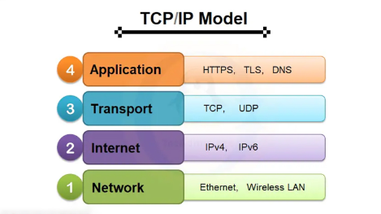
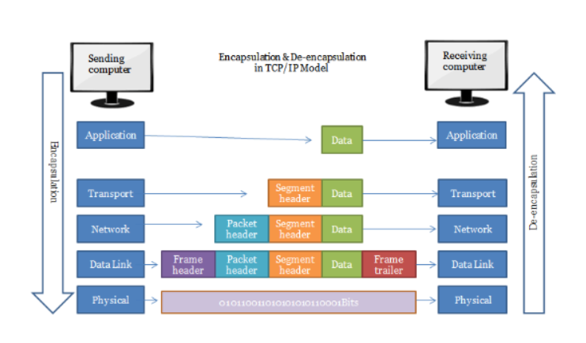
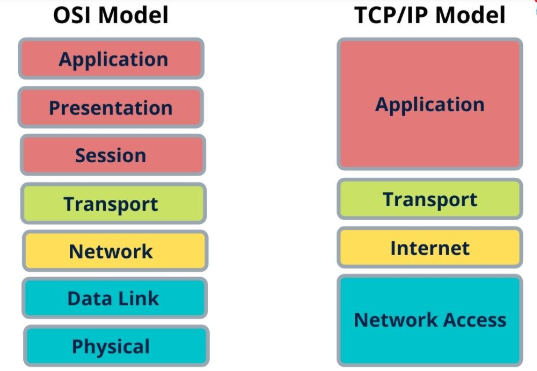
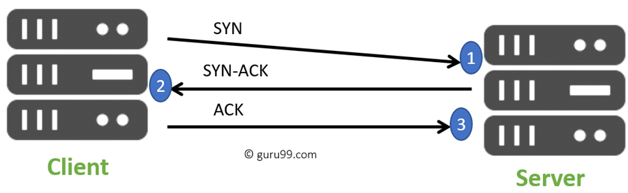

# 1. Mô hình TCP/IP là gì?
Mô hình TCP/IP (Transmission Control Protocol / Internet Protocol) là mô hình mạng giao tiếp chuẩn của Internet, do Bộ Quốc phòng Mỹ phát triển vào những năm 1970. Mô hình này là xương sống của các mạng hiện đại, bao gồm Internet.Cụ thể hơn, TCP/IP chỉ rõ cho chúng ta cách thức đóng gói thông tin (còn được gọi là gói tin ), được gửi và nhận bởi các máy tính có kết nối với nhau.

 Mô hình TCP/IP tiêu chuẩn bao gồm 4 tầng được chồng lên nhau là:
- Tầng 1: Tầng vật lý (Network Access )
- Tầng 2: Tầng mạng (Internet)
- Tầng 3: Tầng giao vận (Transport)
- Tầng 4: Tầng ứng dụng (Application).
Cung cấp chuẩn để các thiết bị mạng giao tiếp với nhau qua nhiều loại mạng khác nhau.

## 2. Các Layer của Mô hình TCP/IP
2.1 Mô hình TCP/IP có 4 lớp, mỗi lớp đảm nhiệm vai trò riêng:
| Lớp TCP/IP | Tên gọi                                    | Chức năng chính                                                                    | Tương đương OSI                                 |
| ---------- | ------------------------------------------ | ---------------------------------------------------------------------------------- | ----------------------------------------------- |
| 1️       | **Network Access Layer** (Hoặc Link Layer) | Quản lý **truy cập vật lý đến phương tiện truyền**, địa chỉ MAC, khung dữ liệu.    | Tầng 1 (Physical) + Tầng 2 (Data Link)          |
| 2️      | **Internet Layer**                         | Định tuyến gói dữ liệu giữa các mạng, sử dụng địa chỉ IP.                          | Tầng 3 (Network)                                |
| 3️       | **Transport Layer**                        | Đảm bảo **giao tiếp đầu cuối**, kiểm soát lỗi, kiểm soát luồng, dùng TCP hoặc UDP. | Tầng 4 (Transport)                              |
| 4️       | **Application Layer**                      | Cung cấp dịch vụ ứng dụng như HTTP, FTP, SMTP...                                   | Tầng 5-6-7 (Session, Presentation, Application) |

 2.2 Chi tiết từng lớp:
1. Network Access Layer
Chức năng: Gửi và nhận dữ liệu trên phương tiện vật lý (cáp đồng, quang, sóng...).
Thành phần: Ethernet, Wi-Fi, ARP...
Đặc điểm:
Không định tuyến.
Địa chỉ vật lý: MAC.
2. Internet Layer
Chức năng: Định tuyến gói từ nguồn đến đích, phân mảnh và hợp nhất gói.
Giao thức tiêu biểu: IP (IPv4, IPv6), ICMP, ARP.
Địa chỉ: Địa chỉ IP.
3. Transport Layer
Chức năng: Đảm bảo truyền dữ liệu tin cậy (TCP) hoặc nhanh (UDP).
Giao thức chính:
TCP: Kết nối, kiểm soát lỗi, thứ tự gói.
UDP: Không kết nối, nhanh nhưng không đảm bảo.
4. Application Layer
Chức năng: Giao tiếp trực tiếp với người dùng, cung cấp giao thức ứng dụng.
Ví dụ: HTTP, FTP, SMTP, DNS, SSH...
Tầng cao nhất người dùng tương tác.
### 3. So sánh TCP/IP và OSI
| Tiêu chí                | Mô hình OSI (7 lớp)       | Mô hình TCP/IP (4 lớp)                |
| ----------------------- | ------------------------- | ------------------------------------- |
| Số lớp                  | 7                         | 4                                     |
| Phát triển bởi          | ISO                       | Bộ Quốc Phòng Mỹ                      |
| Phổ biến                | Mô hình lý thuyết         | Mô hình thực tế áp dụng trên Internet |
| Tầng phiên / trình diễn | Có                        | Gộp chung vào Application Layer       |
| Tầng truy cập mạng      | Tách Physical + Data Link | Gộp vào Network Access                |
| Giao thức cụ thể        | Không                     | Có (TCP, IP, HTTP, SMTP...)           |
| Ứng dụng                | Giảng dạy, lý thuyết      | Triển khai thực tế                    |

#### 4. Workflow với mô hình TCP/IP
 Khi máy A gửi dữ liệu đến máy B, các bước như sau:

**Bên Gửi (A)**
1. Application Layer:
- Người dùng dùng ứng dụng (ví dụ trình duyệt).
- Tạo request HTTP (ví dụ: GET website).
2. Transport Layer:
- Chia dữ liệu thành các segment.
- Thêm header (port nguồn, port đích...).
- Chọn TCP hoặc UDP.
3. Internet Layer:
- Thêm header IP.
- Gán địa chỉ IP nguồn và đích.
4. Network Access Layer:
- Gán địa chỉ MAC.
- Gửi frame ra mạng LAN (hoặc qua thiết bị trung gian như router, switch...).
  **Trên Đường Truyền**
- Gói dữ liệu đi qua các router.
- Router chỉ xử lý đến tầng Internet (địa chỉ IP) để định tuyến.

**Bên Nhận (B)**
1. Network Access Layer:
- Nhận frame, tách lấy dữ liệu.
2. Internet Layer:
- Kiểm tra IP đích, xác định là dành cho mình.
3. Transport Layer:
- Kiểm tra port.
- Kiểm tra checksum, thứ tự gói (nếu dùng TCP).
- Lắp lại các segment thành thông điệp.
4. Application Layer:
- Trả dữ liệu cho ứng dụng (ví dụ: trình duyệt hiển thị trang web).

##### 5.Giao thức TCP và UDP

1. **TCP** (Transmission Control Protocol)

- Kết nối ba bước (3-way handshake): Thiết lập kết nối trước khi truyền dữ liệu bằng ba bước: SYN -> SYN-ACK -> ACK.

- Bắt tay ba chiều hoặc bắt tay 3 chiều TCP là một quá trình được sử dụng trong mạng TCP/IP để tạo kết nối giữa máy chủ và máy khách. Đây là một quá trình ba bước yêu cầu cả máy khách và máy chủ trao đổi các gói đồng bộ hóa và xác nhận trước khi quá trình truyền dữ liệu thực sự bắt đầu.

- Quá trình bắt tay ba chiều được thiết kế theo cách mà cả hai đầu đều giúp bạn khởi tạo, đàm phán và tách các kết nối ổ cắm TCP cùng một lúc. Nó cho phép bạn chuyển nhiều kết nối ổ cắm TCP theo cả hai hướng cùng một lúc.

**Đảm bảo dữ liệu**:

- Cơ chế xác nhận (ACK): Mỗi gói tin sẽ nhận từ thiết bị nhận.
- Tự động phát hiện và gửi lại gói tin nếu phát hiện mất dữ liệu.

**Ứng dụng**: sử dụng trong các tình huống cần truyền tải chính xác dữ liệu, chẳng hạn: tải file, duyệt web, gửi email.

- Bước 1: Ở bước đầu tiên, máy khách sẽ thiết lập kết nối với máy chủ. Nó gửi một phân đoạn có SYN và thông báo cho máy chủ về việc máy khách sẽ bắt đầu liên lạc và số thứ tự của nó sẽ là gì.
- Bước 2: Ở bước này server phản hồi yêu cầu của khách hàng bằng bộ tín hiệu SYN-ACK. ACK giúp bạn biểu thị phản hồi của phân đoạn được nhận và SYN biểu thị số thứ tự nào nó có thể bắt đầu với các phân đoạn.
- Bước 3: Ở bước cuối cùng này, máy khách xác nhận phản hồi của Máy chủ và cả hai cùng tạo kết nối ổn định sẽ bắt đầu quá trình truyền dữ liệu thực tế.
2. **UDP** (User Datagram Protocol)

**Không cần thiết lập kết nối** : Gửi dữ liệu trực tiếp mà không cần bước thiết lập ban đầu, giúp tiết kiệm thời gian và tăng tốc độ.

**Không đảm bảo dữ liệu**:

- Không có cơ chế phát hiện mất dữ liệu hoặc gửi lại gói tin.
- Gói tin có thể đến đích không đúng thứ tự hoặc bị mất mà không thông báo.

**Ứng dụng**: Sử dụng trong các tình huống ưu tiên tốc độ hơn độ tin cậy, chẳng hạn: truyền video trực tuyến, gọi VoIP, game online.

3. Khác nhau giữa giao thức TCP và UDP

| Tiêu chí                       | **TCP (Transmission Control Protocol)**                | **UDP (User Datagram Protocol)**                       |
| ------------------------------ | ------------------------------------------------------ | ------------------------------------------------------ |
| **Loại giao thức**             | Hướng kết nối (connection-oriented)                    | Không hướng kết nối (connectionless)                   |
| **Đảm bảo độ tin cậy**         | Có: đảm bảo dữ liệu đến đúng và đầy đủ                 | Không: không đảm bảo dữ liệu đến hoặc không bị mất     |
| **Cách truyền dữ liệu**        | Truyền theo luồng (stream)                             | Truyền theo gói (datagram)                             |
| **Kiểm tra lỗi**               | Có kiểm tra lỗi, phát hiện mất gói, sắp xếp lại thứ tự | Có kiểm tra lỗi nhưng không sửa lỗi, không sắp xếp gói |
| **Tốc độ**                     | Chậm hơn (do kiểm tra, xác nhận, đảm bảo thứ tự)       | Nhanh hơn (do bỏ qua kiểm tra kết nối)                 |
| **Kích thước header**          | Lớn hơn (20 bytes trở lên)                             | Nhỏ hơn (8 bytes)                                      |
| **Ứng dụng phù hợp**           | - Truyền file, web, email (HTTP, FTP, SMTP...)         | - Truyền video, game online, VoIP (DNS, DHCP, TFTP...) |
| **Cơ chế kiểm soát dòng**      | Có (flow control)                                      | Không                                                  |
| **Cơ chế kiểm soát tắc nghẽn** | Có (congestion control)                                | Không                                                  |
| **Thiết lập kết nối**          | Có: bắt tay 3 bước (3-way handshake)                   | Không cần thiết lập kết nối trước                      |
| **Thứ tự gói tin**             | Đảm bảo thứ tự                                         | Không đảm bảo                                          |

Ví dụ minh họa:

- TCP giống như bạn gửi thư có người nhận ký tên, đảm bảo thư đến nơi.

- UDP giống như bạn ném tờ rơi ngoài đường – nhanh, không biết ai nhận được, không quan tâm đến kết quả.

**tài liệu tham khảo**

[1.Mô hình TCP/IP là gì](https://viblo.asia/p/tim-hieu-co-ban-ve-mo-hinh-tcpip-RQqKLkJp57z)
