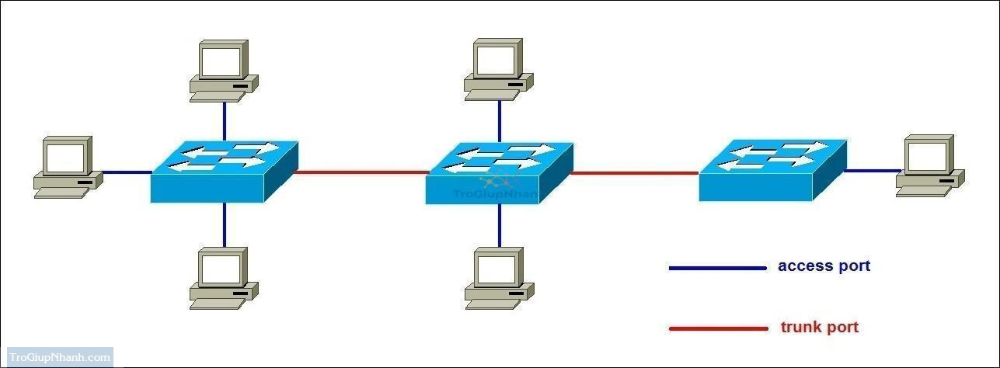

# 1. Trunk là gì?
- Trunk là một đường kết nối giữa hai thiết bị mạng (thường là switch–switch hoặc switch–router) có thể truyền nhiều VLAN cùng lúc trên cùng một đường truyền vật lý.
- Để phân biệt dữ liệu của từng VLAN, trunk sẽ gắn thêm thẻ VLAN (tag) vào khung Ethernet khi truyền.
- Thường sử dụng giao thức 802.1Q để đánh dấu (tag) các gói tin.

💡 Nói đơn giản: Nếu VLAN là “phòng” và switch là “tòa nhà”, thì trunk giống như cầu thang chung nối các tòa nhà, nhưng mỗi người đi trên cầu thang vẫn đeo “thẻ phòng” để biết mình thuộc phòng nào.
## 2. Chuẩn IEEE 802.1Q (DOT1Q)
- Giống như ISL, 802.1Q là một giao thức cho phép một liên kết vật lý có thể thực hiện mang lưu lượng của nhiều VLAN. Đây là tiêu chuẩn VLAN trunking protocol của IEEE. Thay vì đóng gói các frame lớp 2 ban đầu, 802.1Q chèn một thẻ vào header Ethernet, sau đó tính toán lại và cập nhật các FCS trong frame nguồn và truyền qua liên kết trunk.


- IEEE 802.1Q là một chuẩn chung dùng để nhận dạng các VLAN được truyền qua đường trung kế, nó hoạt động trong môi trường Ethernet và là một chuẩn mở. Là giao thức dùng gán nhãn frame khi truyền frame trên đường trung kế giữa hai Switch hay giữa Switch và Router, việc gán nhãn frame được thực hiện bằng cách thêm thông tin VLAN ID vào phần giữa header trước khi frame được truyền lên đường trung kế

**Cách hoạt động**:
- Thêm một thẻ (tag VLAN) vào gói tin Ethernet để xác định VLAN mà nó thuộc về.
- Kích thước tag VLAN: 4 byte (32 bit) được chèn vào giữa phần Header và Payload của gói tin Ethernet.
- Khái niệm Native VLAN: Gói tin thuộc Native VLAN sẽ không gắn tag khi truyền qua Trunk.

| **Trường**                          | **Kích thước**  | **Mô tả**                                                                                     |
| ----------------------------------- | --------------- | --------------------------------------------------------------------------------------------- |
| **TPID** (Tag Protocol Identifier)  | 16 bit (2 byte) | Giá trị mặc định **0x8100** để xác định đây là khung Ethernet có gắn thẻ VLAN.                |
| **TCI** (Tag Control Information)   | 16 bit (2 byte) | Gồm 3 phần nhỏ:                                                                               |
| → **PCP** (Priority Code Point)     | 3 bit           | Xác định mức độ ưu tiên (QoS – IEEE 802.1p), giá trị từ 0–7.                                  |
| → **DEI** (Drop Eligible Indicator) | 1 bit           | Cho biết gói tin có thể bị loại bỏ khi mạng quá tải (0 = giữ, 1 = có thể bỏ).                 |
| → **VID** (VLAN Identifier)         | 12 bit          | Xác định VLAN ID, giá trị từ 0–4095 (0 và 4095 là giá trị đặc biệt, VLAN hợp lệ: **1–4094**). |

Ví dụ VLAN Tagging với 802.1Q:

- Gói tin từ VLAN 10 khi truyền qua Trunk Port sẽ được thêm Tag VLAN 10. Switch nhận được gói tin sẽ đọc tag này để biết nó thuộc VLAN nào.
### 3.Access port và Trunk port



Access port (Cổng truy nhập) trong mạng máy tính, đặc biệt là trên switch, là loại cổng được cấu hình để chỉ thuộc về một VLAN duy nhất và thường được dùng để kết nối với các thiết bị cuối như máy tính, máy in, camera IP...
- Chỉ thuộc về một VLAN: Tất cả lưu lượng đi qua cổng sẽ được gán vào VLAN đó.
- Không gắn thẻ VLAN (untagged): Frame Ethernet gửi ra từ access port không chứa thẻ VLAN 802.1Q. Switch **tự động gán VLAN ID** tương ứng với cấu hình của cổng.
Khi gửi frame ra khỏi access port, switch bỏ **VLAN tag** để thiết bị cuối nhận được frame bình thường.
- Dùng cho thiết bị không hỗ trợ VLAN: Ví dụ PC, máy in — các thiết bị này thường không hiểu hoặc không xử lý được VLAN tag.

**So sánh Access port vs Trunk port**
| Tiêu chí        | Access Port           | Trunk Port                                             |
| --------------- | --------------------- | ------------------------------------------------------ |
| VLAN            | Một VLAN duy nhất     | Nhiều VLAN                                             |
| Thẻ VLAN 802.1Q | Không (untagged)      | Có (tagged)                                            |
| Kết nối         | Thiết bị cuối         | Giữa switch với switch, router hoặc server hỗ trợ VLAN |
| Ví dụ sử dụng   | PC, máy in, camera IP | Liên kết giữa các switch, Switch–Router                |

#### 4. VTP


VTP domain (hay còn được gọi là VLAN managerment domain) bao gồm 1 SW hoặc một vài SW kết nối với nhau với nhiệm vụ quản trị 1 VTP domain name. 1 SW chỉ có thể nằm trong 1 VTP domain.

Xét trong hệ thống có 30 Switch: tất cả các Switch đều có VLAN 10, 20, 30, 40, 50 và tên của các VLAN như IT, Sale.... Bình thường ta phải đi cấu hình lần lượt 30 Switch nhưng khi dùng VTP thì chỉ cần cấu hình các VLAN trên một Switch Server sau đó đồng nhất với các Switch còn lại là xong.

VTP là VLAN Trunking Protocol. Là giao thức độc quyền của thiết bị Cisco. Nó cho phép triển khai đồng nhất nhiều VLAN cùng một lúc xuống nhiều Switch khác nhau trong hệ thống mạng lớn.

**Các mode hoạt động**

1. Mode server:

- Có quyền tạo VLAN, Sửa VLAN, Xóa VLAN
- Có quyền gửi thông tin đi cho các Switch khác
- Có thể học thông tin từ Switch khác sau đó chuyển đi cho switch khác học
2. Mode Client:

- Không thể tạo, sửa, xóa VLAN
- Nó có thể gửi đi thông tin đi cho SW khác học.

3. Mode Transparent:

- Có thể tạo, sửa, xóa VLAN nhưng chỉ trong nộ bộ của Switch đó thôi
- Không đồng bộ cũng không gửi thông tin cấu hình đi cho người khác.
- Làm trạm trung chuyển các thông tin quảng bá của VTP tới Client

Chú ý: Khi nào thì dùng Transparent: Trên SW Server có 5 VLAN: 2 tới 5. Nhưng VLAN 2 là phòng Sale có nhiều nhân viên nên cần có SW mở rộng nhiều cổng. Lúc này trên SW transparent chỉ cần cấu mình mình VLAN 2. SW transparent sẽ không cập nhật thông tin của các VLAN khác.
Cách hoạt động của giao thức VTP

**Điều kiện để VTP hoạt động**

Ta có tất cả các Switch được kết nối tới một Switch tổng bằng đường Trunking.

Toàn bộ các Switch này được đặt trong một miền là Dnu nó sẽ trao đổi thông tin được với nhau.

**Các bước hoạt động**

Bước 1: Khi có thay đổi thông tin trên con Switch tổng như sửa, xóa tên hoặc thông tin VLAN thì chỉ số VTP Revision sẽ tăng lên 1.

=> Số Revision là bộ đếm khi có sự thay đổi trong cơ sở dữ liệu của VLAN. Mỗi lần sửa nó sẽ tăng lên 1.

Bước 2: Khi Revision tăng ngay lập tức các gói tin sẽ gửi tới các Switch trong miền thông qua đường Trunk. Cứ 5 phút nó lại gửi một lần.

Bước 3: Các Switch còn lại trong miền sẽ so sánh chỉ số Revision. Nếu thấy thông tin đến có chỉ số Revision cao hơn nó sẽ cập nhật dữ liệu.

**Xây dựng Backup cho hệ thống**

Để tăng tính dự phòng người ta thường dùng tối hiểu 2 Switch hoạt động ở chế độ Server.

=> Điều kiện bình thường: khi có sự thay đổi trên Switch Server 1 thì Switch Server 2 sẽ học. Nó sẽ đảm bảo duy trì cho thệ thống.

=> Điều kiện thay đổi: khi một Switch Server cắm vào hệ thống mới nếu chỉ số Revision cao hơn Server hiện tại nó sẽ làm sai lệch thông tin VLAN. Bởi vậy trước khi cắm vào phải chuyển nó sang mode Client hoặc Transparen rồi mới chuyển lại mode Server.

**Chống tấn công DoS dùng VTP**

Để chống tấn công DoS ta đặt mật khẩu VTP

**VTP Pruning**

Chống lãng phí lưu lượng đường truyền (dành cho hệ thống có VTP Server và VTP Transparent)

Khi bật tính năng này từ Switch Server các Switch Client sẽ học.

Khi Client nhận được VTP Pruning nó sẽ thông báo lại có những VLAN nào trên nó. Khi một gói tin từ một VLAN gửi đi Switch Server sẽ biết và không gửi vào những Switch không có VLAN đó.

**Cấu hình VTP domain**

a. Câu lệnh cấu hình tổng quan:
```plaintext
SW(config)#vtp  mode [Server | Client | Transparent ]

SW(config)#vtp  domain  domain-name

SW(config)#vtp pasword  abc

SW(config)#vtp version number

SW(config)#vtp pruning

SW(config)#end
```

b. Câu lệnh chi tiết:

Trên Switch Server:

Khởi tạo VTP Server:
     
   
         SW(config)#vtp  mode Server

          SW(config)#vtp  domain  dnu

          SW(config)#vtp pasword  abc

          SW(config)#vtp version 2

          SW(config)#vtp pruning (Packet tracer không hỗ trợ).

          SW(config)#end
          

Bật đường Trunking của cổng kết nối tới các SW Client:

          SW(config)#interface f0/24

          SW(config-if)#switchport mode trunk

Khởi tạo tên VLAN:

          SW(config)#vlan 2

          SW(config)#name IT

          SW(config)#exit

          SW(config)#vlan 3

          SW(config)#name Sale

          SW(config)#exit

Trên Switch Transparent:

     SW(config)#vtp  mode transparent

     SW(config)#vtp  domain  dnu

     SW(config)#vtp pasword  abc

     SW(config)#vtp pruning  (Packet tracer không hỗ trợ).

     SW(config)#end

Trên Switch VTP Client:

Khởi tạo VTP Client:

          SW(config)#vtp  mode client

          SW(config)#vtp  domain  dnu

          SW(config)#vtp pasword  abc

          SW(config)#vtp pruning  (Packet tracer không hỗ trợ).

          SW(config)#end

Gán cổng cho SW: Phải gán cổng cho SW vì VTP Server không gửi thông tin gán cổng cho Client.

          SW(config)#interface range f0/1-10

          SW(config-if-range)#switchport access vlan 2

          SW(config-if-range)#exit

          SW(config)#interface range f0/11-20

          SW(config-if-range)#switchport access vlan 3

          SW(config-if-range)#exit

c. Các lệnh kiểm tra sau khi cấu hình:
```plaintext
SW(config)# show vtp status

SW(config)# show vtp pasword

SW(config)# show vlan

SW(config)# Show interfaces trunk
```

##### 5. STP (Spanning Tree Protocol) 
STP (Spanning Tree Protocol) là một giao thức mạng Layer 2 (Datalink Layer) giúp ngăn chặn các vòng lặp (loops) trong mạng Ethernet bằng cách tạo ra một cây bao trùm (spanning tree) để đảm bảo chỉ có một đường dẫn hoạt động giữa các switch.


1. Tại sao cần Spanning Tree Protocol (STP)

Trong mạng LAN nhiều switch, nếu có đường kết nối dự phòng để tăng độ tin cậy, sẽ dễ tạo ra vòng lặp (loop).
Vòng lặp ở tầng 2 (Layer 2) rất nguy hiểm vì:

- Broadcast Storm: gói tin quảng bá (broadcast) nhân bản vô hạn → tắc nghẽn mạng.
- Bảng MAC bị loạn: switch học sai địa chỉ MAC do gói tin đi vòng.
- Tốn băng thông & CPU.

Giải pháp: STP sẽ tự động tắt (block) một số cổng để loại bỏ vòng lặp, nhưng vẫn giữ đường dự phòng để dùng khi cần.

2. **Nguyên tắc hoạt động của STP**

- STP coi mạng LAN là một cây logic không vòng (spanning tree).

Các bước chính:

- Chọn Root Switch (switch “gốc” của mạng).

- Chọn Root Port trên mỗi switch (cổng gần root nhất).

- Chọn Designated Port trên mỗi đoạn mạng (cổng được phép forward).

- Các cổng còn lại → Blocking (không chuyển dữ liệu).

3. Cách chọn Root Switch
- Mỗi switch có Bridge ID (BID) = Priority (32768 mặc định) + MAC Address.
- Switch có BID thấp nhất → trở thành Root Switch.
- Có thể thay đổi Priority để điều khiển switch nào làm Root.
4. Cách chọn Root Port
- Root Port là cổng trên switch không phải root nhưng có đường ngắn nhất đến Root Switch.
- Độ dài đường → Cost (tính dựa trên tốc độ link: 100 Mbps = cost 19, 1 Gbps = cost 4...).
5. Cách chọn Designated Port
- Trên mỗi segment (đoạn mạng), chọn 1 cổng để forward traffic → Designated Port.
- Switch có đường ngắn nhất đến root sẽ giữ Designated Port cho segment đó.
6. Trạng thái cổng trong STP
- STP truyền thống (IEEE 802.1D) có 5 trạng thái:
- Blocking – Không chuyển dữ liệu, chỉ nghe BPDU.
- Listening – Chuẩn bị gửi/nhận thông tin cấu trúc mạng.
- Learning – Học địa chỉ MAC nhưng chưa forward dữ liệu.
- Forwarding – Chuyển dữ liệu.
- Disabled – Cổng bị tắt thủ công.
7. BPDU (Bridge Protocol Data Unit)
- Gói tin điều khiển mà switch gửi để trao đổi thông tin STP.
- Dùng để bầu chọn Root và cập nhật topology.
8. Rapid STP (RSTP - IEEE 802.1w)
- Nâng cấp từ STP truyền thống → hội tụ nhanh hơn (gần như tức thì).
- Gộp trạng thái thành:
- Discarding (kết hợp Blocking + Listening).
- Learning.
- Forwarding.

Có thêm vai trò cổng:

- Alternate Port: dự phòng cho Root Port.
- Backup Port: dự phòng cho Designated Port.
9. Các tính năng STP tùy chọn
PortFast: Cổng nối trực tiếp với PC bỏ qua giai đoạn STP → vào Forwarding ngay.
- BPDU Guard: Nếu nhận BPDU ở cổng PortFast → tắt cổng (ngăn switch lạ).
- EtherChannel: Gộp nhiều đường vật lý thành 1 link logic, tránh STP block bớt link.

**Ví dụ minh họa dễ hiểu**

- Hãy tưởng tượng các switch như giao lộ và các cổng như đèn giao thông:
- STP là cảnh sát giao thông quyết định chỗ nào bật đèn xanh (forward), chỗ nào đèn đỏ (block) để không bị đi vòng hoài.
- Nếu một giao lộ chính bị chặn (Root Port hỏng) → cảnh sát đổi đèn đỏ thành xanh ở đường dự phòng.
