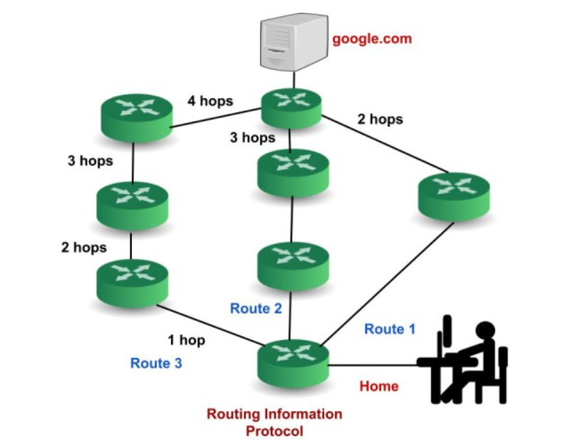

# 1.Giao thức OSPF
Khái niệm OSPF

OSPF (Open Shortest Path First) là một giao thức định tuyến nội bộ (Interior Gateway Protocol – IGP) thường được sử dụng trong mạng nội bộ của một tổ chức. OSPF tập trung vào việc định tuyến trong một Autonomous System và tích hợp các nguyên tắc của thuật toán Dijkstra để tìm đường đi ngắn nhất.

**Cách thức hoạt động của OSPF:**

- Bước 1: Chọn Router – ID
Router tự tạo: Router sẽ xem xét interface nào có địa chỉ IP cao nhất và lấy địa chỉ IP đó làm Router-ID.
Người dùng tự cấu hình: Quá trình tự động chọn Router-ID có thể không phù hợp với một số trường hợp, vì vậy người quản trị có thể tự cấu hình Router-ID.
- Bước 2: Thiết lập quan hệ láng giềng (neighbor): Giao thức OSPF sử dụng gói tin HELLO để tìm kiếm các router và thiết lập mối quan hệ láng giềng với chúng. Gói tin HELLO được gửi theo định kỳ, với tần suất mặc định là 10 giây một lần.
Gói tin HELLO chứa thông tin của router gửi gói tin, bao gồm: Router ID, Area ID, Priority, Link State Advertisement (LSA).
Khi một router nhận được gói tin HELLO từ một router khác, nó sẽ kiểm tra các thông tin trong gói tin. Nếu các thông tin này khớp với thông tin của router nhận, thì hai router sẽ thiết lập mối quan hệ láng giềng.
- Bước 3: Trao đổi LSDB
LSDB (Link State Database) là cơ sở dữ liệu trạng thái liên kết, chứa thông tin về tất cả các liên kết trong mạng OSPF. LSDB đóng vai trò như bản đồ mạng, giúp các router OSPF xác định đường đi ngắn nhất giữa các mạng.
LSDB của các router OSPF cùng vùng sẽ giống nhau. Các router OSPF cùng vùng sẽ trao đổi thông tin liên kết với nhau thông qua các gói tin Link State Advertisement (LSA).
Các LSA chứa thông tin sau: Router ID của router gửi LSA, Area ID của router gửi LSA, Link ID của liên kết, Metric của liên kết, Type của liên kết, TOS của liên kết
Khi một router OSPF nhận được gói tin LSA từ một router khác, nó sẽ cập nhật thông tin trong LSDB của mình.
- Bước 4: Giao thức OSPF sử dụng cost (Cost trên interface) thay cho Metric để đánh giá độ ưu tiên của một liên kết. Cost chỉ được tính khi một gói tin đi vào một cổng, và không được tính khi đi ra.

Cost của một liên kết được tính theo công thức sau: Cost = 108 / Bandwidth (đơn vị bps).
Các gói tin của OSPF

Hello: Gói tin Hello được sử dụng để thiết lập và duy trì mối quan hệ láng giềng giữa các bộ định tuyến OSPF.
Database Description: Sau khi thiết lập mối quan hệ láng giềng, bộ định tuyến láng giềng sẽ gửi thông tin cơ sở dữ liệu về cấu trúc liên kết mạng đến hệ thống. Hệ thống sẽ sử dụng thông tin này để cập nhật hoặc sửa đổi cơ sở dữ liệu của mình.

Link state request: Gói tin Link state request được sử dụng bởi bộ định tuyến để yêu cầu thông tin về một hoặc nhiều liên kết mạng. Ví dụ, bộ định tuyến 1 muốn biết thông tin về bộ định tuyến 2, vì vậy bộ định tuyến 1 gửi gói tin Link state request đến bộ định tuyến 2. Sau khi nhận được gói tin Link state request, bộ định tuyến 2 sẽ gửi gói tin Link state update chứa thông tin về các liên kết mạng của nó đến bộ định tuyến 1.

Link-state update: Gói tin Link state update được sử dụng bởi bộ định tuyến để truyền phát thông tin về các liên kết mạng của nó. Bất kỳ bộ định tuyến nào muốn thông báo cho các bộ định tuyến khác về các liên kết của mình đều có thể sử dụng gói tin Link state update.

Link state Acknowledgment: Xác nhận trạng thái liên kết là một cơ chế để đảm bảo rằng tất cả các bộ định tuyến trong mạng đều có cùng thông tin về trạng thái liên kết của nhau. Cơ chế này hoạt động bằng cách yêu cầu mỗi bộ định tuyến gửi xác nhận cho mỗi bản cập nhật trạng thái liên kết mà nó nhận được.

## 2.BGP
- BGP (Border Gateway Protocol) là giao thức định tuyến EGP (Exterior Gateway Protocol), được dùng để trao đổi thông tin định tuyến giữa các AS (Autonomous System – hệ tự trị).
- Trong BGP có hai dạng quan hệ chính: iBGP và eBGP.

2. eBGP (External BGP)
- Định nghĩa: Là quan hệ BGP giữa các router thuộc những AS khác nhau.
- Đặc điểm:
- Dùng để trao đổi route giữa các ISP, hoặc giữa một doanh nghiệp và ISP.
- TTL mặc định của gói tin BGP = 1 (vì thường hai router eBGP trực tiếp kết nối).
- Khi route được học từ eBGP, router sẽ thay đổi giá trị next-hop thành chính nó trước khi quảng bá cho router khác.
Thường có ưu tiên cao hơn so với iBGP trong việc chọn đường đi.

Ví dụ:
- Router trong AS 65001 thiết lập eBGP session với Router trong AS 65002.

3. iBGP (Internal BGP)
- Định nghĩa: Là quan hệ BGP giữa các router trong cùng một AS.

Đặc điểm:

- Được dùng để phân phối các route học từ eBGP cho tất cả router trong cùng AS.
- TTL mặc định của gói tin BGP = 255 (cho phép kết nối không trực tiếp).
- Không thay đổi next-hop khi quảng bá route cho iBGP neighbor.
- Rule quan trọng: các router iBGP phải kết nối full-mesh (mỗi router phải thiết lập BGP session với tất cả router khác trong AS), trừ khi dùng cơ chế Route Reflector hoặc Confederation để giảm số lượng kết nối.

- Không được phép re-advertise (quảng bá lại) route học từ một iBGP neighbor sang một iBGP neighbor khác (trừ khi có RR hoặc Confederation).

Ví dụ:

Hai router trong cùng AS 65001 thiết lập iBGP session để chia sẻ route.

4. So sánh iBGP và eBGP

| Đặc điểm              | iBGP (Internal)                    | eBGP (External)            |
| --------------------- | ---------------------------------- | -------------------------- |
| AS Number             | Cùng AS                            | Khác AS                    |
| TTL mặc định          | 255                                | 1                          |
| Next-hop              | Giữ nguyên                         | Thay đổi thành chính nó    |
| Full-mesh requirement | Có (trừ khi dùng RR/Confederation) | Không                      |
| Vai trò chính         | Phân phối route trong nội bộ AS    | Trao đổi route giữa các AS |

👉 Tóm lại:
- eBGP = trao đổi route giữa các AS khác nhau (ví dụ ISP ↔ ISP, ISP ↔ Doanh nghiệp).
- iBGP = phân phối route bên trong một AS (giữ cho tất cả router trong AS biết đường đi ra ngoài).

RIP: sử dụng “hop count” để tìm đường đi ngắn nhất từ một mạng đến mạng khác, trong đó “hop count” đếm số lượng thiết bị định tuyến mà một gói tin cần đi qua trên đường đi. Khi một gói tin chuyển từ một mạng sang mạng khác, điều này được gọi là “hop.”

### 3.Cách thức hoạt động của RIP

Router chạy RIP quảng bá toàn bộ bảng định tuyến của nó đến các router láng giềng mỗi 30 giây. Bản cập nhật định kỳ này giúp giữ cho các bảng định tuyến được đồng bộ hóa, tạo điều kiện chia sẻ thông tin định tuyến trên toàn mạng.
RIP sử dụng hop count làm metric duy nhất để lựa chọn đường dẫn. Số lượng hop tối đa được phép cho một đường dẫn là 15, giúp ngăn ngừa vòng lặp định tuyến và giới hạn kích thước mạng.
Split Horizon và Poison Reverse : Các cơ chế này ngăn chặn vòng lặp định tuyến bằng cách đảm bảo rằng bộ định tuyến không quảng bá tuyến đường trở lại bộ định tuyến mà nó đã học được.
Triggered Updates: RIP có thể gửi các cập nhật kích hoạt khi có thay đổi tuyến đường, đảm bảo thông tin định tuyến hội tụ nhanh hơn.
RIP v1: Chỉ hỗ trợ classful (không có subnet mask), không hỗ trợ VLSM. RIP v2: Hỗ trợ classless, VLSM, có tính năng xác thực. RIPng: Hỗ trợ IPv6.
Các trường trong RIP packet

Command (8 bits): Chỉ ra loại tin nhắn. Có hai loại chính: yêu cầu và phản hồi. Yêu cầu có thể yêu cầu thông tin định tuyến cụ thể hoặc đầy đủ. Phản hồi có thể được yêu cầu (để phản hồi yêu cầu) hoặc không được yêu cầu (được gửi định kỳ sau mỗi 30 giây hoặc khi có thay đổi trong bảng định tuyến).
Version (8 bits): Chỉ định phiên bản RIP đang được sử dụng.
Unused (16 bits): Dành riêng cho mục đích sử dụng sau này.
Address Family Identifier (16 bits): Xác định họ địa chỉ (ví dụ: IP).
Route Tag (16 bits): Cung cấp thông tin bổ sung về tuyến đường, thường được sử dụng trong RIP phiên bản 2.
IP Address (32 bits): Địa chỉ IP của mạng đích.
Subnet Mask (32 bits): Chỉ ra Subnet Mask cho địa chỉ IP đích.
Next Hop (32 bits): Chỉ định địa chỉ IP của bộ định tuyến next hop.
Metric (32 bits): Đại diện cho số lượng hop vào mạng đích, từ 1 đến 16, trong đó 16 biểu thị một mạng không thể truy cập được.
