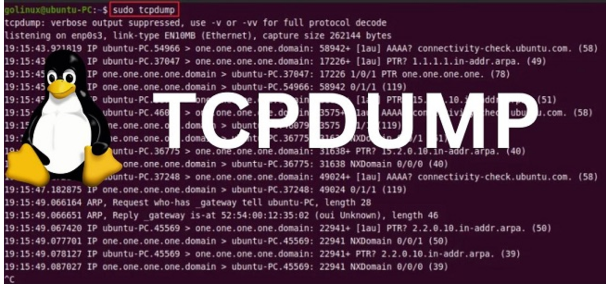
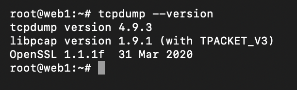
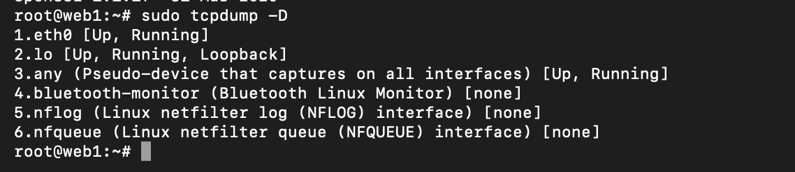
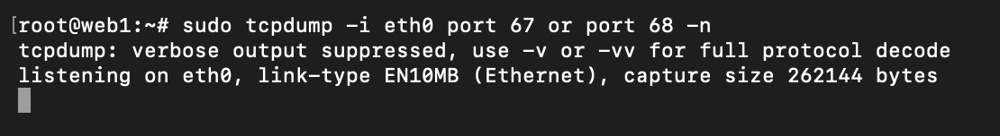

# Tcpdump là gì và nó dùng để làm gì trong mạng máy tính

**Tcpdump** là một tiện ích dòng lệnh (CLI) được thiết kế để “chặn” (capture) và phân tích lưu lượng mạng đi qua hệ thống của bạn. Công cụ này phổ biến trong quản trị mạng và bảo mật vì nó cho phép bạn theo dõi gói tin TCP/IP đang được gửi hoặc nhận trên các giao diện mạng của máy tính và lưu lại chúng để phân tích sau. Nhờ tính chất mã nguồn mở và nhẹ, tcpdump chạy được trên hầu hết hệ thống Unix/Linux, kể cả các máy chủ không có giao diện đồ họa. Nó thường được dùng để khắc phục sự cố kết nối (ví dụ kiểm tra xem lưu lượng có tới được máy đích hay không) và kiểm tra vấn đề bảo mật (ví dụ phân tích gói tin lạ). Nói một cách đơn giản, tcpdump là công cụ tiêu chuẩn để “bắt” và xem chi tiết các gói mạng ngay trên terminal, hỗ trợ lọc gói tin linh hoạt theo nhiều tiêu chí khác nhau (địa chỉ IP, cổng, giao thức, v.v.)

## 2. TCPdump tồn tại ở hình thức nào?

- Để lựa chọn gói tin phù hợp với biểu thức logic mà khách hàng nhập vào, tcmpdump sẽ xuất ra màn hình một gói tin chạy trên card mạng mà máy chủ đang lắng nghe.

- Tùy vào các lựa chọn khác nhau khách hàng có thể xuất mô tả này ra một gói tin thành một file “pcap” để phân tích và có thể đọc nội dung “pcap” đó với option - r của lệnh tcpdump, hoặc sử dụng các phần mềm khác như là: Wireshark.

- Đối với những trường hợp không có tùy chọn, lệnh tcpdump sẽ được chạy cho đến khi nhận được một tín hiệu ngắt từ khách hàng. Sau khi kết thúc việc bắt các gói tin, tcmpdump sẽ báo cáo các cột sau:

- Packet capture: số lượng gói tin bắt được và xử lý.
- Packet received by filter: số lượng gói tin được nhận bởi bộ lọc.
- Packet dropped by kernel: số lượng packet đã bị dropped bởi cơ chế bắt gói tin của hệ điều hành.
## 3. Định dạng chung của một dòng giao thức TCPdump

Định dạng chung của một dòng giao thức tcmpdump cụ thể là:

     time-stamp src > dst:  flags  data-seqno  ack  window urgent options

- Time-stamp: hiển thị thời gian gói tin được capture.

- Src và dst: hiển thị địa IP của người gửi và người nhận.

- Cờ Flags sẽ bao gồm các giá trị cơ bản đó là:

   - S (SYN): Được sử dụng trong quá trình bắt tay của giao thức TCP.
   - .(ACK): Được sử dụng để thông báo cho bên gửi biết là gói tin đã nhận được dữ liệu thành công.
   - F(FIN): Được sử dụng để đóng kết nối TCP.
   - P(PUSH): Thường được đặt ở cuối để đánh dấu việc truyền dữ liệu.
   - R(RST): Được sử dụng khi muốn thiết lập lại đường truyền.
   - Data-sqeno: Số sequence number của gói dữ liệu hiện tại.
   - ACK: Mô tả số sequence number tiếp theo được truyền đến của gói tin mà bên gửi mong muốn nhận được.
   - Window: Đây là vùng nhớ đệm có sẵn trên kết nối theo một hướng khác.
   - Urgent: Giá trị này cho người dùng biết được các gói dữ liệu khẩn cấp có trong gói tin.

   # Cài đặt và sử dụng TCPdump
   ## Cài đặt TCPdump

1. Kiểm tra tcpdump đã được cài chưa

        tcpdump --version

- Nếu hiện version → đã cài
- Nếu báo command not found → chưa cài

2. Cài đặt tcpdump trên Ubuntu

Bước 1: Cập nhật danh sách gói

    sudo apt update

Bước 2: Cài tcpdump

    sudo apt install tcpdump -y

Lưu ý:
- tcpdump sử dụng thư viện libpcap
- Ubuntu sẽ tự động cài libpcap kèm theo

3. Kiểm tra lại sau khi cài

       tcpdump --version

4. Liệt kê card mạng để bắt gói

       sudo tcpdump -D

## Các lệnh cơ bản và cách sử dụng tcpdump

- Quyền người dùng: Phần lớn lệnh tcpdump yêu cầu quyền root hoặc `sudo` mới có thể bắt gói. Nếu chạy lệnh bình thường sẽ báo lỗi (ví dụ “permission denied” hoặc “You don’t have permission to capture on that device”).
- Chọn giao diện: Mặc định, tcpdump sẽ bắt trên giao diện mạng đầu tiên (thường là `eth0`, `ens3`, hoặc giao diện mặc định của hệ). Để liệt kê các giao diện khả dụng, dùng:

       sudo tcpdump -D

(hoặc `--list-interfaces`). Kết quả trả về danh sách các interface như `1.eth0`, `2.ens3`, `3.any` (pseudo-device bắt tất cả interface), `4.lo` (loopback),… Dùng tham số `-i` để chỉ định giao diện cụ thể:

     sudo tcpdump -i eth0

sẽ chỉ bắt gói trên interface `eth0`. Để bắt đồng thời trên tất cả interface, bạn có thể dùng `-i any` (chỉ có trên Linux).
- Bắt mọi gói tin: Chạy

      sudo tcpdump

sẽ bắt tất cả gói tin đi qua giao diện mặc định cho đến khi bạn nhấn `Ctrl+C`. Giao diện đầu ra sẽ lần lượt hiển thị thông tin của từng gói vừa bắt. Bạn cũng có thể thêm `-vv` hoặc `-v` để tăng độ chi tiết giải mã, và `-c N` để chỉ bắt **N** gói rồi tự dừng. Ví dụ:

    sudo tcpdump -c 10 -vv

chỉ bắt 10 gói và hiển thị chi tiết hơn.

- Lọc theo địa chỉ IP (host): Thêm từ khóa host để chỉ bắt gói liên quan đến một địa chỉ IP nhất định. Ví dụ:

      sudo tcpdump host 192.168.1.100

chỉ thu gói giữa host có IP 192.168.1.100 và các host khác. Bạn cũng có thể dùng `src host 192.168.1.100` hoặc `dst host 10.0.0.5` để lọc gói từ hay đến IP cụ thể.
- Lọc theo giao thức: Đơn giản nhất là gõ tên giao thức (ví dụ `icmp`, `arp`, `udp`, `tcp`) vào lệnh. Ví dụ:

      sudo tcpdump icmp

chỉ bắt các gói ICMP (tương tự dùng `udp`, `tcp` để bắt gói UDP/TCP). Bạn cũng có thể dùng `-n udp` để tránh phân giải DNS và chỉ lọc theo UDP. Cú pháp BPF phức tạp hơn còn cho phép lọc bằng số giao thức (`proto 17` tương đương UDP) hoặc kết hợp nhiều điều kiện (ví dụ `src 192.168.1.5 and tcp port 80`).
- Lọc theo cổng: Dùng từ khóa port để chỉ bắt gói liên quan đến cổng cụ thể. Ví dụ:

      sudo tcpdump port 22

chỉ hiển thị gói đến hoặc đi từ cổng 22 (SSH). Tương tự, `port 80` cho HTTP, `port 443` cho HTTPS. Bạn cũng có thể dùng `portrange 1000-2000` để bắt một dải cổng.
- Ghi/gợi thông tin trong file: Tcpdump cho phép ghi kết quả ra file pcap để phân tích sau. Ví dụ:

      sudo tcpdump -i eth0 -w capture.pcap

sẽ lưu tất cả gói trên `eth0` vào file `capture.pcap`. Sau đó bạn có thể mở file này trong Wireshark hoặc đọc lại bằng tcpdump:

     sudo tcpdump -r capture.pcap

. Lưu ý: trong quá trình live capture, tcpdump chỉ in kết quả ra màn hình; nếu dùng  `-w`, nó sẽ không hiển thị và chỉ ghi file.

- Tùy chọn hữu ích khác: Sử dụng `-n` để không phân giải địa chỉ IP thành tên miền (tránh delay khi truy vấn DNS). Dùng `-v`, `-vv`, `-vvv` để tăng độ chi tiết thông tin của các gói khi in ra. Dùng `-s 0` để bắt đầy đủ dữ liệu của gói mà không bị cắt (mặc định tcpdump thường chỉ chụp phần đầu). Tổng hợp một số tùy chọn thông dụng:
- `-i <iface>`: chọn giao diện
- `-n / -nn`: bỏ phân giải DNS (IP và port)
- `-c <N>`: dừng sau khi bắt N gói
- `-s 0`: bắt toàn bộ gói (no snap length limit)
- `-w <file> / -r <file>`: ghi ra / đọc từ file pcap.

# Ví dụ minh họa và giải thích output
Giả sử bạn chạy lệnh sudo tcpdump -vv và nhận được một dòng đầu ra tiêu biểu cho lưu lượng TCP như sau (có một phiên DNS hoặc SSH đang trao đổi):
15:47:24.248737 IP 192.168.1.185.22 > 192.168.1.150.37445: Flags [P.], seq 201747193:201747301, ack 1226568763, win 402, options [nop,nop,TS val 1051794587 ecr 2679218230], length 108
(định dạng chung: [timestamp] [protocol] [SrcIP].[SrcPort] > [DstIP].[DstPort]: [Flags] [Seq] [Ack] [Win] [Options] [Length]). Các trường trong dòng trên có ý nghĩa:
15:47:24.248737 – Timestamp ghi thời điểm gói được bắt (giờ:phút:giây.chẵn).
IP – Giao thức của gói (ở đây là IPv4).
192.168.1.185.22 và 192.168.1.150.37445 – Địa chỉ IP và cổng nguồn > đích. Cụ thể 192.168.1.185:22 gửi đến 192.168.1.150:37445.
Flags [P.] – Cờ TCP (Flags). Ví dụ [P.] có nghĩa đây là gói PUSH + ACK. Các cờ thông dụng khác: [.] (ACK), [S] (SYN), [F] (FIN), [R] (RST).
seq 201747193:201747301 và ack 1226568763 – Số thứ tự (sequence) và ACK (số xác nhận) của TCP. Trường seq 201747193:201747301 nghĩa gói này chứa byte từ 201747193 đến 201747301 trong luồng dữ liệu. ack 1226568763 là số thứ tự mà bên nhận mong chờ ở gói tiếp theo.
win 402 – TCP window (cửa sổ nhận) có giá trị 402 (tức kích thước bộ đệm còn trống).
options [nop,nop,TS val 1051794587 ecr 2679218230] – Các tùy chọn TCP. Ở đây có hai nop (đệm), và hai trường timestamp: TS val (giá trị thời gian) và ecr (echo reply).
length 108 – Độ dài payload (108 bytes dữ liệu) của gói này.
Nhìn chung, mỗi dòng output của tcpdump cho biết chính xác thời gian, giao thức và thông tin cấp thấp (như địa chỉ, cổng, cờ, seq/ack, v.v.) của mỗi gói mạng được bắt. Hiểu rõ từng trường này giúp bạn phân tích được luồng dữ liệu đang chạy trên mạng.

# Mẹo và lưu ý khi dùng tcpdump
- Giới hạn số gói: Để tránh tràn màn hình, nên bắt số gói có hạn khi tập huấn (ví dụ `-c 100`). Tcpdump có thể tạo ra rất nhiều dòng nếu mạng có lưu lượng cao.
- Tắt DNS lookup: Luôn thêm `-n` để không phân giải địa chỉ IP và cổng sang tên (tên miền hoặc tên dịch vụ), giúp tăng tốc và giữ đầu ra đơn giản hơn.
- Bắt đầy đủ dữ liệu: Mặc định tcpdump chỉ chụp phần đầu gói. Nếu bạn cần lấy toàn bộ dữ liệu (payload), hãy dùng `-s 0`.
- Chọn đúng giao diện: Nếu máy có nhiều interface (Ví dụ máy ảo, VPN…), dùng `-i <tên-giao-diện>` để chỉ bắt giao diện mong muốn. Dùng -D hoặc `--list-interfaces` để xem các giao diện có sẵn.
- Ghi và phân tích offline: Khi thực hành lab, bạn có thể lưu kết quả sang file pcap (`-w file.pcap`) và mở bằng Wireshark hoặc tcpdump (`-r file.pcap`) để xem sau. Điều này giúp phân tích kỹ hơn và bảo tồn thông tin để so sánh.
- Chú ý hiệu suất: Tcpdump nhẹ nhưng vẫn có thể làm đầy CPU nếu lọc quá rộng. Nếu bị lỗi “packet dropped” (hệ điều hành không kịp bắt hết gói), hãy thử tăng tham số `-s` hoặc bắt ít gói hơn.
- Dừng lệnh: Dùng `Ctrl+C` để dừng quá trình bắt gói thủ công. Tcpdump sẽ thống kê số gói đã bắt, đã lọc và bị rơi (dropped) khi kết thúc.

# So sánh tcpdump và Wireshark (ngắn gọn)
Wireshark và tcpdump đều là các công cụ phân tích gói tin, nhưng có điểm khác biệt cơ bản. Wireshark có giao diện đồ họa trực quan, hỗ trợ nhiều tính năng nâng cao (đồ thị, phân tích theo tầng giao thức, thống kê, bộ lọc GUI). Nó phù hợp khi bạn cần phân tích chi tiết từng gói bằng cách nhìn trực quan. Ngược lại, tcpdump chỉ là công cụ dòng lệnh, nhấn mạnh vào tốc độ và sự linh hoạt khi chạy ở môi trường terminal hoặc máy chủ (không cần GUI). Tcpdump thường có sẵn trên hầu hết hệ thống Unix/Linux và có thể đưa vào kịch bản (script) dễ dàng. Nói tóm lại, Wireshark đơn giản, đa nền tảng và mạnh về trực quan, trong khi tcpdump nhanh, nhẹ, dễ tự động hóa. Trong thực tế, nhiều quản trị viên dùng tcpdump để ghi file pcap trên server rồi mở bằng Wireshark để phân tích chi tiết hơn.
Nguồn: Các thông tin trên dựa vào tài liệu và hướng dẫn thực hành từ trang chính thức và bài viết chuyên sâu về tcpdump, kết hợp với kinh nghiệm thực tế khi sử dụng công cụ này.