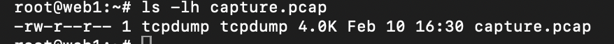

Bắt gói tin (Packet Capture)
1. Mở Wireshark
2. Chọn Network Interface:
- `en0` → WiFi

Click `Start Capturing`

# 3. Phân tích gói tin bằng tcpdump (Ubuntu)

3.1 Bắt gói tin cơ bản

    sudo tcpdump

Chỉ định card mạng:

    sudo tcpdump -i eth0

3.2 Bắt gói TCP

    sudo tcpdump -i eth0 tcp

Bắt HTTP (port 80):

    sudo tcpdump -i eth0 port 80

3.3 Bắt và lưu file pcap

    sudo tcpdump -i eth0 -w capture.pcap

Đọc lại:

    tcpdump -r capture.pcap

👉 File `.pcap` có thể mở bằng Wireshark

3.4 Phân tích chi tiết gói tin

    sudo tcpdump -i eth0 -nn -vvv -X

Tham số	     Ý nghĩa
`-nn`	         Không phân giải DNS/port
`-vvv`	     Chi tiết tối đa
`-X`	         Hex + ASCII payload

3.5 Ví dụ TCP 3-way Handshake bằng tcpdump

    sudo tcpdump 'tcp[tcpflags] & tcp-syn != 0'

Kết quả:
Flags [S]
Flags [S.]
Flags [.]

# 4. Quy trình chuẩn trong thực tế
## Bắt gói tin bằng tcpdump trên server

1. File .pcap là gì?
- `.pcap` (Packet Capture) là file lưu các gói tin mạng
- Được tạo bởi: tcpdump, Wireshark, tshark
- Bên trong chứa:
   - Ethernet header
   - IP header
   - TCP/UDP/ICMP
   - Payload (nếu có)
- Wireshark đọc trực tiếp .pcap, không cần convert.

2. Tạo file .pcap bằng tcpdump (Ubuntu)
2.1 Bắt gói tin và lưu file

       sudo tcpdump -i eth0 -w capture.pcap

| Thành phần     | Ý nghĩa       |
| -------------- | ------------- |
| `-i eth0`      | Card mạng     |
| `-w`           | Write ra file |
| `capture.pcap` | Tên file      |

⏹ Nhấn Ctrl + C để dừng.

2.2 Kiểm tra file đã tạo

     ls -lh capture.pcap

3. Copy file .pcap từ Ubuntu sang macOS
3.1 Dùng scp (chuẩn nhất)

Trên macOS Terminal:

     scp root@192.168.20.26:/home/root/capture.pcap ~/Desktop/

Sau lệnh này:

- File nằm ở Desktop macOS
- Sẵn sàng mở bằng Wireshark

4. Mở file .pcap bằng Wireshark (macOS)
