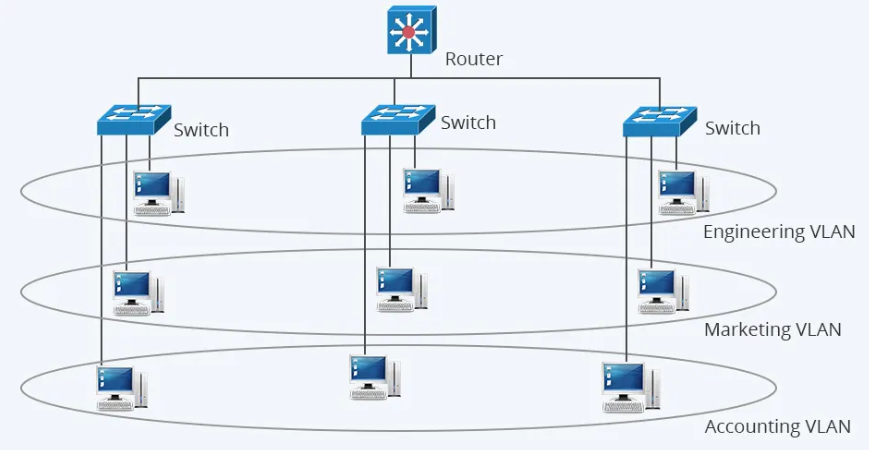
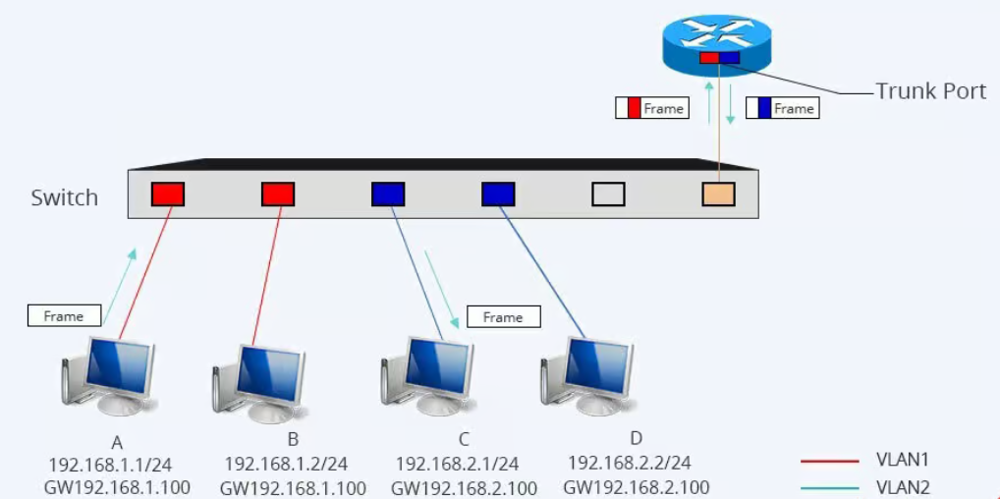

# 1.Khái niệm VLAN
- VLAN (Virtual Local Area Network) là một kỹ thuật cho phép chia một mạng LAN vật lý thành các mạng logic riêng biệt, được gọi là các VLAN. Chúng hoạt động độc lập với nhau, ngay cả khi các thiết bị được kết nối vào cùng một switch (bộ chuyển mạch).

Hiểu đơn giản:

VLAN giống như chia lớp học chung thành các nhóm riêng để học các môn khác nhau, dù đang ngồi chung một phòng.
Thiết bị trong cùng VLAN có thể giao tiếp trực tiếp với nhau, còn nếu khác VLAN thì phải thông qua thiết bị định tuyến (Router).
## 2.Tại sao cần chia VLAN
Tăng cường bảo mật

- Cách ly dữ liệu: Các VLAN tách biệt giúp đảm bảo thiết bị trong VLAN này không thể giao tiếp trực tiếp với thiết bị trong VLAN khác nếu không có thiết bị trung gian như router hoặc firewall. Điều này ngăn chặn truy cập trái phép giữa các phòng ban hoặc nhóm thiết bị.

- Giảm nguy cơ tấn công nội bộ: Nếu có một thiết bị bị nhiễm mã độc, VLAN giúp hạn chế sự lây lan của nó sang các thiết bị khác trong mạng.

Giảm bớt broadcast, tăng hiệu suất mạng

- Hạn chế broadcast storm: Trong mạng LAN thông thường, khi một thiết bị gửi gói tin broadcast, toàn bộ thiết bị trong cùng mạng nhận được gói tin này. Nếu có quá nhiều thiết bị, mạng có thể bị chậm.

- Khi chia VLAN, broadcast chỉ giới hạn trong VLAN đó, giúp giảm tải cho mạng và tối ưu băng thông.

Quản lý linh hoạt

- Phân nhóm thiết bị logic: Dễ dàng nhóm các thiết bị theo chức năng thay vì theo vị trí vật lý.

- Đơn giản hóa việc quản lý: Có thể quản lý các VLAN một cách tập trung thông qua switch hoặc router.

- Tiết kiệm chi phí: VLAN giúp tiết kiệm chi phí đầu tư cho thiết bị mạng. VD: Thay vì sử dụng nhiều switch riêng biệt, có thể sử dụng 1 switch duy nhất để tạo ra nhiều VLAN.

Hỗ trợ QoS (Quality of Service)

- Ưu tiên lưu lượng mạng: Một số VLAN có thể được ưu tiên hơn. VD: VLAN cho hội nghị truyền hình có thể được ưu tiên băng thông hơn VLAN cho nhân viên văn phòng

- Cải thiện hiệu suất cho các ứng dụng quan trọng như VoIP, Video Call
### 3.Cách hoạt động VLAN
Mạng VLAN hoạt động bằng cách chia một mạng vật lý thành các mạng con ảo độc lập giúp tăng cường quản lý và an ninh, cũng như cải thiện hiệu suất mạng.

- Phân chia mạng vật lý: Mạng VLAN bắt đầu bằng việc phân chia mạng vật lý thành các phần nhỏ hơn gọi là VLANS. Mỗi VLAN tương ứng với một đơn vị tổ chức, bộ phận làm việc hoặc yêu cầu nào đó.

- Gán VLAN IDs: Mỗi VLAN được gán một VLAN ID, là một số nguyên dương đại diện cho mạng ảo đó. Các thiết bị mạng như switch, sẽ sử dụng VLAN ID để xác định các VLAN.

- Gán cổng và cổng trừu tượng: Các cổng trên switch được gán cho từng mạng VLAN cụ thể. Cổng này có thể là cổng vật lý hoặc cổng trừu tượng (port-based VLANs). Các thiết bị trong cùng một VLAN có thể giao tiếp trực tiếp với nhau và hạn chế giao tiếp với các thiết bị ở VLAN khác.

- Access Ports và Trunk Ports: Trong mạng VLAN, có hai loại cổng quan trọng: access ports và trunk ports. Cổng Access ports được gán cho một VLAN cụ thể (thiết bị cuối)  trong khi cổng trunk được sử dụng để chuyển dữ liệu giữa các switch và giữa các mạng VLAN.

- Tagging và Untagging: Khi dữ liệu đi qua cổng trunk, thông tin về VLAN ID thường được thêm vào gói tin (tagging). Ngược lại, khi dữ liệu rời khỏi mạng VLAN, thông tin này có thể được loại bỏ (untagging).

- Tạo Broadcast Domains: Mỗi VLAN tạo ra một broadcast domain độc lập, giảm thiểu lưu lượng broadcast trên mạng và cải thiện hiệu suất.

**Chi tiết về cách VLAN hoạt động**
- Gửi khung Ethernet: Khi một thiết bị gửi khung Ethernet, nó sẽ thêm mã VLAN vào khung. Mã VLAN này xác định VLAN mà khung Ethernet thuộc về.
- Chuyển khung đến Switch: Khung Ethernet được truyền qua cáp đến Switch.
Switch đọc mã VLAN: Bộ chuyển mạch đọc mã VLAN trong khung Ethernet.
- Chuyển khung đến cổng tương ứng: Switch chuyển khung Ethernet đến cổng tương ứng với VLAN được xác định bởi mã VLAN.
- Thiết bị nhận khung: Thiết bị trên cổng nhận được khung Ethernet và xử lý nó.

Ví dụ:
- PC1 (VLAN 10) gửi gói tin đến PC2 (VLAN 10), cả hai nối vào switch.
Quy trình:
1. PC1 gửi khung Ethernet → đi vào **Access port** của VLAN 10.
2. Switch gán khung này vào bảng VLAN nội bộ (VLAN table).
3. Switch tìm địa chỉ MAC đích và chỉ chuyển khung đến các port thuộc VLAN 10.
4. PC2 (cùng VLAN 10) nhận được gói tin → giao tiếp thành công.
- Nếu PC1 gửi sang PC3 (VLAN 20), switch sẽ chặn vì khác VLAN (Layer 2 không định tuyến).
#### 4.Phân loại VLAN
1. Static VLAN (Port-based VLAN)

**Cách hoạt động**: VLAN được gán cố định cho từng cổng (port) trên switch.
→ Bất kỳ thiết bị nào cắm vào cổng đó sẽ thuộc VLAN đã cấu hình.

**Ưu điểm**:
- Dễ cấu hình và quản lý.
- Ít bị thay đổi khi thiết bị di chuyển trong cùng một port.

**Nhược điểm**:
- Nếu người dùng đổi sang cổng khác thì phải cấu hình lại VLAN cho cổng mới.
- Ứng dụng: Môi trường ổn định, thiết bị cố định như văn phòng.
2. Dynamic VLAN

**Cách hoạt động**: Switch tự động gán VLAN cho thiết bị dựa trên thông tin của thiết bị như:
- MAC address (phổ biến nhất, thông qua VMPS – VLAN - Membership Policy Server)
- IP address
- User ID (qua 802.1X)

**Ưu điểm**:
Người dùng di chuyển giữa các cổng vẫn giữ nguyên VLAN.
Tự động hóa, giảm cấu hình thủ công.

**Nhược điểm**:
- Cần hệ thống quản lý VLAN (VMPS server).
- Cấu hình ban đầu phức tạp.

**Ứng dụng**: Doanh nghiệp lớn, môi trường người dùng hay di chuyển.

3. Protocol-based VLAN

**Cách hoạt động**: VLAN được gán dựa trên loại giao thức Layer 3 (ví dụ IPv4, IPv6, IPX…).

**Ưu điểm**:
- Phân tách mạng dựa trên loại giao thức mà không phụ thuộc port hoặc MAC.

**Nhược điểm**:
- Ít phổ biến, chủ yếu dùng khi cần phân tách lưu lượng theo loại protocol.

**Ứng dụng**: Mạng hỗn hợp nhiều giao thức.

**Tóm tắt bảng so sánh**:
| Loại VLAN           | Tiêu chí gán     | Ưu điểm                 | Nhược điểm                    | Ứng dụng              |
| ------------------- | ---------------- | ----------------------- | ----------------------------- | --------------------- |
| Static VLAN         | Cổng (Port)      | Dễ quản lý, ổn định     | Không linh hoạt khi di chuyển | Văn phòng cố định     |
| Dynamic VLAN        | MAC, IP, User ID | Linh hoạt, tự động      | Cần server, cấu hình phức tạp | Doanh nghiệp lớn      |
| Protocol-based VLAN | Loại giao thức   | Phân loại theo protocol | Ít phổ biến                   | Mạng hỗn hợp protocol |

