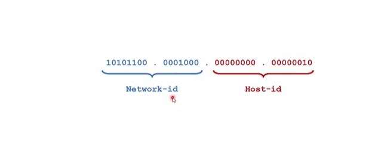
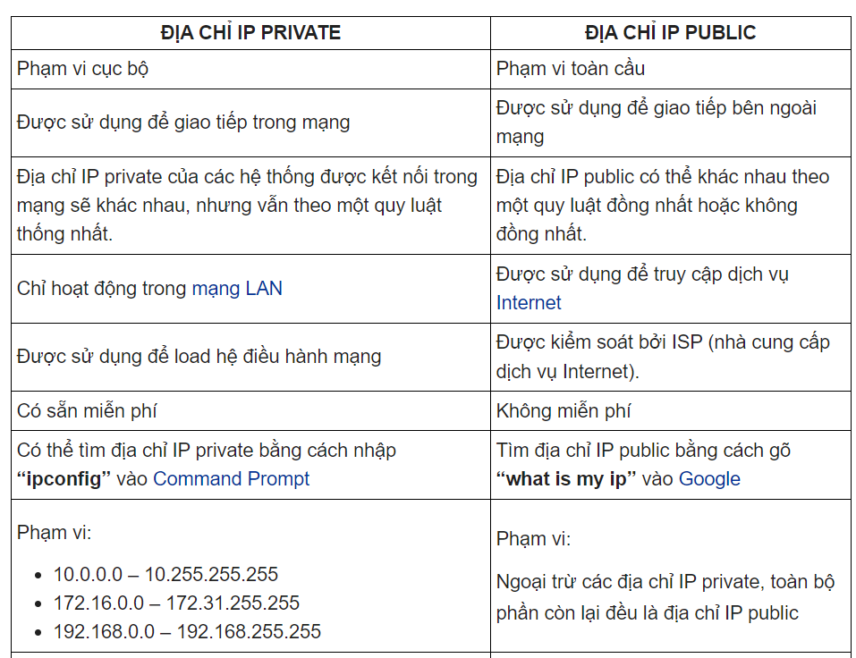

# 1.IPv4 là gì ?
- IPv4 (Internet Protocol version 4) là giao thức lớp mạng trong mô hình TCP/IP, được dùng để định danh và định tuyến các thiết bị trong mạng thông qua địa chỉ IP 32 bit và chia ra làm 4 octet(mỗi octet có 8 bit = 1 byte), giữa các octet ngăn cách nhau bằng dấu chấm
- IPv4 là phiên bản thứ 4 và là phiên bản phổ biến nhất hiện nay.

 
 # 2.Tại sao lại không có IPv1,v2,v3,v5
 - IPv1–IPv3: là phiên bản thử nghiệm, dùng trong giai đoạn phát triển ban đầu.
- IPv5: đã từng tồn tại như một thử nghiệm mang tên ST – Internet Stream Protocol, nhưng không được triển khai rộng rãi và được bỏ qua để tránh nhầm lẫn.Tuy nhiên, giao thức này sau đó đã được đổi tên và trở thành Giao thức Internet phiên bản 6 (IPv6).
- Vì vậy, sau IPv4, phiên bản tiếp theo là IPv6, với địa chỉ dài 128 bit.
# 3. Cấu trúc của địa chỉ IPv4
- IPv4 có độ dài 32 bit, chia thành 4 octet (8 bit), viết dưới dạng thập phân, ngăn cách bằng dấu chấm.
Ví dụ địa chỉ IPv4: 192.168.1.1 = 11000000.10101000.00000001.00000001
# 4. Các thành phần của IPv4
Địa chỉ IPv4 gồm 2 phần:
- Network ID (Net ID): định danh mạng.
- Host ID: định danh thiết bị trong mạng đó.

Phân tách NetID và HostID dựa trên subnet mask.
# 5. Các lớp địa chỉ IPv4
| Lớp | Phạm vi địa chỉ             | Bit đầu | Net/Host               | Dùng cho   |
| --- | --------------------------- | ------- | ---------------------- | ---------- |
| A   | 1.0.0.0 – 126.255.255.255   | 0       | 8 Net / 24 Host        | Mạng lớn   |
| B   | 128.0.0.0 – 191.255.255.255 | 10      | 16 Net / 16 Host       | Mạng trung |
| C   | 192.0.0.0 – 223.255.255.255 | 110     | 24 Net / 8 Host        | Mạng nhỏ   |
| D   | 224.0.0.0 – 239.255.255.255 | 1110    | Dùng cho multicast |            |
| E   | 240.0.0.0 – 255.255.255.255 | 1111    | Dự phòng, nghiên cứu   |            |
# 6. Phân biệt IP Public và IP Private
## **Địa chỉ IP Public**
- Địa chỉ IP public của hệ thống là địa chỉ IP được sử dụng để giao tiếp bên ngoài mạng. Địa chỉ IP public về cơ bản được gán bởi ISP (Nhà cung cấp dịch vụ Internet).

## **Địa chỉ IP Private**
- Địa chỉ IP private của hệ thống là địa chỉ IP được sử dụng để giao tiếp trong cùng một mạng. Thông tin hoặc dữ liệu IP private có thể được gửi hoặc nhận trong cùng một mạng.

### **Khác biệt giữa IP Public và IP Private**

# 7. Cách chia địa chỉ IPv4 (subnetting)
- Subnetting là chia nhỏ một mạng lớn thành các mạng con.
- Dựa vào subnet mask (mặt nạ mạng), 
 - ví dụ:/24 tương đương 255.255.255.0: 256 địa chỉ (254 usable) ,/26 tương đương 255.255.255.192: 64 địa chỉ (62 usable)
 # 8. Phân biệt multicast và broadcast
|Loại     |	Định nghĩa   |	Phạm vi|	Ví dụ địa chỉ|
|------|------|-------|------|
|Broadcast|	Gửi đến tất cả thiết bị trong mạng con|	Cục bộ|	255.255.255.255|
| Multicast|	Gửi đến nhóm thiết bị xác định|	Rộng hơn, có tổ chức| 	224.0.0.1, 239.x.x.x | 
# 9. Các khái niệm: subnet, subnet mask, prefix
- Subnet (hay còn gọi là mạng con): là một phần của một mạng lớn được chia nhỏ để quản lý tài nguyên mạng hiệu quả hơn. Một subnet được định nghĩa bởi một địa chỉ IP mạng và một subnet mask. Các thiết bị trong cùng một subnet có thể giao tiếp với nhau trực tiếp mà không cần thông qua một router.

- Subnet mask(mặt nạ mạng): là một dạng số nhị phân 32bit, cho phép người sử dụng phân tách địa chỉ IP thành địa chỉ mạng và địa chỉ host. Các địa chỉ theo dạng số học sẽ không được sử dụng cho máy chủ.

- Prefix (dạng ngắn gọn của subnet mask), Subnet mask được sử dụng kèm với địa chỉ IP để một host 
có thể căn cứ vào đó xác dịnh được địa chỉ mạng tương ứng của địa chỉ này. Vì vậy, khi khai báo một địa chỉ IP ta luôn phải khai báo kèm theo một subnet mask. Tuy nhiên, subnet mask dù đã được viết dưới dạng số thập phân vẫn khá dài dòng nên để mô tả một địa chỉ IP một cách ngắn gọn hơn, người ta dùng một đại lượng được gọi là số prefix. Số prefix đơn giản chỉ là số bit mạng trong một địa chỉ IP, 
được viết ngay sau địa chỉ IP, và được ngăn cách với địa chỉ này bằng một dấu “/”.
Nguyên lý cơ bản của kỹ thuật chia subnet: Để có thể chia nhỏ một mạng lớn thành nhiều mạng con bằng nhau, người ta thực hiện mượn thêm một số bit bên phần host để làm phần mạng, các bit mượn này được gọi là các bit subnet. Tùy thuộc vào số bit subnet mà ta có được các số lượng các mạng con khác nhau với các kích cỡ khác nhau
 ví dụ /24 = 24 bit mạng.
 # **Tài liệu tham khảo**
<https://bizflycloud.vn/tin-tuc/ipv4-la-gi-20210607115922143.htm#:~:text=%C4%90%E1%BB%8Ba%20ch%E1%BB%89%20Ipv4%20l%C3%A0%201,ng%C4%83n%20c%C3%A1c%20octet%20v%E1%BB%9Bi%20nhau.>

<https://www.youtube.com/watch?v=Z_syAVeMCSA>
<https://www.youtube.com/watch?v=N4xJYVPdtaA>
<https://www.youtube.com/watch?v=bexW8QYDKz0>
<https://www.youtube.com/watch?v=_LlVcy19Ojs&t=101s>
<https://www.youtube.com/watch?v=rz3bae9FOvE>

<https://quantrimang.com/cong-nghe/so-sanh-dia-chi-ip-public-va-private-183479>

