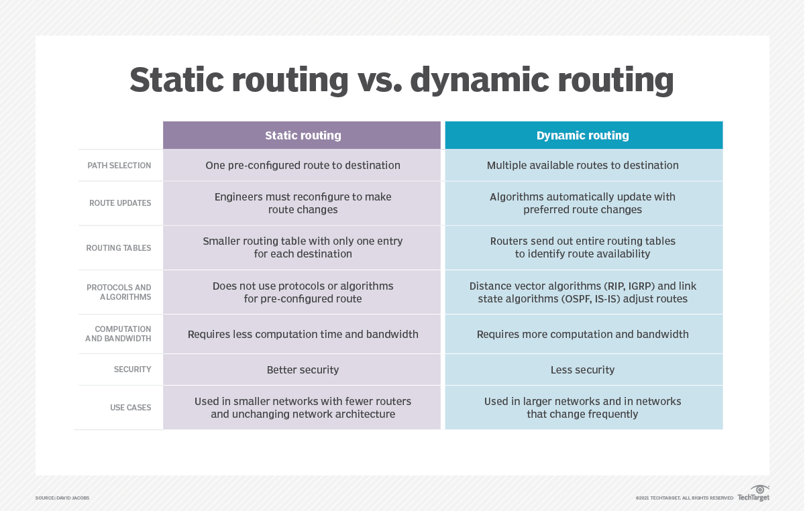

# 1. Routing là gì?
- Routing (định tuyến) là quá trình lựa chọn đường đi và quản lý lưu lượng trong mạng IP
- Nó cho phép các gói dữ liệu di chuyển từ nguồn đến đích qua một hoặc nhiều mạng khác nhau. Trên thực tế, router (thiết bị lớp 3) sẽ kiểm tra địa chỉ IP đích của gói tin và chọn đường đi “tốt nhất” cho nó. Sau đó, router sẽ chuyển tiếp từng gói tin đến đích bằng cách tham khảo bảng chuyển tiếp (forwarding table hay routing table), trong đó ánh xạ tiền tố đích với thiết bị hoặc giao diện next-hop 

- Bảng định tuyến có thể được tạo ra nhờ cấu hình tĩnh hoặc bằng các giao thức định tuyến động. Về bản chất, routing đảm bảo mỗi gói tin được gửi đến next-hop trên con đường cuối cùng dẫn đến đích, cho phép các mạng khác nhau (subnet, site, hoặc ISP) kết nối hiệu quả.

- Routing có vai trò quan trọng trong các hệ thống mạng, đặc biệt là mạng Internet, giúp đảm bảo các thiết bị có thể liên lạc với nhau một cách hiệu quả. Quá trình này được thực hiện bởi các thiết bị mạng như router, switch layer 3 và máy chủ mạng.

Theo ví dụ trên, Máy tính A muốn nhắn tin cho máy tính B có thể đi theo 2 đường dẫn:

- Đường 1: đi qua mạng 1, 3 và 5.
- Đường 2: đi qua mạng 2 và 4.

Khi dữ liệu từ máy tính A đến Router nó sẽ phân tích và quyết định lựa chọn đường dẫn tốt nhất trong 2 đường dẫn. Trong trường hợp này, Router sẽ chọn đường 1 vì đường truyền từ mạng 2 đến mạng 4 bị chậm.

**Router (Bộ định tuyến)**:

- Là thiết bị mạng kết nối và chuyển tiếp gói tin giữa các mạng khác nhau. Router kiểm tra phần header của gói tin (bao gồm địa chỉ IP đích) và xác định nơi gói tin cần được gửi tiếp (nguồn: cisco.com).
- Trong những mạng lớn hoặc Internet, router thực hiện việc này hàng triệu lần mỗi giây.

 2. **Bảng định tuyến (Routing Table)**

- Đây là cấu trúc dữ liệu trong mỗi router, liệt kê các mạng đích đã biết và cách để đến chúng. Với mỗi tiền tố đích, bảng định tuyến chứa địa chỉ next-hop hoặc giao diện đi ra. Router sử dụng longest-prefix match để chọn đường đi cụ thể nhất
- Bao gồm các thông tin như địa chỉ mạng đích, cổng ra (interface), và metric (độ đo để so sánh các đường đi).

| Destination | Mask          | Next-hop    | Interface | Metric |
| ----------- | ------------- | ----------- | --------- | ------ |
| 192.168.1.0 | 255.255.255.0 | 192.168.2.2 | G0/0      | 1      |
| 192.168.2.0 | 255.255.255.0 | Directly    | G0/1      | 0      |
| 0.0.0.0     | 0.0.0.0       | 192.168.2.1 | G0/1      | 10     |

 **Next Hop**:
- Next hop là router hoặc giao diện lân cận ngay lập tức mà gói tin sẽ được gửi tới. Router xác định next-hop từ bảng định tuyến, sau đó đóng gói (nếu cần) và chuyển tiếp gói tin đến đó, đưa nó đến gần đích hơn (nguồn: jumpcloud.com).

**Tóm lại, các khái niệm này cho phép router phối hợp để di chuyển gói tin qua mạng: mỗi router tra cứu bảng định tuyến, chọn tuyến phù hợp nhất, tìm next-hop, rồi gửi gói đi. Quá trình này lặp lại cho đến khi gói tin tới được đích**

## 2.Phân loại Routing

Định tuyến (routing) có thể chia thành 3 loại: định tuyến tĩnh, định tuyến mặc định, định tuyến động.

**Static Routing (Định tuyến tĩnh):**
- Được cấu hình thủ công bởi quản trị viên, các tuyến không tự thay đổi.
- Đơn giản, không tốn tài nguyên (CPU, băng thông).
- Thích hợp cho mạng nhỏ, ổn định.
- Nhược điểm: không linh hoạt, nếu đường đi gặp sự cố thì phải cấu hình lại thủ công.
- Không phù hợp với mạng lớn vì tốn nhiều công sức quản trị (nguồn: aws.amazon.com).

**Cấu hình trên router cisco:**

Router(config)# ip route (network-address) (subnet-mask) (next-hop ip address/ exit interface)

**Dynamic Routing (Định tuyến động):**
- Router tự động trao đổi thông tin định tuyến bằng các giao thức định tuyến (RIP, OSPF, EIGRP, BGP).
- Có thể thích ứng với sự thay đổi trong mạng (mất kết nối, tắc nghẽn, …).
- Ưu điểm: linh hoạt, thích ứng nhanh.
- Nhược điểm: tốn CPU, RAM và phức tạp hơn.
- Được dùng phổ biến trong mạng vừa và lớn (nguồn: aws.amazon.com).

➡️ Trên thực tế, người ta thường kết hợp cả hai. Ví dụ: doanh nghiệp nhỏ dùng static default route đến ISP, nhưng trong nội bộ dùng giao thức động.

**Định tuyến mặc định (default routing)**

- Khi router không biết đường đi cụ thể của gói tin, nó sẽ chuyển đến một tuyến đường mặc định.
- Hữu ích trong các mạng có nhiều chi nhánh kết nối về trung tâm.

**Giao thức định tuyến (Routing Protocol)**:

1. RIP (Routing Information Protocol) – giao thức vector khoảng cách (IGP).
- Dùng số hop làm metric (tối đa 15 hop).
- Đơn giản, dễ cấu hình, hỗ trợ trên nhiều thiết bị cũ.
- Nhưng: hội tụ chậm, dễ xảy ra vòng lặp định tuyến, không thích hợp cho mạng lớn.
- Ngày nay chỉ dùng trong môi trường nhỏ hoặc mục đích học tập.

2. OSPF (Open Shortest Path First) – giao thức trạng thái liên kết (IGP).
- Tính toán đường đi ngắn nhất bằng thuật toán Dijkstra dựa trên cost.
- Hỗ trợ chia mạng thành nhiều area để mở rộng và tối ưu.
- Hội tụ nhanh, hỗ trợ VLSM/CIDR, ECMP.
- Nhược điểm: phức tạp, tiêu tốn nhiều tài nguyên (CPU, RAM).
- Được dùng nhiều trong doanh nghiệp và ISP.

3. EIGRP (Enhanced Interior Gateway Routing Protocol) – hybrid (vector + link-state).
- Cisco-proprietary (chỉ hỗ trợ tốt trong thiết bị Cisco).
- Hội tụ cực nhanh nhờ thuật toán DUAL.
- Hỗ trợ load balancing không đều (unequal-cost).
- Nhược điểm: kém tương thích trong môi trường đa hãng.
- Phổ biến trong hệ thống Cisco-centric enterprise.

4. BGP (Border Gateway Protocol) – giao thức định tuyến liên miền (EGP).
- Dùng trên Internet toàn cầu.
- Là path-vector, quảng bá prefix và các thuộc tính đường đi (AS-path, MED, local preference…).
- Ưu điểm: cực kỳ mở rộng, hỗ trợ multi-homing, traffic engineering.
- Nhược điểm: hội tụ chậm, tốn tài nguyên, dễ bị tấn công (route hijack).

**Interior vs Exterior Gateway Protocols**

Các giao thức định tuyến IP thuộc một trong hai loại chính: giao thức cổng bên trong (IGP) hoặc giao thức cổng bên ngoài (EGP). Các định nghĩa của mỗi định nghĩa như sau: 
- IGP: Một giao thức định tuyến được thiết kế và dự định sử dụng bên trong một hệ thống tự trị duy nhất (AS) 
- EGP: Một giao thức định tuyến được thiết kế và dự định sử dụng giữa các hệ thống tự trị khác nhau

➡️ Thực tế: doanh nghiệp thường dùng IGP nội bộ (OSPF/EIGRP), còn BGP để kết nối ISP.

**Các khái niệm quan trọng**

- Convergence (hội tụ): quá trình tất cả router trong mạng cập nhật bảng định tuyến nhất quán sau thay đổi.OSPF/EIGRP hội tụ nhanh, RIP rất chậm.
- Route Summarization (tóm gọn tuyến): gộp nhiều mạng con liên tiếp thành một prefix chung (VD: 192.168.0.0/16 thay cho nhiều subnet nhỏ). Giúp giảm bảng định tuyến, tiết kiệm tài nguyên.
- Administrative Distance (AD): độ tin cậy của tuyến. Router chọn tuyến có AD thấp hơn nếu có nhiều lựa chọn. (Ví dụ: EIGRP AD=90 < OSPF AD=110, nên ưu tiên EIGRP).

**Ứng dụng thực tế**

Enterprise (Doanh nghiệp):

- Thường dùng OSPF nội bộ (vì chuẩn mở, dễ mở rộng).
- Cisco-centric có thể dùng EIGRP.
- Static route hoặc default route cho chi nhánh nhỏ.
- BGP khi cần multi-homing ISP.

ISP (Nhà cung cấp dịch vụ):

- Nội bộ (intra-AS): OSPF hoặc IS-IS (IS-IS phổ biến trong MPLS backbone).
- Liên kết ngoài (inter-AS): BGP để trao đổi route toàn cầu.

➡️ OSPF là giao thức phổ biến nhất trong cả doanh nghiệp và ISP. RIP gần như không còn dùng, EIGRP chỉ trong môi trường Cisco, còn BGP là xương sống của Internet.

