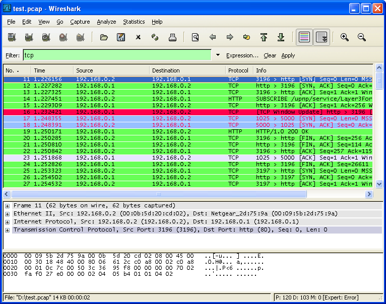
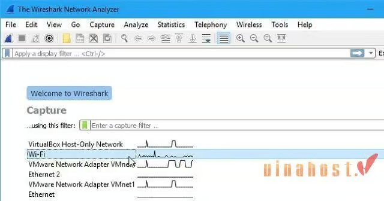
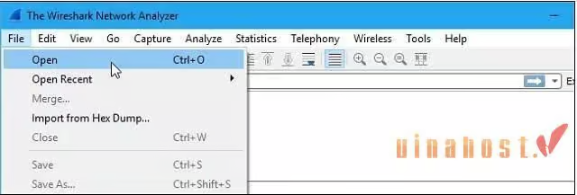
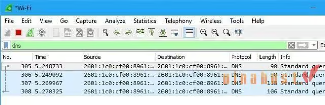
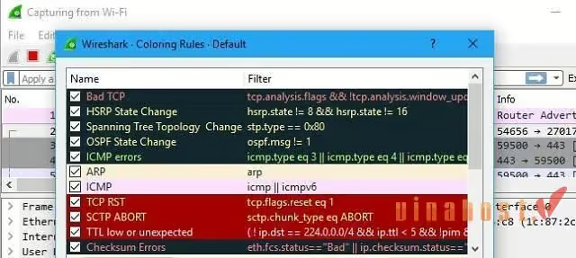
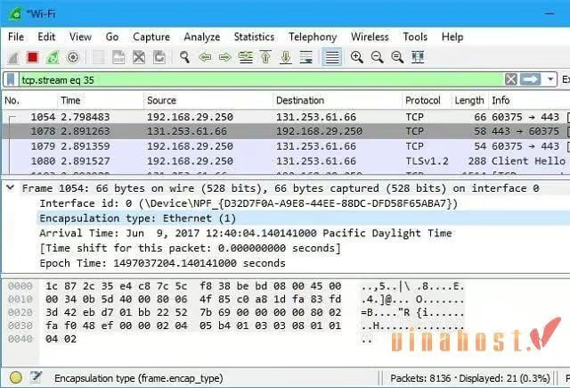

# 1. Phần mềm WireShark là gì?
Wireshark là một công cụ phân tích mạng và ghi lại giao thức mạng. Nó cho phép người dùng theo dõi và phân tích các gói tin mạng trong thời gian thực. Wireshark có khả năng xem và phân tích dữ liệu trong các giao thức mạng phổ biến như TCP, UDP, IP, HTTP và nhiều giao thức khác.

Với Wireshark, người dùng có thể xem các gói tin mạng được truyền qua mạng, xác định nguồn gốc và đích của các gói tin, kiểm tra nội dung và cấu trúc của các giao thức, và phân tích lưu lượng mạng để tìm hiểu về hiệu suất và vấn đề liên quan đến mạng.

Phần mềm này cung cấp một giao diện đồ họa dễ sử dụng, cho phép người dùng lọc và phân loại các gói tin mạng theo nhiều tiêu chí khác nhau. Nó cung cấp các tính năng mạnh mẽ như tìm kiếm, phân tích thống kê, và khả năng xuất dữ liệu phân tích để tạo báo cáo và chia sẻ thông tin với người khác.

Wireshark là một công cụ quan trọng trong việc phân tích và xử lý sự cố mạng, tìm hiểu và kiểm tra hiệu suất mạng, và nghiên cứu về các giao thức mạng.

## 2. Phần mềm WireShark dùng để làm gì?
Wireshark được sử dụng để bắt, phân tích và giám sát lưu lượng mạng trong môi trường máy tính. Dưới đây là một số ứng dụng phổ biến của Wireshark:

- **Phân tích và gỡ lỗi mạng**: Phần mềm này cho phép người dùng xem và phân tích các gói tin mạng để xác định nguyên nhân gây ra sự cố mạng, như kết nối chậm, lỗi giao thức, mất dữ liệu và các vấn đề khác. Điều này giúp kỹ thuật viên mạng tìm ra và giải quyết các vấn đề mạng một cách hiệu quả.
- **Kiểm tra bảo mật mạng**: Wireshark có khả năng phân tích và hiển thị dữ liệu trong các gói tin mạng, cho phép người dùng kiểm tra bảo mật mạng bằng cách phát hiện và theo dõi các hoạt động không mong muốn, tấn công mạng, hoặc các thông tin nhạy cảm đang được truyền qua mạng.
- **Phân tích hiệu suất mạng**: Phần mềm này cung cấp các công cụ phân tích mạnh mẽ để đo lường và đánh giá hiệu suất mạng, bao gồm độ trễ, tốc độ truyền dữ liệu, thời gian đáp ứng và các tham số khác. Điều này giúp người dùng xác định và cải thiện hiệu suất mạng để đảm bảo hoạt động mạng tối ưu.
- **Giảng dạy và nghiên cứu**: Wireshark là công cụ quan trọng trong việc giảng dạy và nghiên cứu về mạng máy tính. Nó cho phép người dùng tìm hiểu về các giao thức mạng, quá trình truyền thông, cấu trúc gói tin và các khía cạnh kỹ thuật khác liên quan đến mạng.

### 3.Phần mềm WireShark hoạt động thế nào?
Wireshark hoạt động bằng cách sử dụng một giao diện mạng để bắt và theo dõi gói tin mạng được truyền qua mạng. Khi một gói tin mạng đi qua giao diện mạng, Wireshark sẽ bắt và lưu trữ thông tin về gói tin đó để phân tích.

**Các bước hoạt động cơ bản**:

- **Bắt gói tin**: Phần mềm này cho phép bạn chọn giao diện mạng để bắt gói tin. Bạn có thể chọn giao diện Ethernet, Wi-Fi hoặc bất kỳ giao diện mạng nào khác trên hệ thống của bạn.

- **Lưu trữ và hiển thị gói tin**: Wireshark lưu trữ các gói tin mạng được bắt vào bộ nhớ và hiển thị chúng trên giao diện người dùng. Mỗi gói tin được hiển thị với các chi tiết như địa chỉ nguồn, địa chỉ đích, giao thức, thông tin dữ liệu và nhiều thông tin khác.

- **Phân tích gói tin**: Phần mềm này cung cấp các công cụ phân tích mạnh mẽ để giải thích và hiểu các gói tin mạng. Bạn có thể phân tích các trường dữ liệu trong gói tin, xác định các giao thức được sử dụng, xem thông tin về kết nối mạng và nhiều tính năng khác.

- **Lọc và tìm kiếm**: Wireshark cung cấp khả năng lọc và tìm kiếm dựa trên các tiêu chí như **địa chỉ IP**, cổng, giao thức, dữ liệu và nhiều tiêu chí khác. Điều này giúp bạn tìm kiếm và tập trung vào các gói tin quan trọng hoặc các sự kiện đặc biệt trong mạng.

- **Xuất và chia sẻ dữ liệu**: Phần mềm này cho phép bạn xuất dữ liệu phân tích thành các định dạng như CSV, XML hoặc JSON để tạo báo cáo hoặc chia sẻ thông tin với người khác.

#### 4. Các tính năng nổi bật
- **Giao diện đồ họa người dùng (GUI)**: Wireshark cung cấp giao diện người dùng thân thiện, dễ sử dụng và trực quan. Người dùng có thể dễ dàng theo dõi và phân tích lưu lượng mạng thông qua giao diện đồ họa.

- **Hỗ trợ giao thức rộng**: Phần mềm này hỗ trợ nhiều giao thức mạng phổ biến, bao gồm **Ethernet, TCP/IP, UDP, HTTP, DNS, FTP, SSL và nhiều giao thức khác**. Điều này cho phép người dùng theo dõi và phân tích các hoạt động mạng từ các giao thức khác nhau trên cùng một giao diện.

- **Khả năng lọc dữ liệu mạnh mẽ**: Wireshark cho phép người dùng áp dụng các bộ lọc để tìm kiếm và tập trung vào các gói tin quan trọng hoặc thông tin cụ thể. Điều này giúp giảm độ phức tạp và tăng hiệu quả trong quá trình phân tích.

- **Hiển thị chi tiết gói tin**: Phần mềm này hiển thị chi tiết của từng gói tin mạng, bao gồm các trường dữ liệu, giao thức, địa chỉ nguồn và đích, thời gian và nhiều thông tin khác. Điều này giúp người dùng nắm bắt được thông tin quan trọng trong quá trình phân tích.

- **Tính năng phân tích mạng mở rộng**: Công cụ này cung cấp các tính năng phân tích mạng mạnh mẽ như phân tích luồng, thống kê, biểu đồ, phân tích bảo mật và nhiều khả năng mở rộng khác. Điều này giúp người dùng có cái nhìn tổng quan về hiệu suất, bảo mật và sự hoạt động của mạng.

##### 5. Khi nào nên sử dụng phần mềm Wireshark?

Wireshark được sử dụng nhằm mục đích là giúp xác định các sự cố mạng trong gia đình có kết nối bị chậm:

- Khi một hộ gia đình gặp vấn đề về tốc độ kết nối Internet chậm, công cụ này có thể được sử dụng để phân tích lưu lượng mạng và xác định nguyên nhân gây ra vấn đề này.

- Bằng cách theo dõi và phân tích các gói tin truyền qua mạng, phần mềm này có thể giúp người dùng xác định các vấn đề như gói tin bị mất, tắc nghẽn mạng hoặc sự cạnh tranh tài nguyên mạng, từ đó tìm ra giải pháp để cải thiện tốc độ kết nối trong gia đình.

Wireshark có thể xác định các vấn đề mạng phức tạp hơn như tắc nghẽn đường truyền mạng:

- Khi một mạng lớn hoặc môi trường doanh nghiệp gặp vấn đề về tắc nghẽn đường truyền mạng hoặc hiệu suất mạng thấp, Wireshark là một công cụ hữu ích để phân tích và xác định nguyên nhân.

- Bằng cách theo dõi lưu lượng mạng chi tiết, phần mềm này cho phép người dùng xem các thông tin như tốc độ truyền dữ liệu, độ trễ, lỗi gói tin, tải trọng mạng và sự tương tác giữa các thiết bị trong mạng.

- Điều này giúp người dùng xác định các điểm tắc nghẽn, sự cạnh tranh tài nguyên hoặc sự cố trong hệ thống mạng, từ đó đưa ra các giải pháp tối ưu hóa và cải thiện hiệu suất mạng.

###### 6. Một số hạn chế của Wireshark là gì?

**Khả năng xử lý tài nguyên**: Công cụ này là một ứng dụng đòi hỏi tài nguyên cao, đặc biệt là trong việc xử lý lưu lượng mạng lớn. Việc phân tích các gói tin chi tiết có thể tốn nhiều bộ nhớ và tài nguyên CPU, đặc biệt khi đang ghi lại lưu lượng mạng trong thời gian dài hoặc khi phân tích lưu lượng mạng ở tốc độ cao. Điều này có thể gây ra sự giảm hiệu suất hoặc làm cho máy tính trở nên chậm.

**Khả năng sử dụng phức tạp**: Wireshark là một công cụ phân tích mạng mạnh mẽ, nhưng đồng thời cũng có giao diện và khả năng sử dụng phức tạp. Người dùng mới có thể gặp khó khăn khi tìm hiểu và sử dụng các tính năng của Wireshark. Cần có kiến thức và kỹ năng phân tích mạng cơ bản để tận dụng hết tiềm năng của công cụ này.

**Phụ thuộc vào kết nối mạng và quyền truy cậ**p**: Để sử dụng Wireshark và phân tích lưu lượng mạng, người dùng cần có quyền truy cập và kiểm soát đối với kết nối mạng hoặc giao diện mạng trên máy tính. Điều này có thể hạn chế sử dụng Wireshark trong môi trường công ty hoặc trên các hệ thống mạng được quản lý chặt chẽ.

**Không phân tích được mã hóa SSL/TLS**: Công cụ này không thể giải mã và phân tích thông tin trong các kết nối mạng được mã hóa bằng giao thức SSL/TLS. Điều này là do tính bảo mật của các kết nối mã hóa và hạn chế của Wireshark trong việc giải mã các thông tin này.

7. Hướng dẫn cài đặt và sử dụng Wireshark chi tiết (Wireshark tutorial)

7.1. Cách chụp các gói tin bằng ứng dụng Wireshark

- Mở ứng dụng Wireshark trên máy tính.
- Chọn một giao diện mạng để chụp gói tin từ danh sách giao diện có sẵn.

- Để dùng Wireshark bắt gói tin, bạn nhấp vào nút “Start” hoặc “Capture” để bắt đầu chụp gói tin trên giao diện đã chọn.

- Wireshark sẽ bắt đầu chụp các gói tin trên giao diện và hiển thị chúng trong cửa sổ chính.

7.2. Cách mở và lưu gói tin trên ứng dụng Wireshark

- Chọn File > Open hoặc nhấn Ctrl+O để mở một tệp tin gói tin đã được lưu trữ trước đó.

- Tìm và chọn tệp tin gói tin muốn mở.

- Gói tin sẽ được hiển thị trong cửa sổ chính của Wireshark.

7.3. Cách lọc các gói tin trên Wireshark (Wireshark Filter)

- Sử dụng thanh Filter hoặc nhấn Ctrl+F để mở cửa sổ Wireshark Filter.

- Nhập các biểu thức lọc vào ô tìm kiếm để lọc các gói tin dựa trên các tiêu chí như địa chỉ IP, giao thức, cổng, v.v.

- Nhấn Enter hoặc nhấp vào nút Apply để áp dụng bộ lọc và chỉ hiển thị các gói tin phù hợp.

7.4. Cách Color Coding trong phần mềm Wireshark

- Wireshark sử dụng color coding để tô màu các gói tin dựa trên giao thức, trạng thái và các thuộc tính khác.

- Mỗi màu đại diện cho một giao thức cụ thể hoặc loại gói tin.

- Bạn có thể xem thông tin chi tiết về màu sắc và giao thức tương ứng trong phần “Coloring Rules” hoặc “Coloring Options” của công cụ này.

7.5. Cách kiểm tra gói tin bằng Wireshark

- Xem danh sách các gói tin trong cửa sổ chính của Wireshark.
- Nhấp vào một gói tin để xem các thông tin chi tiết như địa chỉ nguồn, đích, giao thức, dữ liệu,..
- Bạn cũng có thể sử dụng các tính năng của Wireshark như Follow TCP Stream để xem nội dung truyền qua một kết nối TCP cụ thể.
