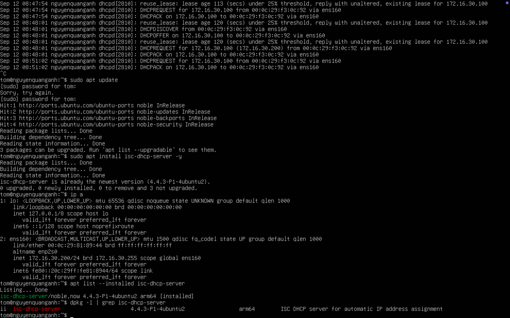
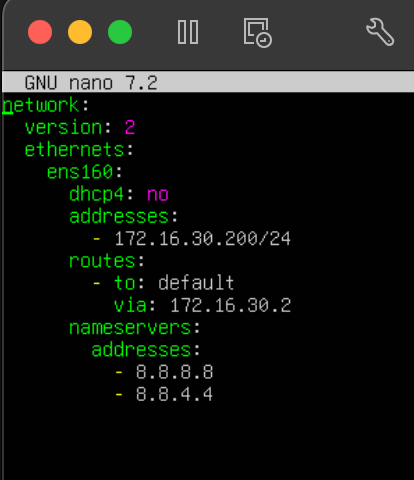
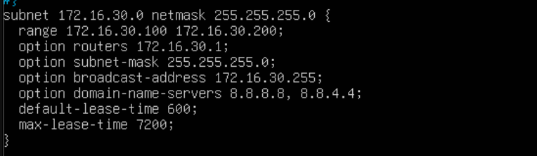
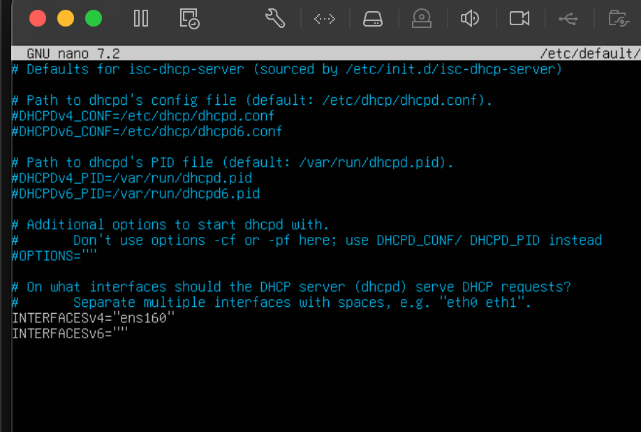
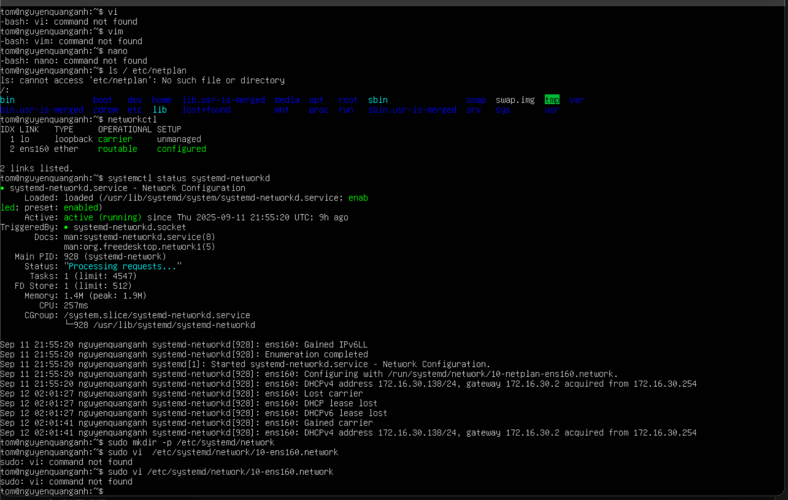
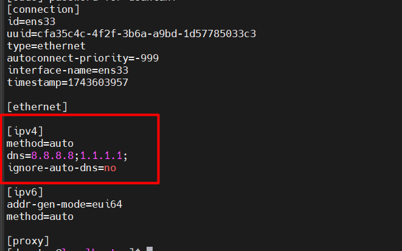
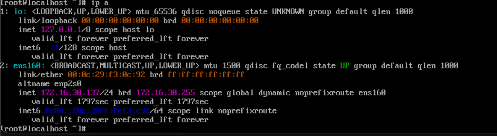

# 1.Lab DHCP

**Vai trò**

- Ubuntu: DHCP server
- CentOS: DHCP client

**Cấu hình**

Bước 1: Cài đặt DHCP Server trên Ubuntu

Cập nhật và cài gói DHCP:

     sudo apt update
     sudo apt install isc-dhcp-server -y

Kiểm tra interface mạng:

     ip a

Hoặc kiểm tra với câu lệnh:

     apt list --installed isc-dhcp-server

     hoặc

     dpkg -l | grep isc-dhcp-server

Bước 2: Đặt IP tĩnh cho ubuntu

Sửa file netplan:

     sudo nano /etc/netplan/50-cloud-init.yaml

Sửa thành:

Áp dụng:

     sudo netplan apply

Bước 3: Cấu hình DHCP Server trên ubuntu

Sửa file cấu hình /etc/dhcp/dhcpd.conf:

     sudo nano /etc/dhcp/dhcpd.conf

Thêm cấu hình sau:

 

- default-lease-time 600: Thiết lập thời gian thuê mặc định (default lease time) cho các địa chỉ IP được cấp phát bởi DHCP server là 600 giây (10 phút).
- max-lease-time 7200: Thiết lập thời gian thuê tối đa mà DHCP server sẽ cấp phát cho một client là 7200 giây (2 giờ). Khi client yêu cầu thời gian thuê dài hơn, server sẽ không cấp phát quá thời gian này.
- authoritative: Khai báo rằng DHCP server này là có thẩm quyền (authoritative) cho các subnet được cấu hình trong file này. Server sẽ phản hồi các yêu cầu DHCP ngay cả khi nó không chắc chắn về cấu hình mạng.
- subnet 172.16.30.0 netmask 255.255.255.0 { ... }:
- subnet 172.16.30.0: Xác định địa chỉ mạng của subnet là 172.16.30.0
- netmask 255.255.255.0: Xác định subnet mask cho subnet này là 255.255.255.0.
- range 172.16.30.100 172.16.30.200: Dải địa chỉ DCP có thể cấp phát.
- option routers 172.16.30.1: 172.16.30.1 là địa chỉ IP của router (cổng mặc định - default gateway) mà các client sẽ sử dụng để truy cập các mạng khác bên ngoài subnet này.
- option domain-name-servers 8.8.8.8, 8.8.4.4: Thiết lập tùy chọn domain-name-servers cho các client trong subnet. Các client sẽ sử dụng các địa chỉ IP 8.8.8.8 (máy chủ DNS của Google) và 8.8.4.4 (máy chủ DNS của Cloudflare) này để phân giải tên miền thành địa chỉ IP.

**Chỉ định interface để DHCP lắng nghe, sửa file**:

    sudo nano /etc/default/isc-dhcp-server

Tìm dòng:

      INTERFACESv4=""

Thay bằng:

     INTERFACESv4="ens160"  # Hoặc interface kiểm tra được ở bước trên
Khởi động DHCP Server:

     sudo systemctl restart isc-dhcp-server
     sudo systemctl status isc-dhcp-server

Kết quả DHCP đang chạy:

Bước 3: Cấu hình CentOS làm DHCP Client
Kiểm tra interface mạng:

     ip a

Cấu hình thường là ens33, eth0, hoặc enpXsY.

Bước 4: Cấu hình mạng trên centos dùng dhcp

Sửa file:

    sudo vi /etc/NetworkManager/system-connections/ens160.nmconnection

Khởi động lại NetworkManager để áp dụng:

     sudo systemctl restart NetworkManager

Kiểm tra IP:

     ip a

nằm trong dải địa chỉ mạng DHCP server cấp phát.

Bước 5: Kiểm tra kết nối với DHCP server

Sử dụng lệnh:

     cat /var/lib/dhcp/dhcpd.leases

- IP: 172.16.30.100 đã được cấp.
starts: Thời điểm bắt đầu lease – nghĩa là thời điểm client nhận được IP.
- ends: Thời điểm kết thúc lease – sau đó client cần gia hạn (renew) hoặc lấy IP mới.
- cltt (Client Last Transaction Time): Thời điểm cuối cùng client thực hiện giao dịch với DHCP server (giống starts nếu là lần đầu).
- binding state active: Trạng thái binding hiện tại là active → IP này đang được sử dụng.
- next binding state free: Khi lease hết hạn, trạng thái tiếp theo sẽ là free → IP này sẽ sẵn sàng để cấp phát lại.
- rewind binding state free: Khi thực hiện "rewind" (quay lui cấu hình trước khi server restart), IP này cũng sẽ trở lại trạng thái free.
- 00:0c:29:f3:0c:92: Địa chỉ MAC address của client được cấp phát IP.

