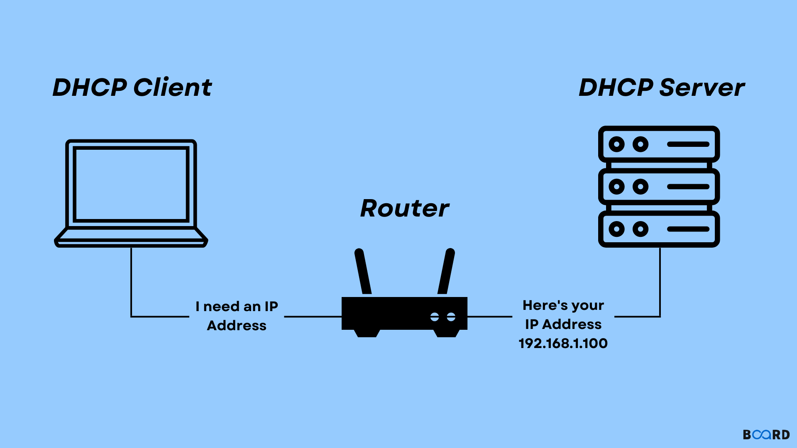
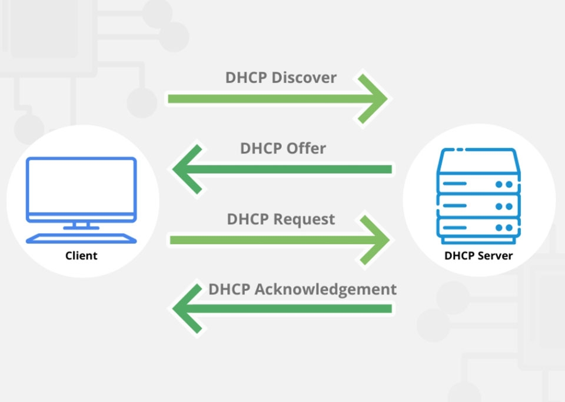

# 1. Khái niệm DHCP

DHCP (Dynamic Host Configuration Protocol) là một giao thức mạng cho phép tự động cấp phát địa chỉ IP và các thông số mạng khác (như subnet mask, default gateway, DNS server...) cho các thiết bị trong mạng một cách tự động thay vì cấu hình thủ công.Quá trình này giúp cho việc quản lý địa chỉ IP trên mạng trở nên dễ dàng và hiệu quả hơn, đồng thời giảm thiểu lỗi do cấu hình địa chỉ IP sai hoặc trùng lặp trên mạng.

DHCP là một giao thức mạng phổ biến được sử dụng trong hầu hết mạng LAN (Local Area Network) và WAN (Wide Area Network).

## 2. Chức năng chính của DHCP:
1.  Tự động cấp phát IP: Thay vì phải gán IP thủ công cho từng máy, DHCP server sẽ tự động cấp IP cho client (máy tính, điện thoại, switch, router...).
2. Quản lý tập trung: Toàn bộ địa chỉ IP được quản lý bởi DHCP server → tránh trùng lặp IP.
3. Cấp phát thông tin cấu hình mạng:
 - Địa chỉ IP
- Subnet mask
- Default gateway
- DNS server
4. Linh hoạt và dễ dàng thay đổi cấu hình: Khi có sự thay đổi về cấu trúc mạng hoặc các thông số cấu hình, chỉ cần thực hiện thay đổi trên máy chủ DHCP, các thiết bị sẽ tự động nhận cấu hình mới khi chúng kết nối lại mạng.
### 3.Các thành phần chính:
1. DHCP Server (Máy chủ DHCP)
- Là thiết bị hoặc phần mềm chịu trách nhiệm cấp phát IP động.
- Có thể chạy trên router, switch layer 3, hoặc máy chủ (Windows Server, Linux).
- Lưu trữ dải IP (IP pool), thông tin Subnet Mask, Default Gateway, DNS Server.
2. DHCP Client (Máy khách DHCP)
- Là các thiết bị cần IP: máy tính, laptop, điện thoại, camera IP, switch, router…
- Khi khởi động, client sẽ gửi yêu cầu DHCP Discover để xin IP.
3. DHCP Relay Agent (Tác nhân chuyển tiếp DHCP)
- Xuất hiện khi DHCP Server và Client không cùng subnet.
- Relay Agent (thường chạy trên router hoặc switch L3) có nhiệm vụ chuyển tiếp gói tin DHCP giữa client và server.
- Sử dụng lệnh như ip helper-address trên router Cisco để cấu hình.
4. IP Address Pool (Dải địa chỉ IP)
- Là tập hợp các IP mà DHCP server quản lý và phân phát cho client.

Có thể chia thành:
- Dynamic allocation (cấp phát động, tự do).
- Automatic allocation (gán cố định cho client khi quay lại).
- Manual allocation / Static binding (gắn cố định IP theo MAC address).

#### 4.Cách hoạt động của DHCP

 DHCP hoạt động theo cơ chế trao đổi thông tin giữa máy khách và máy chủ DHCP, trong đó máy chủ DHCP cung cấp thông tin cấu hình mạng cho những máy khách.
1. Khi một thiết bị kết nối vào mạng, nó sẽ gửi một yêu cầu DHCP thông qua gói tin broadcast đến tất cả máy chủ DHCP có sẵn trên mạng. Gói tin yêu cầu(DHCPDISCOVER) này chứa thông tin về **việc yêu cầu cấu hình mạng**, bao gồm **địa chỉ MAC (Media Access Control)** duy nhất của thiết bị để máy chủ DHCP có thể nhận diện và phân biệt thiết bị này với các thiết bị khác trên mạng.

2. Sau khi nhận được yêu cầu DHCP, máy chủ DHCP sẽ phản hồi bằng gói tin DHCP Offer, chứa **thông tin cấu hình mạng** và **một địa chỉ IP đang trống** để cấp cho thiết bị đó. Nếu có nhiều máy chủ DHCP phản hồi, thiết bị sẽ chọn một trong số những phản hồi này để sử dụng.

Gói tin này bao gồm:
- bao gồm địa chỉ IP, subnet mask (mã mạng con), gateway mặc định (cổng truy cập internet) và thời gian thuê bao (lease time) mà máy chủ DHCP đề nghị cấp phát cho thiết bị.

3. Sau khi nhận được gói tin DHCP Offer, thiết bị sẽ gửi lại yêu cầu DHCP Request để xác nhận rằng nó muốn sử dụng địa chỉ IP được cung cấp trong gói tin Offer đó.
- Gói tin DHCP Request bao gồm **địa chỉ MAC** của thiết bị và **địa chỉ IP** mà thiết bị muốn sử dụng. - Thiết bị sẽ gửi gói tin DHCP Request này sau khi nhận được gói tin DHCP Offer từ máy chủ DHCP.

VD: Sau khi nhận được gói tin DHCP Offer từ modem/router, laptop của bạn sẽ gửi gói tin DHCP Request để xác nhận rằng nó đồng ý sử dụng địa chỉ IP và các thông số cấu hình mạng được cung cấp.

4. Cuối cùng, máy chủ DHCP sẽ gửi gói tin **DHCP Acknowledge (ACK)** .Gói tin này xác nhận rằng máy chủ DHCP đã cấp phát địa chỉ IP và các thông số cấu hình mạng cho thiết bị thành công. Sau khi nhận được gói tin DHCP Acknowledge, thiết bị có thể bắt đầu sử dụng địa chỉ IP và truy cập các nguồn tài nguyên trên mạng.

- Gói tin này cũng bao gồm thời gian thuê địa chỉ IP (Lease Time) và các thông tin cấu hình mạng

 Từ đó, thiết bị có thể sử dụng **địa chỉ IP** và **những thông số cấu hình mạng** được cấp phát bởi máy chủ DHCP để truy cập vào những tài nguyên mạng khác trên cùng mạng LAN hoặc kết nối tới Internet. Quá trình này giúp cho việc cấu hình địa chỉ IP trên mạng trở nên đơn giản, hiệu quả và giúp tránh được những lỗi do cấu hình địa chỉ IP sai hoặc trùng lặp trên mạng.

##### 5.Các thuật ngữ DHCP bạn cần biết

 1. DHCP Nak:

DHCP Nak là gói tin được gửi từ máy chủ DHCP tới thiết bị mới kết nối mạng. Gói tin này thông báo cho thiết bị biết rằng yêu cầu cấp phát địa chỉ IP và các thông số cấu hình mạng của thiết bị bị từ chối. Nguyên nhân có thể là do địa chỉ IP đã được cấp phát cho thiết bị khác hoặc do máy chủ DHCP không có đủ địa chỉ IP để cấp phát.

Ví dụ: Trong trường hợp có quá nhiều thiết bị kết nối mạng cùng lúc và không còn địa chỉ IP nào khả dụng, modem/router sẽ gửi gói tin DHCP Nak tới thiết bị mới để thông báo rằng nó không thể cấp địa chỉ IP cho thiết bị này.

 

2. DHCP Decline:

DHCP Decline là gói tin được gửi từ thiết bị tới máy chủ DHCP. Mục đích của gói tin này là thông báo cho máy chủ DHCP biết rằng thiết bị không muốn sử dụng địa chỉ IP và các thông số cấu hình mạng đã được cấp phát. Gói tin DHCP Decline thường được gửi khi thiết bị được cấu hình thủ công với địa chỉ IP tĩnh hoặc khi thiết bị gặp sự cố và không thể sử dụng địa chỉ IP được cấp phát.

Ví dụ: Nếu bạn cấu hình thủ công địa chỉ IP cho laptop thay vì sử dụng DHCP, laptop sẽ gửi gói tin DHCP Decline tới modem. Chỉ khi cấu hình thủ công địa chỉ IP, máy tính xách tay sẽ gửi gói tin DHCP Decline tới modem/router để thông báo rằng nó không cần sử dụng địa chỉ IP do DHCP cấp phát.

 3. DHCP Lease

DHCP Lease là khoảng thời gian mà DHCP Server cấp phát địa chỉ IP cho một thiết bị cụ thể. Thời gian thuê này được quản lý để tối ưu hóa việc sử dụng tài nguyên địa chỉ IP trong mạng. Khi thời gian thuê sắp hết, DHCP Client có thể yêu cầu gia hạn để tiếp tục sử dụng địa chỉ IP đó. Nếu không có yêu cầu gia hạn, địa chỉ IP sẽ được giải phóng và tái sử dụng cho thiết bị khác, giúp đảm bảo việc quản lý IP hiệu quả.

4. DHCP Release:

DHCP Release là gói tin được gửi từ thiết bị tới máy chủ DHCP. Mục đích của gói tin này là thông báo cho máy chủ DHCP biết rằng thiết bị muốn trả lại địa chỉ IP và các thông số cấu hình mạng đã được cấp phát. Gói tin DHCP Release thường được gửi khi thiết bị được tắt hoặc ngắt kết nối khỏi mạng. Việc giải phóng địa chỉ IP giúp đảm bảo rằng địa chỉ IP đó có thể được sử dụng cho thiết bị khác cần kết nối mạng.

Ví dụ: Khi bạn tắt laptop, nó sẽ tự động gửi gói tin DHCP Release tới modem/router để thông báo rằng nó đã trả lại địa chỉ IP và các thông số cấu hình mạng. Nhờ vậy, địa chỉ IP này có thể được cấp phát cho thiết bị khác khi cần thiết.

 5. DHCP Binding

DHCP Binding là bản ghi lưu trữ trong DHCP Server, chứa thông tin ánh xạ giữa địa chỉ IP được cấp và địa chỉ MAC của thiết bị nhận. Đây là cơ chế giúp DHCP Server ghi lại các thông tin cấp phát, đảm bảo tính nhất quán và minh bạch trong quản lý mạng. Ngoài ra, DHCP Binding cũng hỗ trợ cấp phát địa chỉ IP cố định (Reservation) dựa trên địa chỉ MAC của thiết bị, rất hữu ích cho các thiết bị cần sử dụng một IP cụ thể, chẳng hạn như máy in hoặc máy chủ trong mạng.

###### 6.Ưu/Nhược điểm DHCP

1. Ưu điểm

- Tự động hóa việc cấp phát địa chỉ IP: DHCP giúp tự động hóa việc gán địa chỉ IP cho các thiết bị trên mạng, loại bỏ nhu cầu cấu hình thủ công cho từng thiết bị. Điều này giúp đơn giản hóa việc quản lý mạng, đặc biệt là đối với các mạng có nhiều thiết bị.
- Giảm thiểu lỗi cấu hình: Cấu hình thủ công địa chỉ IP dễ dẫn đến lỗi, gây ra các vấn đề về kết nối mạng. DHCP giúp loại bỏ nguy cơ này bằng cách tự động gán địa chỉ IP chính xác cho từng thiết bị.
- Hỗ trợ quản lý tập trung: DHCP cho phép quản trị viên mạng quản lý tập trung các thiết bị trên mạng từ một vị trí. Việc này giúp tiết kiệm thời gian và công sức cho quản trị viên, đồng thời nâng cao hiệu quả quản lý mạng.
- Khả năng mở rộng: DHCP có thể dễ dàng mở rộng để hỗ trợ thêm nhiều thiết bị trên mạng mà không cần thay đổi cấu hình thủ công.
- Tiết kiệm chi phí: Việc sử dụng DHCP giúp tiết kiệm chi phí quản lý mạng và giảm thiểu nguy cơ xảy ra sự cố mạng do lỗi cấu hình.

2. Nhược điểm

- Tùy thuộc vào máy chủ DHCP: Mạng cần có máy chủ DHCP hoạt động để cấp phát địa chỉ IP cho các thiết bị. Nếu máy chủ DHCP gặp sự cố, các thiết bị trên mạng sẽ không thể kết nối internet.
- Vấn đề bảo mật: Máy chủ DHCP có thể trở thành mục tiêu tấn công của tin tặc, dẫn đến việc giả mạo máy chủ DHCP và cấp phát địa chỉ IP sai cho các thiết bị. Do vậy, cần có các biện pháp bảo mật phù hợp để bảo vệ máy chủ DHCP.
- Khả năng kiểm soát hạn chế: Việc sử dụng DHCP có thể hạn chế khả năng kiểm soát địa chỉ IP của người dùng. Quản trị viên mạng có thể gặp khó khăn trong việc gán địa chỉ IP tĩnh cho các thiết bị cụ thể.
- Không tương thích với các thiết bị cũ: Một số thiết bị đời cũ sẽ không tương thích với DHCP và cần được cấu hình thủ công để kết nối mạng.