# 1.Linux là gì?
- Linux là một hệ điều hành mã nguồn mở dựa trên nhân (kernel) Linux. Nó cung cấp môi trường hoạt động cho phần mềm và phần cứng, tương tự như Windows hoặc macOS, nhưng có tính linh hoạt và bảo mật cao hơn.

- Một cách chính xác, thuật ngữ Linux được sử dụng để chỉ Nhân Linux, nhưng tên này được sử dụng một cách rộng rãi để miêu tả tổng thể một hệ điều hành 

## 2. Cấu trúc hệ điều hành Linux

2.1. Kiến trúc tổng quan hệ thống Linux

- Kiến trúc của HĐH Linux chia làm 3 thành phần: **Kernel,
Shell, Applications**

- Kernel (nhân): Đây là phần quan trọng và được ví như
trái tim của HĐH, Phần kernel chứa các module, thư viện
để quản lý và giao tiếp với phần cứng và các ứng dụng.
Kernel trên Centos 7 có version 3.10.0.

- Shell: Shell là một chương trình. Có chức năng thực thi
các lệnh (command) từ người dùng hoặc từ các ứng dụng –
tiện ích yêu cầu chuyển đến cho Kernel xử lý. Bên cạnh
đó, shell còn có khả năng bảo vệ kernel từ các yêu cầu
không hợp lệ

- Applications (Ứng dụng): là các phần mềm được người dùng sử dụng để thực hiện tác vụ của mình. Hầu hết các bản phân phối Linux đều cung cấp cửa hàng ứng dụng (giống Appstore) để tìm kiếm và cài đặt ứng dụng dễ dàng.

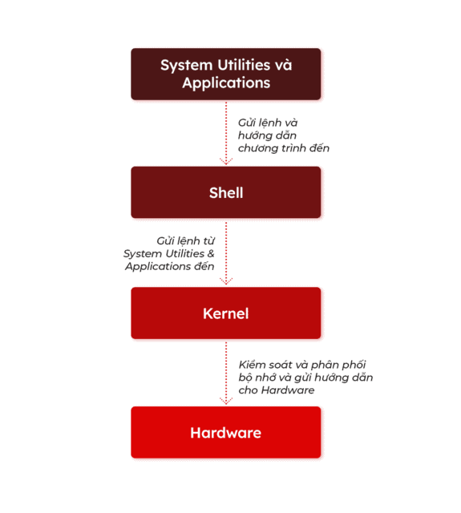

2.2. Cấu trúc hệ thống File

- Cấu trúc hệ thống file trên Centos được bố trí theo dạng hình
cây (tree) như sau:

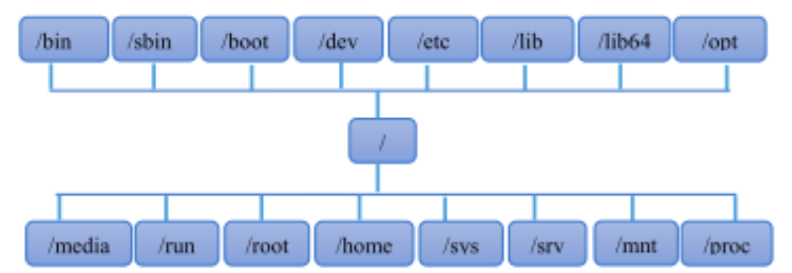

- Bắt đầu là thư mục gốc “/”, sau đó là các thư mục con (hay
còn gọi là nhánh): /bin, /sbin, /home, /mnt …

- Mỗi thư mục con của thư mục gốc có các chức năng khác
nhau.

👉 Tư tưởng chính: Linux không có ổ C, D như Windows, tất cả đều nằm trong cây thư mục duy nhất.

### 3. Ưu điểm và hạn chế của Linux

Ưu điểm:

- Miễn phí, mã nguồn mở
- Bảo mật cao, ít virus
- Ổn định, ít bị crash → phù hợp cho server
- Hỗ trợ đa người dùng, đa nhiệm
- Nhiều bản phân phối (distro) cho nhu cầu khác nhau

Hạn chế:

- Khó dùng hơn với người mới
- Một số phần mềm chỉ có trên Windows/macOS
- Cần kiến thức dòng lệnh để khai thác tối đa

#### 4. Linux command là gì?
command-linux

- Linux có được tiếng là hệ điều hành dành cho các tín đồ máy tính và điều này đạt được chủ yếu là nhờ vào sự phổ biến của giao diện dòng lệnh (terminal). Đây là một hộp đen với chữ xanh truyền thống để ta có thể sử dụng các lệnh thực thi. Nói cách khác, nó giống như Command Prompt của Windows.

- Nếu muốn chuyển sang dùng Linux thì bạn phải học các cấu trúc lệnh vì sẽ phải sử dụng chúng thường xuyên. Giao diện đồ họa dễ sử dụng nhưng chắc chắn không mạnh mẽ và hiệu quả bằng giao diện dòng lệnh.

##### 5. Tài khoản và quyền user

**Linux có 3 loại user: Regular, Administrator (Root), Service**. Trong đó:

- **Regular**: Là tài khoản user thông thường được tạo khi cài đặt Ubuntu trên máy tính. Tất cả các file, thư mục được lưu trữ trong /home/ là thư mục chính của tài khoản này. User này không có quyền truy cập vào thưc mục của những user khác.

- **Root**: Tài khoản này được tạo ra tại thời điểm cài đặt Linux. Root là một superuser, có thể truy cập vào những file bị giới hạn quyền, cài đặt phần mềm và có quyền quản trị. Bất cứ khi nào bạn muốn cài đặt phần mềm, thay đổi file hệ thống hoặc thực hiện các tác vụ cần quyền quản trị khác trên Linux thì phải đăng nhập bằng tài khoản Root. Những hoạt động như nghe nhạc, duyệt web thì có thể sử dụng tài khoản bình thường cũng được.

- **Service**: Hẳn bạn cũng biết Linux là bá chủ trong hệ điều hành máy chủ. Các dịch vụ như Apache, Squid, email,... đều có những tài khoản dịch vụ cá nhân riêng. Những tài khoản này giúp tăng tính bảo mật cho máy tính. Linux cũng cho phép hoặc từ chối truy cập vào những nguồn lực khác nhau tùy thuộc vào dịch vụ.

Ghi chú: Bạn sẽ không thấy các tài khoản Service trên phiên bản Ubuntu Desktop.

# II. Distro Linux

## 1. Distro Linux là gì?

Linux distro – hay bản phân phối Linux là giLinux distro là các hệ điều hành được phát triển dựa trên nhân Linux. Nó có vai trò đóng gói nhân Linux cùng với các phần mềm và tiện ích cần thiết, tạo thành một hệ điều hành hoàn chỉnh mà mà người dùng có thể cài đặt và khởi chạy. 

👉 Nói dễ hiểu: Linux distro = Linux kernel + phần mềm bổ sung + công cụ quản lý → thành một hệ điều hành hoàn chỉnh mà bạn có thể cài đặt và sử dụng.

Ví dụ: Ubuntu, Debian, CentOS, Fedora, Arch Linux, Kali Linux…

## 2. Bên trong 1 Distro Linux

Ngoài nhân Linux, một Linux distro có thể bao gồm các thành phần như: trình quản lý gói, trình cài đặt, các công cụ GNU, môi trường desktop, các tiện ích và ứng dụng,…

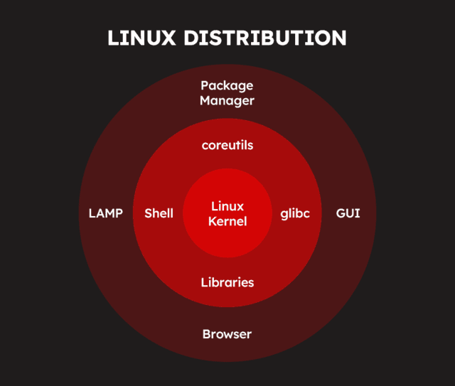

Linux là từ chỉ phần hạt nhân, còn Linux distro mới thực sự là một hệ điều hành. Tên gọi đúng hơn của các Linux distro là “hệ điều hành dựa trên Linux”.

Lớp lõi (Core) – Trung tâm của hệ thống:

- Kernel: nhân hệ điều hành, quản lý tài nguyên hệ thống và giao tiếp với phần cứng.
Lớp hệ thống (System Layer) – Cung cấp công cụ cơ bản:

- Shell: Giao diện dòng lệnh (CLI) giúp người dùng giao tiếp với hệ thống.
- glibc (GNU C Library): Thư viện C tiêu chuẩn mà hầu hết các chương trình trong Linux sử dụng.
- Libraries: Các thư viện phần mềm mà ứng dụng cần để chạy.
- coreutils: Bộ công cụ dòng lệnh cơ bản (ls, cat, cp, mv, rm, etc.).

Lớp ứng dụng và quản lý phần mềm:

- Package Manager: Hệ thống quản lý gói phần mềm, giúp cài đặt và cập nhật ứng dụng (ví dụ: apt, dnf, pacman).
- LAMP (Linux, Apache, MySQL, PHP/Python/Perl): Bộ công cụ cho máy chủ web.
- GUI (Graphical User Interface): Giao diện đồ họa, giúp người dùng thao tác dễ dàng hơn (Gnome, KDE, XFCE…).
- Browser: Trình duyệt web được cài sẵn trong nhiều bản phân phối.

### 3. Phân loại Disco Linux

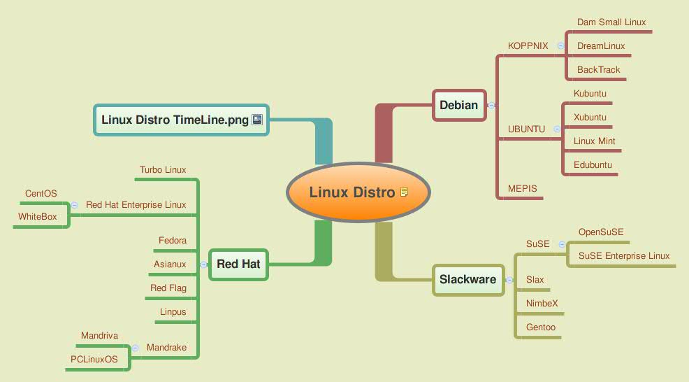

- Dành cho cá nhân: Một số bản distro nổi bật gồm Linux Mint, Arch Linux, Fedora, Ubuntu, CentOS, và openSUSE.

- Dành cho máy chủ: Ubuntu Server, CentOS, Red Hat Enterprise Linux và SUSE Enterprise Linux.

- Điểm giống nhau là về cơ bản, chúng đều dựa trên 3 nhánh chính, đó là Debian, Red Hat, Slackware. Đồng thời, tất cả các bản Distrolinux đều có Kernel và Linux.

- Còn khác nhau thì chủ yếu dựa vào 2 yếu tố chính: thị trường distro Linux là gì và triết lý phần mềm của chúng.

## 3.1. Xét về thị trường:

Các distro Linux phổ biến và phát triển hiện nay được chia thành 4 nhóm:

## Nhóm 1: Arch, Gentoo và Slackware
Các các bản distrolinux này nhắm vào người dùng am hiểu Linux. Do đó, phần lớn các phương thức xây dựng, cũng như cấu hình của hệ thống được thực hiện qua dòng lệnh.

Đặc điểm nổi bật:
Hệ thống gọn nhẹ và linh hoạt.
Người dùng có thể tùy chỉnh hoàn toàn theo nhu cầu cá nhân.
Tiêu biểu: Gentoo, Arch Linux, và Slackware.

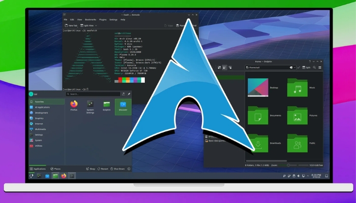

### Nhóm 2: Debian, Redhat
Nhóm này hướng đến người dùng có kiến thức nhất định về hệ thống nhưng vẫn cung cấp nhiều công cụ hỗ trợ. Từ đó giúp những người chưa hoàn toàn thành thạo Linux có thể làm quen và sử dụng dễ dàng hơn.

Đặc điểm nổi bật:
- Thân thiện hơn với người dùng mới so với nhóm dành cho chuyên gia.
- Quy trình phát triển và kiểm tra chất lượng gói phần mềm rất nghiêm ngặt.
- Cần thời gian đóng góp dài hạn và sự chứng nhận từ cộng đồng lập trình viên. Rồi sau đó mới có thể trở thành lập trình viên chính thức của các bản phân phối như Debian hoặc Fedora.

Lợi ích: Đây là môi trường lý tưởng để lập trình và nghiên cứu nhờ tính ổn định và chất lượng cao của các gói phần mềm.

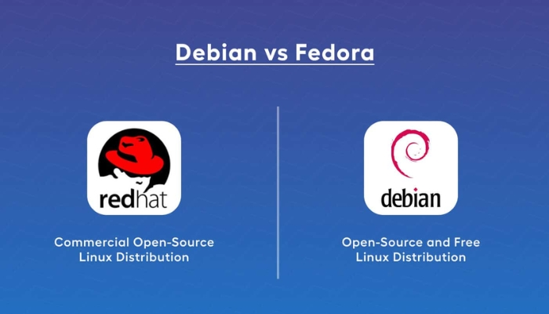

Tuy nhiên, các distro của nhóm 2 lại có quy trình phát triển và kiểm tra chất lượng phần mềm khắt khe hơn các nhóm còn lại. Do đó, để trở thành lập trình viên chính thức của nhóm này, bạn buộc phải có thời gian đóng góp dài. Đồng thời, được chứng nhận chất lượng bởi những lập trình viên khác. Vì thế, giới công nghệ luôn đánh giá cao môi trường của nhóm Debian, Fedora.

## Nhóm 3: Centos, RHEL, SUSE EL
Các bản distrolinux nhắm vào thị trường máy chủ, doanh nghiệp, cơ quan… Vì chúng có sự ổn định cao, thời gian ra phiên bản mới lâu, khoảng 3 – 5 năm tùy distrolinux. Ngoài ra, còn có dịch vụ hỗ trợ thương mại cho công ty, hướng dẫn sử dụng sản phẩm.

Đặc điểm chính:
Chu kỳ phát hành phiên bản mới dài (thường từ 3 đến 5 năm, tùy thuộc vào từng bản phân phối).
Ưu tiên các công nghệ cũ đã được kiểm chứng thay vì áp dụng ngay các công nghệ mới nhất.
Lợi ích: Mang lại sự ổn định và an toàn, phù hợp cho môi trường làm việc cần sự tin cậy cao.
Tiêu biểu: RHEL, SUSE Enterprise Linux, CentOS.

## Nhóm 4: Ubuntu, Open SUSE, Linux Mint

Đối tượng khách hàng của nhóm 4 là người mới bắt đầu dùng Linux và người dùng cuối. Đặc tính của chúng là phát triển trong thời gian ngắn, ứng dụng các công nghệ mới liên tục, nhiều công cụ đồ họa để thiết kế và cấu hình hệ thống theo nhu cầu sử dụng. Nhóm này cũng rất thân thiện với người dùng mới làm quen Linux.

Đặc điểm nổi bật:
Chu kỳ phát hành nhanh, thường xuyên cập nhật các công nghệ hiện đại.
Tích hợp nhiều công cụ đồ họa hỗ trợ cấu hình hệ thống.
Giao diện thân thiện, dễ sử dụng ngay cả khi không cần đọc tài liệu hướng dẫn.
Ví dụ tiêu biểu: OpenSUSE, Linux Mint, Ubuntu.

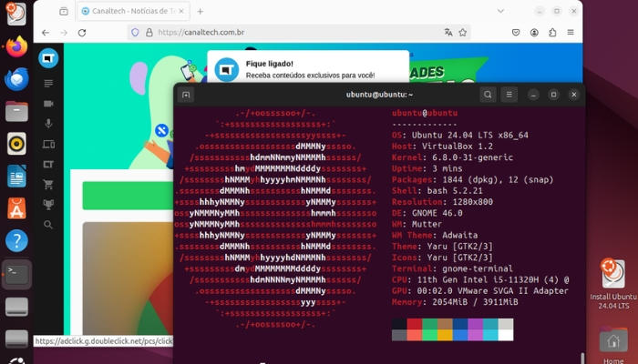

## 3.2. Xét về triết lý phần mềm (Distro Philosophy)

Triết lý phần mềm là những nguyên tắc, hay định hướng, mục tiêu của người phát triển chúng đặt ra. Vì thế, khi xét về yếu tố này thì distro cũng được phân thành 4 nhóm.

Nhóm 1: nhóm này có cấu trúc gọn, linh hoạt để các lập trình viên có thể xây dựng theo nhu cầu của mình.

Nhóm 2: nhóm này nhắm đến sự chuẩn hóa quá trình phát triển phần mềm, nhằm tạo ra hệ thống hoạt động nhịp nhàng và hạn chế tối đa lỗ hỏng bảo mật.

Nhóm 3: phát triển theo hướng bền vững, chuyên nghiệp, phù hợp cho việc cung cấp dịch vụ/sản phẩm dài hạn, có vòng đời lên tới 7 năm.

Nhóm 4: đi theo hướng công nghệ. Nhóm này có nhiều công cụ hiệu ứng đồ họa và không cần cấu hình nhiều.

Như vậy, dù xét về thị trường hay triết lý phần mềm thì cũng đều có 4 nhóm distro để bạn quyết định nên dùng distro Linux nào phù hợp nhất với nhu cầu của mình.

# 4. Giấy phép nguồn mở

Giấy phép Công cộng GNU (tiếng Anh: GNU General Public License, viết tắt GNU GPL hay chỉ GPL) là giấy phép phần mềm tự do được sử dụng rộng rãi, đảm bảo cho người dùng cuối tự do chạy, nghiên cứu, sửa đổi và chia sẻ phần mềm. GPL là giấy phép copyleft, có nghĩa là tác phẩm phát sinh chỉ có thể được phân phối theo các điều khoản cấp phép tương tự. Đây là sự phân biệt đối với giấy phép phần mềm tự do cho phép, trong đó giấy phép BSD và Giấy phép MIT được sử dụng rộng rãi là ví dụ. GPL là giấy phép copyleft đầu tiên để sử dụng chung.

Phần mềm GPL phải là phần mềm tự do.

Tức là người sử dụng có 4 quyền sau với phần mềm GPL:

- Tự do chạy chương trình, cho bất cứ mục đích nào.

- Tự do tìm hiểu cách hoạt động của chương trình, và tự do sửa đổi nó. (Quyền truy cập mã nguồn là điều kiện tiên quyết cho quyền tự do này.)

- Tự do tái phân phối bản sao.

- Tự do cải tiến chương trình, và phát hành những gì cải tiến ra công cộng. (Quyền truy cập mã nguồn là điều kiện tiên quyết cho quyền tự do này.)

- So sánh với thoả thuận giấy phép người dùng cuối của phần mềm thương mại thường không cho người dùng cuối quyền nào trừ quyền sử dụng phần mềm và luôn hạn chế kỹ thuật phân tích ngược (reverse engineering).

## **Những licenses phổ biến**

1. Apache License 2.0
2. BSD 3-Clause “New” or “Revised” license
3. BSD 2-Clause “Simplified” or “FreeBSD” license
4. GNU General Public License (GPL)
5. GNU Library or “Lesser” General Public License (LGPL)
6. MIT license
7. Mozilla Public License 2.0
8. Sun Industry Standards Source License

## **Tóm lại**:

- GPL: Một khi sử dụng và phân phối, bắt buộc phải sử dụng giấy phép GPL, không được phép đóng mã nguồn và thay đổi giấy phép.

- LGPL: là giấy phép tự do “ít ràng buộc” hơn, là giấy phép sửa đổi của GPL, được sử dụng cho một số thư viện phần mềm (các thư viện dùng ngôn ngữ C thường áp dụng giấy phép này)

- MPL: MPL dung hoà giữa BSD và GPL. MPL cho phép dùng MPL software để tạo ra một sản phẩm khác (thương mại hoặc không), tuy nhiên nếu thay đổi MPL software thì phải được đưa miễn phí lên Internet.

- Apache: được phép đóng mã nguồn, thương mại hoá và giữ bản quyền sản phẩm

- BSD: là giấy phép tự do “ít ràng buộc” hơn, các giấy phép kiểu BSD để những sản phẩm phái sinh được tái phân phối như phần mềm thương mại.

## **Khi sửa đổi phải đưa mã nguồn ra thành mã nguồn mở?**

- BSD: Không cần

- GPL, LGPL, MPL: Yêu cầu

## Khi sử dụng có phải đưa mã nguồn ra thành mã nguồn mở?

-  BSD, LGPL, MPL: Không

- GPL: Có

# 5.User, group trong Linux

Trên linux có hai loại tài khoản user đó là: tài khoản user hệ thống và tài khoản user người dùng.

- User hệ thống: dùng để thực thi các module, script cần thiết
phục vụ cho HĐH.
- User người dùng: là những tài khoản để login để sử dụng
HĐH. Trong các tài khoản user thì tài khoản user root
(superuser) là tài khoản quan trọng nhất. Tài khoản này được
tự động tạo ra khi cài đặt linux. Tài khoản này không thể đổi
tên hoặc xóa bỏ. User root còn được gọi là superuser vì có
toàn quyền trên hệ thống. Chỉ làm việc với tài khoản user root
khi muốn thực hiện công tác quản trị hệ thống, trong các
trường hợp khác chỉ nên làm việc với tài khoản user bình
thường.

Mỗi user có các đặc điểm sau:

- Tên mỗi user là duy nhất, chỉ có thể đặt tên chữ thường,
chữ hoa.
- Mỗi user có một mã định danh duy nhất (uid).
- Mỗi user có thể thuộc về nhiều nhóm.
- Tài khoản superuser có uid = gid = 0.

## . File /etc/passwd
- Là file văn bản chứa thông tin về các tài khoản user trên máy. Mọi user đều có thể đọc tập tin này nhưng chỉ có
root mới có quyền thay đổi.
- Để xem nội dung của file ta dùng lệnh:

      #cat /etc/passwd

- Cấu trúc của file gồm nhiều hàng, mỗi hàng là thông tin của 1 user. Dòng đầu tiên của tập tin mô tả thông tin cho user root (có ID = 0), tiếp theo là các tài khoản khác của hệ thống, cuối cùng là các tài khoản người dùng thường. Mỗi hàng được chia làm 7 cột cách nhau bằng
dấu “:”.

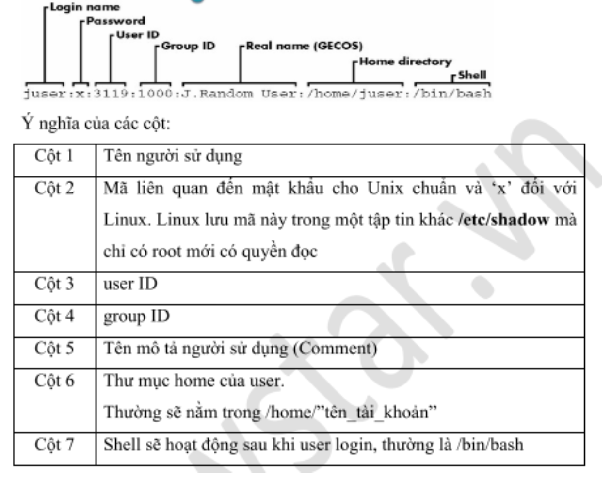

## . File /etc/shawdown
- Là tập tin văn bản chứa thông tin về mật khẩu của các
tài khoản user trên máy. Chỉ có root mới có quyền đọc
tập tin này. User root có quyền reset mật khẩu của bất
kỳ user nào trên máy.
- Mỗi dòng trong tập tin chứa thông tin về mật khẩu của
user, định dạng của dòng gồm nhiều cột giá trị, dấu “:”
được sử dụng để phân cách các cột.

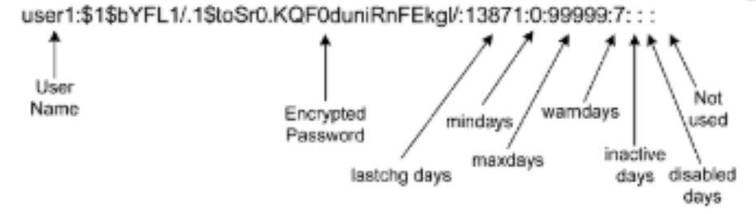

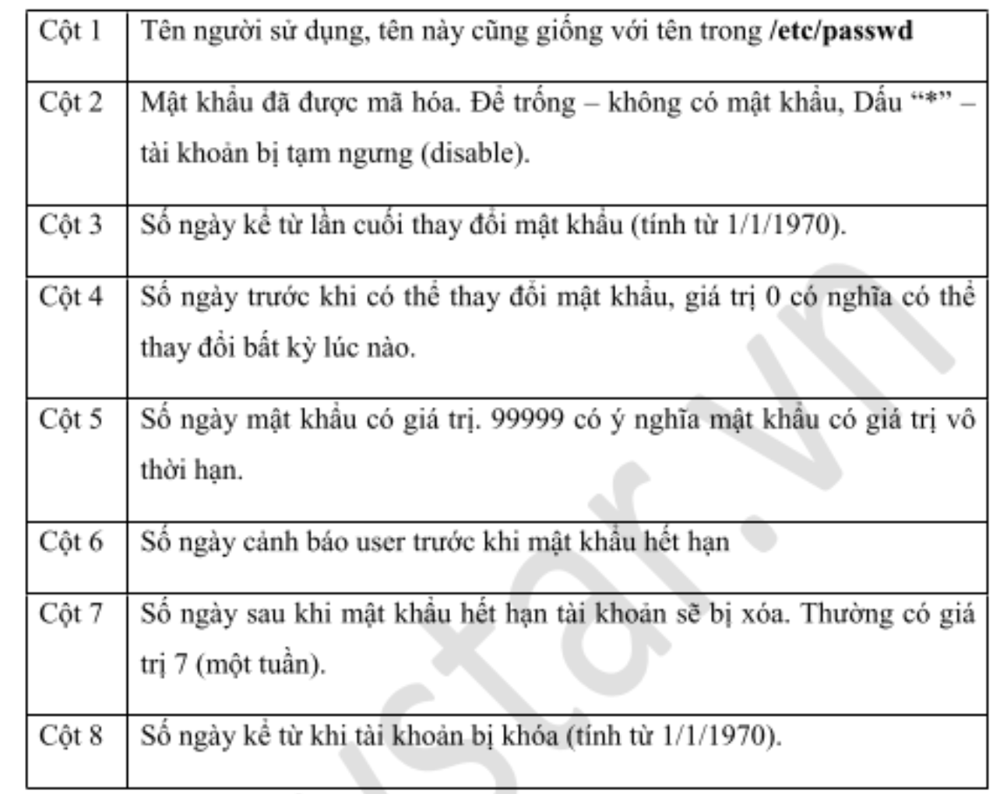

## . Các lệnh quản lý User
### Tạo, sửa, xóa user
- Lệnh useradd: Tạo tài khoản user.
Cấu trúc lệnh:

      useradd [Options] login_name

- Options:

-m : đồng thời tạo thư mục ở home

-d : tên thư mục tạo ở home

-c : thêm mô tả về thư mục đó

- Lệnh usermod: Sửa thông tin tài khoản.

- options

-G: Thêm user vào group

-c : thay đổi thông tin người dùng

-e : thiết lập ngày hết hạn cho người dùng

-L : Khóa tài khoản

-U : mở khóa tài khoản

-s : thay đổi shell script cho user

Cấu trúc lệnh:

     usermod [Options] login_name

- Lệnh userdel: Xóa tài khoản user

Cấu trúc lệnh:

     userdel [Options] login_name

- Options:

-m : dùng để xóa user

-r : xóa user đồng thời xóa cả file mà user đó tạo ra

- Lệnh chage: Dùng để thiết lập các chính sách (policy) cho
user.

Cấu trúc lệnh:

     chage [options] login_name

Ta có thể tạo hoặc thay đổi password cho user bằng lệnh “passwd”. Chỉ có quyền root mới có thể thực hiện việc này.

     passwd [user-name]

### Chuyển đổi user
Khi ta muốn chuyển từ user này sang user khác ta có thể sử dụng lệnh “su” hoặc “sudo su”

      sudo su [user-name]

## Quản trị Group

- Group là một nhóm tập hợp các user.
- Mỗi group có 1 tên duy nhất và 1 mã định danh duy nhất (gid).
- Khi tạo ra 1 user ( không dùng option -g ) thì mặc định 1 group mang tên user được tạo ra.

### . File /etc/group:
Là tập tin văn bản chứa thông tin về nhóm user trên máy.
Mọi user đều có thể đọc tập tin này nhưng chỉ có root mới
có quyền thay đổi.

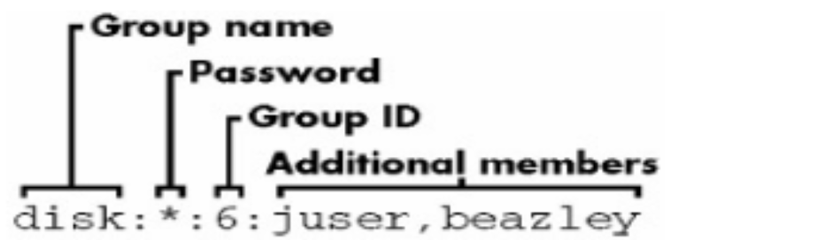

Mỗi dòng trong tập tin chứa thông tin về các nhóm user
trên máy, định dạng của dòng gồm nhiều cột giá trị, dấu
“:” được sử dụng để phân cách các cột.
Ý nghĩa các cột giá trị như sau:

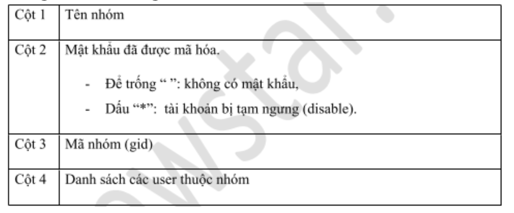

### . Các lệnh quản lý group
- Lệnh groupadd: Tạo nhóm

Cấu trúc lệnh:

     groupadd  [group_name]

Để tạo mật khẩu cho group ta sử dụng lệnh “gpasswd”.

     gpasswd [group_name]

- Lệnh groupmod: Sửa thông tin nhóm

Cấu trúc lệnh:

     groupmod [options] [group_name]

- Options

-g [gid] : sửa lại mã nhóm ( gid )

-n [group_name] : sửa lại tên group

- Lệnh groupdel: dùng để xóa nhóm

Cấu trúc lệnh:

      groupdel [group_name]

# 6 . Các quyền quản lý trong linux
Trên thực tế mọi tập tin sẽ đều có chủ sở hữu, nó sẽ bao gồm user và group sở hữu tập tin đó.
Ta có thể sử dụng lệnh “ls -lh” để xem.

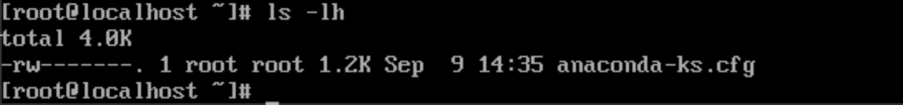

##  Các quyền của file

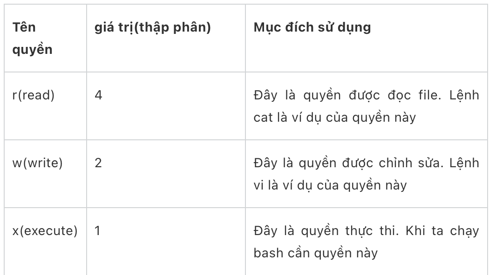

## Các lệnh thay đổi quyền của file

- Ta nhận thấy rằng mỗi file sẽ quy định quyền cho 3 chủ thể là: user, group và other (user khác) được sắp xếp theo đúng thứ tự trên.

Ví dụ: file ssh_config thì chủ sở hữu file có quyền đọc và sửa, đối với group và other chỉ có quyền đọc.

Để thay đổi chủ sở hữu file ta dùng lệnh “chown”

     chown [tên user mới] [tên file]

Để thay đổi group mới của file ta có dùng lệnh “chgrp”

     chgrp [tên group mới] [tên file]

Để có thể thay đổi các quyền của file ta có thể sử dụng lệnh “chmod”

     chmod [u/g/o][+/-][r/w/x] [tên file]

# 7. Một số lưu ý cần nhớ
- Chỉ có quyền root mới có thể thực hiện câu lệnh “su”, còn các user khác muốn thực lệnh “su” thì đều cần quyền sudo.
- Sự khác biệt giữa “su” và “su -”
- Lệnh “su” sẽ giúp chúng ta chuyển đổi user mà vẫn giữ nguyên vị trí đang đứng trước đó.
Lệnh “su -” sẽ giúp chúng ta chuyển đổi user và đưa luôn chúng ta đến vị trí thư mục “/home/” của user đó.
- Theo mặc định khi tạo ra các user thì nó sẽ không có quyền sudo nếu muốn user có quyền sudo thì phải thêm user đó vào group “wheel” đối với CentOS và group “sudo” đối với Ubuntu. Chỉ có quyền root mới có thể thực hiện điều này.

https://suncloud.vn/quan-ly-nguoi-dung-user-va-nhom-group-trong-linux

https://github.com/nhanhoadocs/thuctapsinh/blob/master/HaiDD/Linux/LinuxOverview.md