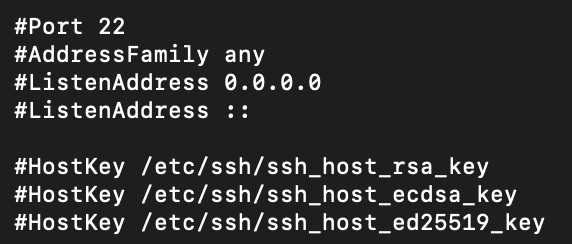
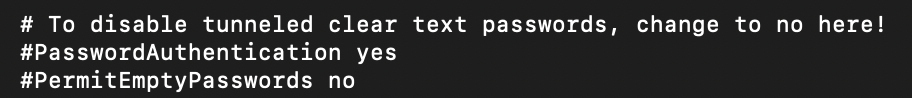
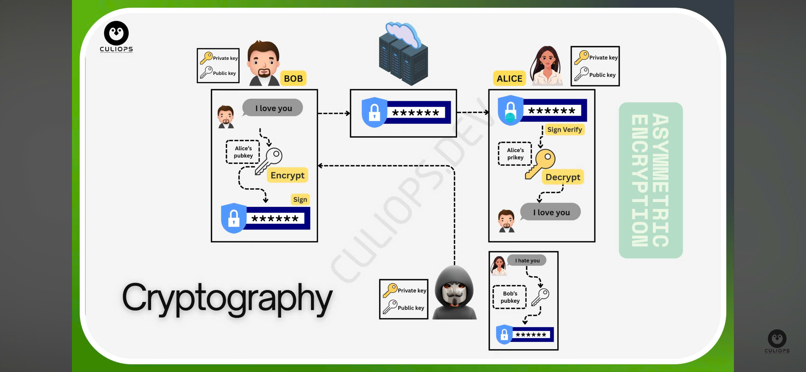
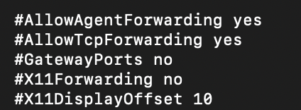
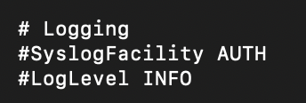

# 1. Khởi tạo phiên SSH

Nếu đang sử dụng Linux hoặc Mac OS , kết nối SSH khá đơn giản bằng cách sử dụng Terminal . Nếu sử dụng Windows , cần thêm 1 chương trình khác để mở kết nối SSH . Trình kết nối SSH được sử dụng phổ biến nhất cho Windows là PuTTY .

Với Mac OS và Linux , mở Terminal và gõ lệnh theo cấu trúc sau :

     ssh user@[host/IP]

Trong đó :

- user : user local trên máy cần ssh
- host/IP : hostname ( VD : ``www.xyzdomain.com`` ) hoặc IP của máy cần kết nối SSH ( VD : ``244.235.23.19`` )

Sau khi thực hiện lệnh , máy đầu xa sẽ yêu cầu password của user sử dụng SSH .

# Thông số cấu hình SSH

Các file cấu hình ssh cần lưu ý:

- ``/etc/ssh/sshd_config`` : file cấu hình SSH Server
- ``/etc/ssh/ssh_config`` : file cấu hình SHS Client
- ``~/.ssh/`` : thư mục chứa nội dung cấu hình SSH của user client trên Linux
- ``/etc/nologin`` : Nếu file này tồn tại, thì dịch vụ SSH Server trên Linux sẽ từ chối đăng nhập từ các user khác trên hệ thống trừ user root. File này thường dùng cho trường hợp khẩn cấp cần cách ly hệ thống sớm

# Cấu hình SSH Server (``/etc/ssh/sshd_config``)

File này kiểm soát máy chủ SSH hoạt động. Mở file bằng lệnh:

     sudo vi /etc/ssh/sshd_config

## 1. Port - ListenAddress - Hostkey

- Mặc định, SSh chạy trên cổng 22.
- Chỉ định IP mà SSH server lắng nghe. Mặc định sử dụng 0.0.0.0 (IPv4) hoặc :: (IPv6) để lắng nghe trên tất cả các giao diện mạng.
- Chỉ định đường dẫn đến các tệp chứa khóa riêng tư của máy chủ. Máy chủ thường có nhiều loại khóa (RSA, ECDSA, EdDSA). Nên có ít nhất một khóa được tạo. Các tệp này thường nằm trong thư mục ``/etc/ssh/``.

## 2. Xác thực (Authentication)

Cho phép đăng nhập bằng mật khẩu:

- Mặc định là yes, SSH cho phép đăng nhập bằng mật khẩu:

Tắt đăng nhập bằng mật khẩu, chỉ cho phép dùng SSH Key (xóa dấu # đầu dòng để bỏ comment):

     PasswordAuthentication no

Cho phép xác thực bằng SSH Key:

- Thư mục chứa danh sách khóa công khai của user: ``.ssh/authorized_keys``.

## 3. Chỉ cho phép user cụ thể đăng nhập

- Giới hạn user có thể SSH, thêm các dòng sau vào file:

      AllowUsers user1 user2 

- Hoặc chặn một số user:

      DenyUsers user3 user4

## 4. Giới hạn số lần đăng nhập sai

     # Chỉ cho phép nhập sai mật khẩu 6 lần
     MaxAuthTries 6

     # Số phiên tối đa
     MaxSessions 10

     # Kiểm soát số lượng SSH chưa xác thực
     MaxStartups 10:30:100

- MaxStartups <bắt đầu từ số X>:<tỷ lệ từ chối Y>:<giới hạn tối đa Z>: ``10:30:100``
  - 10: Cho phép tối đa 10 kết nối SSH chưa xác thực cùng lúc mà không bị hạn chế.
  - 30: Nếu vượt quá 10 kết nối, từ kết nối thứ 11 trở đi, máy chủ sẽ từ chối dần với tỷ lệ 30%.
  - 100: Khi số lượng kết nối chưa xác thực đạt 100, máy chủ sẽ từ chối hoàn toàn các kết nối mới.
- Nếu muốn đặt giới hạn đơn giản (không theo tỷ lệ), chỉ cần:

     MaxStartups 10

## 5. Chuyển tiếp kết nối (Forwarding)

- ``AllowTcpForwarding yes:`` Cho phép chuyển tiếp cổng (Port Forwarding) để tạo SSH Tunnel.
- ``X11Forwarding yes``: Cho phép X11 Forwarding (Chayj ứng dụng GUI qua SSH).

## 6. Nhật ký giám sát

Ghi log SSH vào ``/var/log/auth.log``:

- ``SyslogFacility AUTH``: Cho biết AUTH là facility được định nghĩa trong syslog, thường được sử dụng cho các thông điệp liên quan đến bảo mật và ủy quyền (authorization).
- ``LogLevel INFO``:INFO là mức độ chi tiết của thông điệp nhật ký và SSH server ghi lại. Các thông tin cơ bản sẽ được lưu.

# Cấu hình SSH Client (~/.ssh/config)

File này giúp cấu hình SSH Client trên máy khách để kết nối nhanh hơn.

## 1. Host

Chức năng: Định nghĩa một khối cấu hình riêng biệt cho một hoặc nhiều máy chủ. Điều này cho phép bạn thiết lập các tùy chọn khác nhau cho từng máy chủ thường xuyên kết nối đến.

Ví dụ: nếu thường xuyên SSH vào 192.168.1.100 với user ubuntu và cổng 2222, thay vì gõ lệnh dài:

     ssh -p 2222 ubuntu@192.168.1.100

Có thể cấu hình như sau:

     Host myserver
       HostName 192.168.1.100
       User ubuntu
       Port 2222
       IdentityFile ~/.ssh/id_rsa
IdentityFil: Xác định đường dẫn đến tệp chứa khóa riêng tư (private key) mà SSH client sẽ sử dụng để xác thực bằng khóa công khai.
Sau đó chỉ cần gõ lệnh:

      ssh myserver

