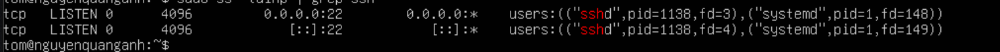
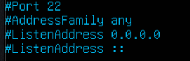
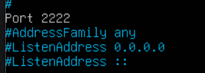
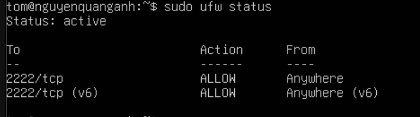
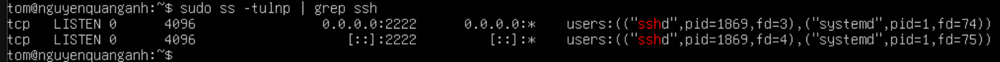
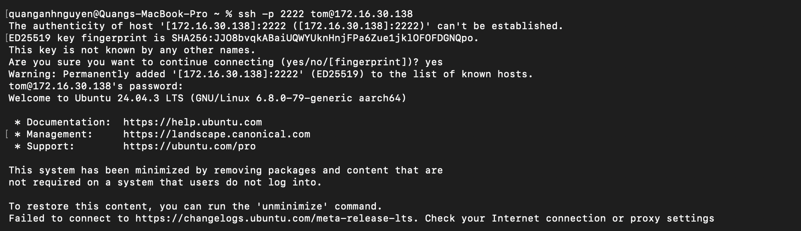

# Đổi port ssh. Sử dụng port khác để ssh vào máy chủ

Mặc định, SSH sử dụng cổng 22. Để tăng bảo mật, bạn có thể thay đổi cổng này thành một số khác, ví dụ 2222.

## Đổi port ssh

### Trên máy ảo ubuntu và CentOS Stream 9

``Bước 1``: Kiểm tra SSH đang chạy trên cổng nào

     sudo ss -tulnp | grep ssh

- Kết quả

- `0.0.0.0:22` → SSH lắng nghe trên mọi địa chỉ IPv4
- `[::]:22` → SSH lắng nghe trên mọi địa chỉ IPv6
- `users:(("sshd",pid=1138,...))` → tiến trình sshd đang chạy, PID là `1138`

`Bước 2`: Sửa file cấu hình SSH để đổi cổng

- Mở file `/etc/ssh/sshd_config`:

      sudo nano /etc/ssh/sshd_config

- Tìm dòng:

Bỏ dấu # và đổi số cổng, ví dụ cổng 2222:

- Lưu ý:

  - Nên chọn cổng >1024 để tránh xung đột (ví dụ: 2222, 8022, 10022, v.v.).
  - Không chọn cổng đang dùng bởi dịch vụ khác (HTTP 80, HTTPS 443, v.v.).

`Bước 3`: Mở cổng mới trên firewall

- Mở cổng 2222 với lệnh sau:

**Trên Ubuntu**:

     sudo ufw allow 2222/tcp

- Kiểm tra lại trạng thái firewall:

      sudo ufw status

**Trên CentOS Stream 9:**

     sudo firewall-cmd --permanent --add-port=2222/tcp
     sudo firewall-cmd --reload

Kiểm tra lại trạng thái firewall:

     sudo firewall-cmd --list-ports

- Kiểm tra lại trạng thái firewall:

      sudo firewall-cmd --list-ports

`Bước 4`: Khởi động lại SSH để áp dụng thay đổi

- Sau khi cấu hình và đổi cổng, restart lại ssh:

      sudo systemctl restart sshd

`Bước 5`: thực hiện ssh

- Sử dụng lệnh để ssh vào máy chủ:

      ssh -p 2222 tom@172.16.30.138

`Bước 6 - tùy chọn`: chặn cổng 22 để tăng bảo mật

- Sau khi SSH trên cổng mới hoạt động, chặn cổng 22:

      sudo firewall-cmd --permanent --remove-port=22/tcp
      sudo firewall-cmd --reload