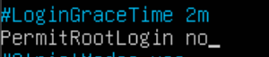
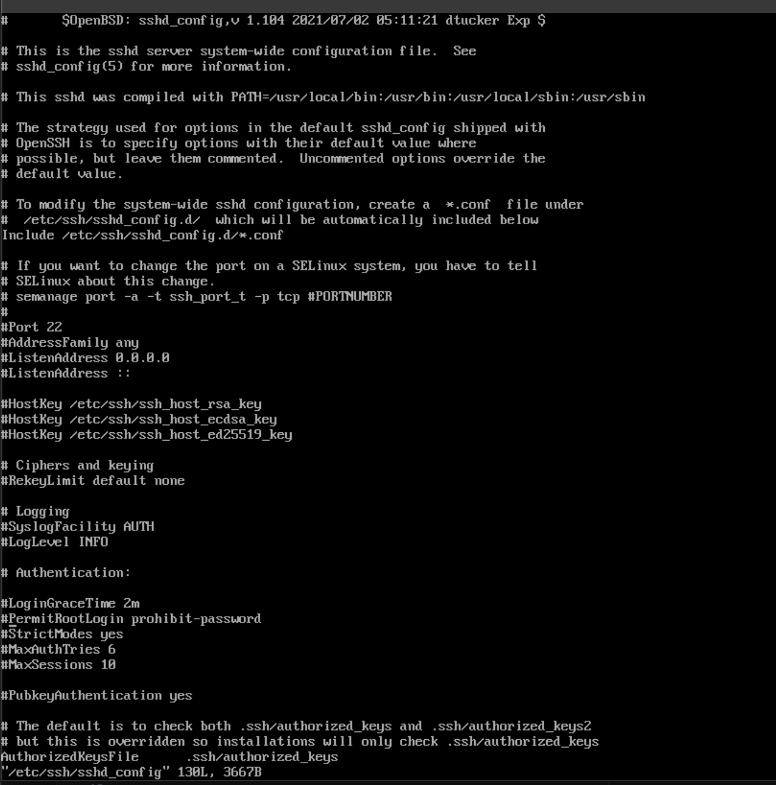
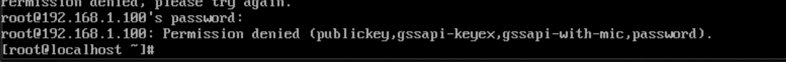

# Cấu hình không cho ssh bằng root

## Trên Ubuntu

**Lưu ý: Cần dùng tài khoản root để truy cập file cấu hình.**

`Bước 1`: Chỉnh sửa file cấu hình SSH

- Mở file cấu hình SSH:

      sudo nano /etc/ssh/sshd_config

- Tại dòng `PermitRootLogin`, bỏ dấu `#` và chuyển thành `no`

`Bước 2`: Restart SSH để áp dụng thay đổi

     sudo systemctl restart ssh

`Bước 3`: Kiểm tra lại

     ssh root@172.16.30.138

- Nếu thấy lỗi `Permission denied` hoặc `Connection refused` như ảnh dưới -> OK.

- Thay vào đó, đăng nhập bằng tài khoản thường

      ssh tom@172.16.30.138

- Khi đăng nhập, nếu cần quyền root, dùng:

      su -

## Trên CentOS Stream 9

**Lưu ý: Cần dùng tài khoản root để truy cập file cấu hình.**

`Bước 1`: Chỉnh sửa file cấu hình SSH

- Mở file cấu hình SSH:

      sudo vi /etc/ssh/sshd_config

- Tại dòng `PermitRootLogin`, bỏ dấu `#` và chuyển thành `no`

`Bước 2`: Restart SSH để áp dụng thay đổi

      sudo systemctl restart sshd

`Bước 3`: Kiểm tra lại

     ssh root@192.168.2.100

- Nếu thấy lỗi Permission denied hoặc Connection refused như ảnh dưới -> OK.

