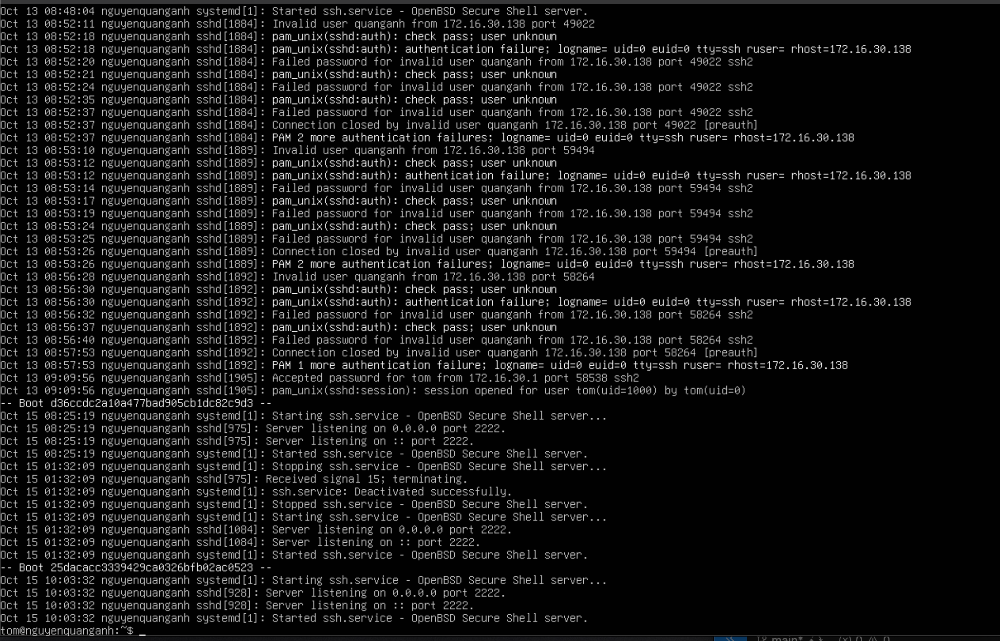
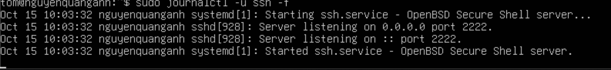
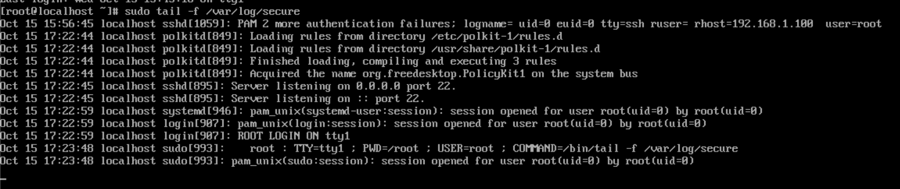
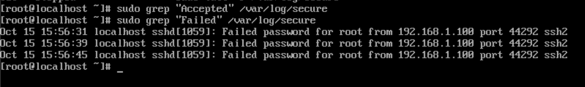

# SSH Logs

## Mục đích của file log SSH

File log SSH ghi lại các sự kiện liên quan đến hoạt động của SSH server, bao gồm:

- Các nỗ lực kết nối đến (thành công và thất bại).
- Thông tin về người dùng đã đăng nhập.
- Các lỗi hoặc cảnh báo liên quan đến dịch vụ SSH.
- Hoạt động của các kênh SSH (ví dụ: chuyển tiếp cổng).

File log này rất hữu ích cho việc giám sát bảo mật, khắc phục sự cố kết nối và kiểm tra các hoạt động bất thường.

## Vị trí file log SSH trên Ubuntu 24.04 và CentOS Stream 9
### 1. Ubuntu 24.04

**Hiện nay: Ubuntu 24.04 dùng `systemd-journald`**
`systemd-journald` là trình quản lý log tích hợp sẵn trong systemd.

Nó thu thập toàn bộ log từ kernel, services, và ứng dụng, lưu vào cơ sở dữ liệu nhị phân (binary) thay vì file text.

- Đường dẫn lưu log:
`/var/log/journal/` → nơi lưu log ở dạng nhị phân (không đọc trực tiếp bằng `cat`).
- Nếu thư mục này chưa tồn tại, log chỉ lưu tạm trong RAM (mất khi khởi động lại).

| Mục đích                      | Lệnh                                   |
| ----------------------------- | -------------------------------------- |
| Xem tất cả log SSH            | `sudo journalctl -u ssh`               |
| Xem log theo thời gian thực   | `sudo journalctl -u ssh -f`            |
| Xem log hôm nay               | `sudo journalctl -u ssh --since today` |
| Xem 50 dòng cuối              | `sudo journalctl -u ssh -n 50`         |
| Không ngắt trang khi hiển thị | `sudo journalctl -u ssh --no-pager`    |

### 2. CentOS Stream 9

 **Trên CentOS Stream 9, cơ chế ghi log cũng đã chuyển sang systemd-journald (tương tự Ubuntu 24.04), nhưng vẫn giữ lại rsyslog để tương thích ngược với các ứng dụng cũ — nghĩa là cả hai hệ thống log có thể cùng tồn tại.**

| Thành phần             | Vai trò                                                                       | Ghi chú                             |
| ---------------------- | ----------------------------------------------------------------------------- | ----------------------------------- |
| **`systemd-journald`** | Hệ thống log mặc định của systemd, thu thập log từ kernel, service, ứng dụng. | Giống Ubuntu mới.                   |
| **`rsyslog`**          | Dịch vụ ghi log truyền thống (tùy chọn, vẫn được cài mặc định).               | Ghi ra file text trong `/var/log/`. |

- SSHD có thể ghi log cả vào `journald` lẫn file ``/var/log/secure`` nếu `rsyslog` đang chạy.

| Loại log                  | Vị trí / Cách xem                          |
| ------------------------- | ------------------------------------------ |
| **File log truyền thống** | `/var/log/secure` (nếu `rsyslog` đang bật) |
| **Log qua journald**      | `sudo journalctl -u sshd --no-pager`                  |

## Đọc file log SSH

### 1. Kiểm tra log SSH

### Trên ubuntu:

- Xem log của dịch vụ SSH:

      sudo journalctl -u ssh --no pager

  - `journalctl`: công cụ dòng lệnh được sử dụng để truy vấn và hiển thị nhật ký được thu thập bởi systemd journal.
  - `u ssh`: Tùy chọn -u (unit) được sử dụng để lọc nhật ký theo một đơn vị systemd cụ thể. Trong trường hợp này, ssh thường là tên của đơn vị quản lý dịch vụ SSH server (thường là ssh.service). Lệnh này sẽ hiển thị chỉ những nhật ký liên quan đến dịch vụ SSH.
  - `--no-pager`: Tùy chọn `--no-pager` yêu cầu journalctl hiển thị toàn bộ nhật ký trực tiếp ra terminal mà không cần sử dụng pager.

 

- Lọc log chỉ chứa lỗi SSH

      sudo journalctl -u ssh --no-pager -p 3

  - -p 3: chỉ lấy log ở mức error.
  - 0: emerg (emergency) - Hệ thống. không ổn định.
  - 1: alert - Cần hành động ngay lập. tức.
  - 2: crit (critical) - Lỗi nghiêm trọng
  - 3: err (error) - Lỗi.
  - 4: warning - Cảnh báo.
  - 5: notice - Thông báo quan trọng. nhưng không phải lỗi.
  - 6: info - Thông tin.
  - 7: debug - Thông tin gỡ lỗi.
- xem log theo thời gian thực (giống tail -f)

      sudo journalctl -u ssh -f

Kết quả (xuất hiện log khi có thay đổi. Để thoát khỏi chế độ này, sử dụng `Ctrl + c`):

- Tìm log đăng nhập SSH thành công và thất bại:

      sudo journalctl -u ssh --no-pager | grep "Accepted"
      sudo journalctl -u ssh --no-pager | grep "Failed"

### Trên CentOS Stream 9: /var/log/secure

- Xem log gần đây:

      sudo tail -f /var/log/secure

- Lọc log đăng nhập thành công/thất bại:

      sudo grep "Accepted" /var/log/secure
      sudo grep "Failed" /var/log/secure

## 2. Kiểm tra tấn công SSH (Brute-force, Failed Login)

### Trên ubuntu:

     sudo journalctl -u ssh --no-pager | grep "Failed"

### Trên centos:

      sudo grep "Failed" /var/log/secure

