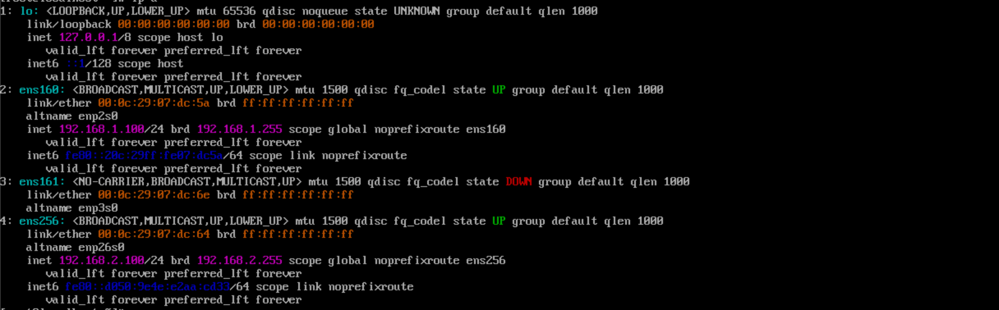
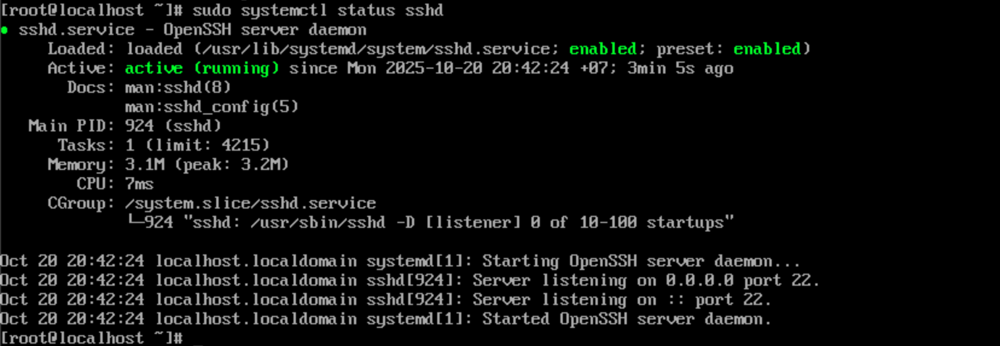
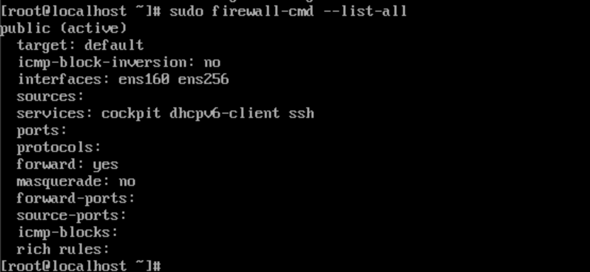
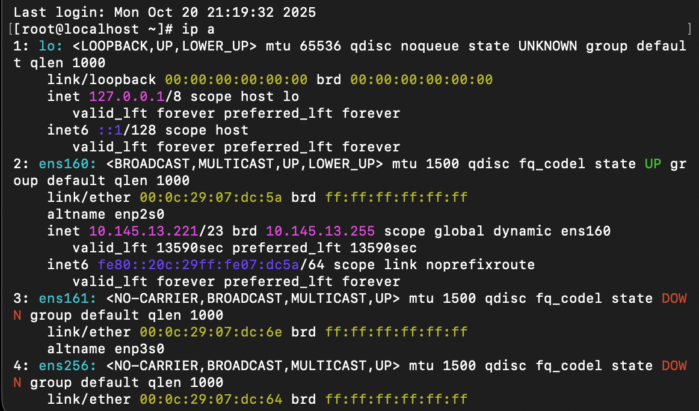
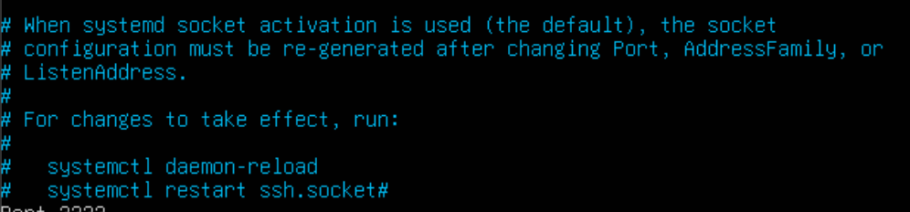
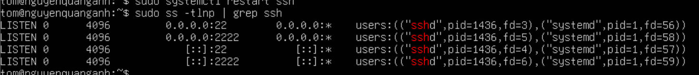
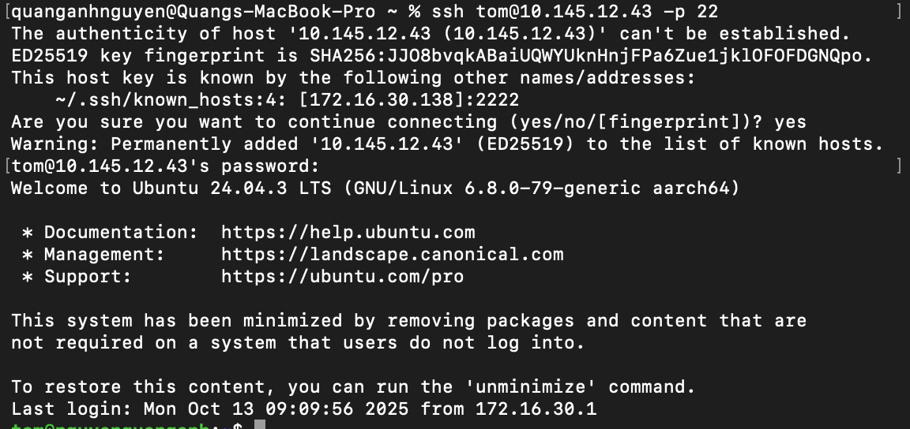
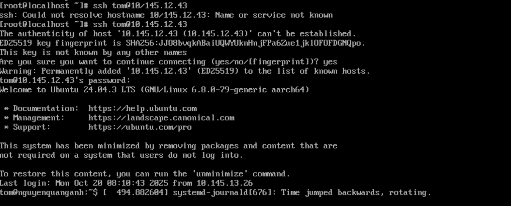

# Lab SSH
Từ máy chủ (macOS) đến webserver
## 1. CentOS Stream 9

Bước 1: Kiểm tra IP trên máy ảo

Bước 2: Kiểm tra SSH Server trên máy ảo

- Trên máy ảo CentOS stream 9, kiểm tra dịch vụ OpenSSH có đang chạy không:

      sudo systemctl status sshd

Nếu không, khởi động với lệnh:

      sudo systemctl start sshd

Nếu muốn SSH Server tự động chạy mỗi khi 

khởi động máy ảo:

      sudo systemctl enable sshd

Bước 3: Cấu hình tường lửa trên máy ảo

CentOS dùng firewall, kiểm tra cổng SSH đã mở chưa (mặc định là 22):

      sudo firewall-cmd --list-all

- Nếu có dòng ssh trong danh sách services là OK.

Trường hợp cổng chưa mở, thực hiện các lệnh sau:
# Mở cổng SSH

    sudo firewall-cmd --permanent. --add-service=ssh

# reload lại firewall

     sudo firewall-cmd --reload

# Thực hiện kiểm tra lại danh sách

     sudo firewall-cmd --list-all
  
Bước 4: SSH từ máy host (windows) vào máy ảo CentOS Stream 9

Mở terminal trên máy host và chạy lệnh:

      ssh root@192.168.2.100

root: Tài khoản trên máy ảo.

192.168.2.100: IP của máy ảo đã kiểm tra. ở. bước 1.
- **lưu ý**: 
    - Nếu không cùng giải phải xin DHCP. cấp lại ip

          sudo dhclient -r
          sudo dhclient

   - Nhớ vào check file cấu hình

         sudo vi /etc/ssh/sshd_config

- khởi động lại file:

      sudo systemctl restart sshd

Kết quả sau kết nối:

## 2. Ubuntu Server

làm y hệt như trên 

- **Lưu ý**:

SSH đang bị quản lý bằng systemd socket activation, không phải khởi động trực tiếp bằng sshd.service.

 
Để port 22 có hiệu lực, bạn cần làm đúng như hướng dẫn này:

Chạy lần lượt các lệnh sau trong terminal:

      sudo systemctl daemon-reload
      sudo systemctl restart ssh.socket
      sudo systemctl restart ssh

Sau đó kiểm tra lại:

	sudo ss -tlnp | grep ssh

- rồi ssh lại: 

- Exit:

**Ctrl + D**

## Từ CentOS Stream 9 đến Ubuntu Server

- Tương tự như các bước ở trên, kiểm tra IP, OpenSSH, tường lửa trên ubuntu.
- Thực hiện lệnh ssh trên CentOS Stream 9 với lệnh:

      ssh tom@10.145.12.43

