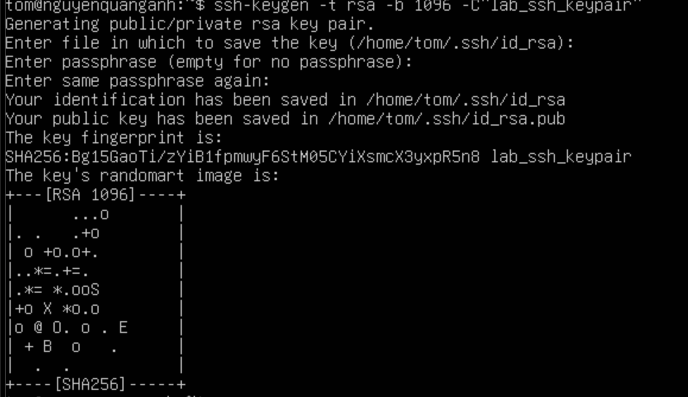

# Lab keypair

Tạo SSH Keypair và sử dụng nó để SSH từ máy client (Ubuntu 24.04) vào máy server (CentOS Stream 9).

- Máy client: ubuntu
- Máy server: centos

Bước 1: Kiểm tra SSH key trên client (ubuntu)

Trên máy client (ubuntu), kiểm tra đã có SSH Key chưa:

     ls -l ~/.ssh/

Nếu chưa có, tạo mới:

     ssh-keygen -t rsa -b 4096 -C "lab_ssh_keypair"

- `ssh-keygen`: lệnh dùng để tạo, quản lý và chuyển đổi các khóa SSH.
- `-t rsa`: Tùy chọn -t (type) chỉ định loại thuật toán mã hóa sẽ được sử dụng để tạo khóa.
- `-b 4096`: Tùy chọn -b (bits) chỉ định số lượng bit cho khóa. Đối với thuật toán RSA, số lượng bit càng cao thì khóa càng mạnh và an toàn hơn, nhưng cũng có thể mất nhiều thời gian hơn để tạo và sử dụng. 4096 là một kích thước khóa mạnh và được khuyến nghị sử dụng hiện nay.
- `-C "lab_ssh_keypair"`: Tùy chọn -C (comment) thêm một dòng chú thích vào file khóa công khai.
Nhấn Enter để lưu key vào đường dẫn mặc định `(~/.ssh/id_rsa).`

Sau khi tạo xong, kiểm tra:

     ls -l ~/.ssh/

- Sẽ có 2 file:
   - id_rsa (Private key)
   - id_rsa.pub (public key)

Bước 2:Copy public key qua máy server (centos)

Chạy lệnh sau trên máy client (ubuntu):

    ssh-copy-id -i ~/.ssh/id_rsa.pub doantan1@192.168.3.73

- `-i`: Tùy chọn -i (identity file) chỉ định đường dẫn đến file chứa khóa công khai mong muốn sao chép lên máy chủ.
- `doantan1`: Tên user trên máy server (centos).
- `192.168.3.73`: địa chỉ IP máy server (centos).

Kết quả sau nhập lệnh:

Kiểm tra trên máy server (centos)

     cat ~/.ssh/authorized_keys

Kết quả:

Bước 3: SSH từ client (ubuntu) vào server (centos) bằng SSH Key

Trên ubuntu SSH vào centos:
ssh doantan1@192.168.3.73
Nếu có passphrase, sẽ cần nhập rõ. Nhưng như ở bước 1 tạo keypair không dùng passphrase.

Kết quả đăng nhập thành công:

Bước 4: Cấu hình nâng cao

Chặn SSH bằng mật khẩu trên centos:

Mở file cấu hình SSH:
sudo vim /etc/ssh/sshd_config
Tìm dòng sau và sửa thành:
PasswordAuthentication no
PubkeyAuthentication yes
Lưu file và khởi động lại SSH:
sudo systemctl restart sshd
Bây giờ chỉ có thể SSH bằng SSH key.
Cấu hình SSH client để dễ dàng quản lý

Trên máy client (ubuntu), chỉnh file ~/.ssh/config:
vim ~/.ssh/config:
Thêm nội dung sau:
Host myserver
  HostName 192.168.3.73
  doantan1
  IdentityFile ~/.ssh/id_rsa
Lưu file, giờ có thể SSH bằng:
ssh doantan1

