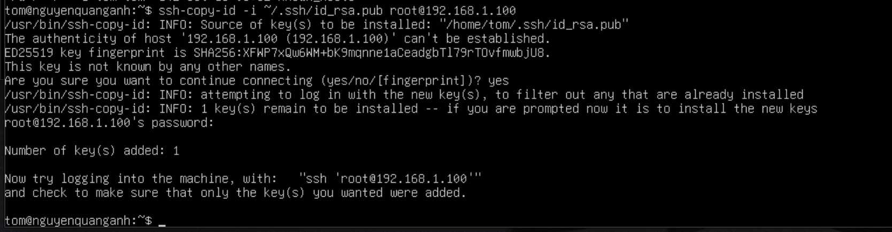
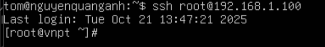

# Keypair là gì?

"Keypair" (cặp khóa) là một cặp khóa mật mã gồm:
- Public key (khóa công khai): Dùng để mã hóa hoặc xác minh dữ liệu. Có thể chia sẻ công khai cho người khác.
- Private key (khóa riêng tư):Dùng để giải mã hoặc ký dữ liệu. Phải được giữ bí mật tuyệt đối.

## Trong SSH
- Khi dùng SSH Keypair, ta dùng chúng để xác thực đăng nhập vào máy chủ mà không cần mật khẩu.

Cụ thể:
- Client (máy bạn) giữ private key.
- Server (máy chủ) lưu public key trong file `~/.ssh/authorized_keys`.

Khi bạn kết nối SSH:
- Server gửi một thử thách (challenge).
- Client dùng private key để tạo chữ ký số trả lại.
- Server dùng public key để kiểm tra chữ ký, nếu khớp thì xác nhận đúng người → đăng nhập thành công mà không cần mật khẩu.

# Lab keypair

Tạo SSH Keypair và sử dụng nó để SSH từ máy client (Ubuntu 24.04) vào máy server (CentOS Stream 9).

- Máy client: ubuntu
- Máy server: centos

Bước 1: Kiểm tra SSH key trên client (ubuntu)

Trên máy client (ubuntu), kiểm tra đã có SSH Key chưa:

     ls -l ~/.ssh/

Nếu chưa có, tạo mới:

     ssh-keygen -t rsa -b 4096

- `ssh-keygen`: lệnh dùng để tạo, quản lý và chuyển đổi các khóa SSH.
- `-t rsa`: Tùy chọn -t (type) chỉ định loại thuật toán mã hóa sẽ được sử dụng để tạo khóa.
- `-b 4096`: Tùy chọn -b (bits) chỉ định số lượng bit cho khóa. Đối với thuật toán RSA, số lượng bit càng cao thì khóa càng mạnh và an toàn hơn, nhưng cũng có thể mất nhiều thời gian hơn để tạo và sử dụng. 4096 là một kích thước khóa mạnh và được khuyến nghị sử dụng hiện nay.
- Nhấn Enter để lưu key vào đường dẫn mặc định `(~/.ssh/id_rsa).`

Sau khi tạo xong, kiểm tra:

     ls -l ~/.ssh/

- Sẽ có 2 file:
   - id_rsa (Private key)
   - id_rsa.pub (public key)

Bước 2:Copy public key qua máy server (centos)

Chạy lệnh sau trên máy client (ubuntu):

    ssh-copy-id -i ~/.ssh/id_rsa.pub root@192.168.1.100

- `-i`: Tùy chọn -i (identity file) chỉ định đường dẫn đến file chứa khóa công khai mong muốn sao chép lên máy chủ.
- `root`: Tên user trên máy server (centos).
- `192.168.1.100`: địa chỉ IP máy server (centos).

Kết quả sau nhập lệnh:

Kiểm tra trên máy server (centos)

     cat ~/.ssh/authorized_keys

Kết quả:

Bước 3: SSH từ client (ubuntu) vào server (centos) bằng SSH Key

Trên ubuntu SSH vào centos:

     ssh root1@192.168.1.100

Nếu có passphrase, sẽ cần nhập rõ. Nhưng như ở bước 1 tạo keypair không dùng passphrase.

Kết quả đăng nhập thành công:

Bước 4: Cấu hình nâng cao

Chặn SSH bằng mật khẩu trên centos:

Mở file cấu hình SSH:

    sudo vim /etc/ssh/sshd_config

Tìm dòng sau và sửa thành:

     PasswordAuthentication no
     PubkeyAuthentication yes

Lưu file và khởi động lại SSH:

    sudo systemctl restart sshd

Bây giờ chỉ có thể SSH bằng SSH key.
Cấu hình SSH client để dễ dàng quản lý

Trên máy client (ubuntu), chỉnh file `~/.ssh/config`:

      vim ~/.ssh/config:

Thêm nội dung sau:

     Host myserver
        HostName 192.168.1.100
        quanganh
     IdentityFile ~/.ssh/id_rsa

Lưu file, giờ có thể SSH bằng:
ssh quanganh

