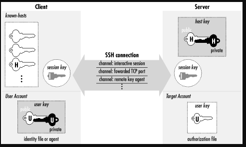

# 1. Khái niệm SSH
- SSH (viết tắt của Secure Shell) là một giao thức bảo mật dùng để điều khiển máy tính từ xa qua dòng lệnh 
- Giao thức điều khiển cho phép người dùng kiểm soát và chỉnh sửa server từ xa qua Internet. 
- hoạt động ở layel 4

- Nó xác thực người dùng từ xa, truyền dữ liệu input từ client tới host, và relay kết quả trả về tới khách hàng. Dịch vụ được tạo ra nhằm thay thế cho trình Telnet không có mã hóa và sử dụng kỹ thuật cryptographic dẫn đến dữ liệu dễ bị đánh cắp.

- SSH là một giao thức bảo mật phổ biến trong lĩnh vực CNTT. Nhờ được sử dụng rộng rãi trong việc quản lý từ xa và truyền tải dữ liệu một cách an toàn, SSH đặt ra tiêu chuẩn cao về đảm bảo thông tin, ngăn chặn các rủi ro an ninh mạng.

# 2. Tính năng chính

1. Mã hóa (Encryption)

- Toàn bộ dữ liệu trao đổi giữa client và server được mã hóa, tránh bị nghe lén (sniffing) hoặc đánh cắp thông tin.
- SSH sử dụng các thuật toán mã hóa mạnh như AES, 3DES, Blowfish, ChaCha20, v.v.

2. Xác thực (Authentication)

SSH hỗ trợ nhiều phương thức xác thực để đảm bảo người dùng hợp lệ:
- Xác thực bằng mật khẩu (password-based authentication).
- Xác thực bằng khóa công khai (public key authentication) — an toàn hơn, thường dùng khi quản lý server.
- Ngoài ra có thể dùng xác thực hai yếu tố (2FA) hoặc xác thực qua certificate.

3. Truy cập máy chủ từ xa: Cho phép quản trị viên kết nối và điều khiển máy chủ Linux/Unix từ xa.

4. Truyền tệp an toàn (Secure File Transfer): Cho phép truyền dữ liệu an toàn qua các kết nối không an toàn bằng cách bọc dữ liệu trong đường hầm SSH. Có 2 loại:

  - Local Port Forwarding: Định tuyến lưu lượng từ máy cục bộ qua máy chủ SSH.
  - Remote Port Forwarding: Cho phép máy chủ SSH chuyển tiếp lưu lượng đến một máy khác.

5. Chuyển file an toàn

- SCP :(Secure Copy): Truyền tệp tin giữa client và server an toàn.

- SFTP: (SSH File Transfer Protocol): Giao thức truyền tệp an toàn dựa trên SSH.

6. Tunneling và Port Forwarding
- Cho phép chuyển tiếp cổng (port forwarding) để mã hóa kết nối của các ứng dụng khác (như HTTP, VNC, MySQL...).

- Ví dụ:

      ssh -L 8080:localhost:80 user@server

→ Kết nối cổng 8080 của máy bạn tới cổng 80 của server một cách an toàn.

7. Thực thi lệnh từ xa (Remote Command Execution)

- Có thể chạy một lệnh duy nhất mà không cần mở phiên shell:

      ssh user@server "sudo systemctl restart nginx"

# 3. Các thành phần trong SSH

- Server : Một chương trình cho phép đi vào kết nối SSH với một bộ máy, trình bày xác thực, cấp phép, … Trong hầu hết SSH bổ sung của Unix thì server thường là sshd.

- Client : Một chương trình kết nối đến SSH server và đưa ra yêu cầu như là “log me in” hoặc “copy this file”. Trong SSH1, SSH2 và OpenSSH, client chủ yếu là ssh và scp.

- Session : Một phiên kết nối giữa một client và một server. Nó bắt đầu sau khi client xác thực thành công đến một server và kết thúc khi kết nối chấm dứt. Session có thể được tương tác với nhau hoặc có thể là một chuyến riêng.

- Key:

## 3.1. Khái niệm Key

Dùng để xác thực và mã hóa dữ liệu, bao gồm:

- Khóa Công khai: Được đặt trên máy chủ, dùng để mã hóa dữ liệu.
- Khóa Riêng tư: Được giữ bí mật trên máy khách, dùng để giải mã dữ liệu đã được mã hóa bằng khóa công khai tương ứng.
- Khóa phiên: Một khóa ngẫu nhiên được tạo ra trong mỗi phiên làm việc để mã hóa dữ liệu trong phiên đó. 

## 3.2. SSH Key

- Khi tạo ra một SSH Key, bạn cần biết sẽ có 3 thành phần quan trọng như sau:

   - Public Key (dạng file và string) – Bạn sẽ copy ký tự key này sẽ bỏ vào file `` ~/.ssh/authorized_keys`` trên server của bạn.
   - Private Key (dạng file và string) – Bạn sẽ lưu file này vào máy tính, sau đó sẽ thiết lập cho PuTTY, WinSCP, MobaXterm,..để có thể login.
   - Keyphrase (hay Passphrase)(dạng string, cần ghi nhớ) – Mật khẩu để mở private key, khi đăng nhập vào server nó sẽ hỏi cái này.

# 4.Cách hoạt động của SSH

1. Establish TCP Connection.

- SSH Client mở kết nối **TCP** đến SSH Server (mặc định port 22 hoặc cổng tùy chỉnh).
- Server lắng nghe trên cổng 22 và phản hồi bằng một gói tin SYN-ACK để chấp nhận yêu cầu kết nối.
- Client gửi lại một gói tin ACK để hoàn tất quá trình **bắt tay ba bước (three-way handshake)** của TCP. Lúc này, một kết nối TCP đã được thiết lập giữa client và server

2. Supported Version Negotiation.
- Hai bên trao đổi và xác nhận phiên bản giao thức SSH mà cả hai hỗ trợ (thường là SSH-2).
- Đảm bảo client và server hiểu cùng “ngôn ngữ” SSH.

3. Supported Algorithms Negotiation.
- Hai bên thống nhất thuật toán mã hóa, nén, băm và xác thực sẽ dùng.
- Ví dụ:
  - Mã hóa: AES, ChaCha20
  - Băm: SHA-256
  - Trao đổi khóa: Diffie-Hellman (DH), ECDH

4. Generate Key Pairs.
- Client sinh ra một cặp public key / private key (nếu chưa có).
- Private key được giữ bí mật, public key có thể gửi cho server.

**bắt đầu sử dụng pp mã hoá bất đối xứng**

5. Send Public Key.
- Client gửi public key của mình đến SSH Server.
- Server kiểm tra xem khóa này có nằm trong file ``~/.ssh/authorized_keys`` của user không.

6. Initiate a Login Request.
- Client yêu cầu đăng nhập bằng tên người dùng (username).
- Server chuẩn bị xác thực client.

7. Server Found Matching Key.
- Server tìm thấy public key trùng khớp trong ``~/.ssh/authorized_keys``.
- Server gửi một chuỗi ngẫu nhiên (challenge) – có thể là số ngẫu nhiên, session ID, hoặc 1 message do server chọn được mã hóa bằng public key đó đến client.

8. Return an Encrypted Random Number.
- Chuỗi ngẫu nhiên (challenge) này chỉ có private key tương ứng mới giải mã được.
- Mục đích: kiểm tra xem client thực sự sở hữu private key hay không.

9. Client Decrypts Data Using Private Key.
- Client ký số chuỗi đó bằng private key của mình. để giải mã chuỗi random từ server.
- Nếu giải mã thành công → chứng minh client hợp lệ.

10. Send Decrypted Data.
- Client gửi lại kết quả giải mã cho server.

11. Server Verifies.
- Server xác minh kết quả:
  - Server dùng public key (client đã đăng ký trước) để kiểm tra chữ ký.
  - Nếu đúng → xác thực thành công (client. thực sự có private key).
  - Nếu sai → từ chối kết nối.

12. Session Request and Response.
- Sau khi xác thực xong, client và server tạo một session key (khóa phiên).
- Session key này dùng để mã hóa toàn bộ dữ liệu trong suốt phiên làm việc, nhanh hơn vì là mã hóa đối xứng.

13. Send Encrypted Commands.
- Client gửi các lệnh (command) đến server qua đường hầm SSH Tunnel.
- Tất cả được mã hóa bằng session key.

14. Server Decrypts Command.
- Server giải mã lệnh nhận được bằng session key, sau đó thực thi.

15. Send Encrypted Result.
- Kết quả thực thi lệnh (output) được server mã hóa và gửi lại client.

16. Client Decrypts Result
- Client giải mã kết quả bằng cùng session key, hiển thị ra terminal.
- Phiên SSH giờ đã sẵn sàng cho việc điều khiển, truyền file hoặc port forwarding.

# 5. Một số thuật toán sử dụng trong SSH

- SSH sử dụng nhiều thuật toán, bao gồm các thuật toán cho `mã hóa khóa công khai (như RSA, ECDSA, ED25519) để xác thực`, `trao đổi khóa (như Diffie-Hellman, ECDH) để tạo khóa phiên`, và `mã hóa đối xứng (như AES, Blowfish) để mã hóa dữ liệu phiên`. Ngoài ra, SSH còn sử dụng thuật toán băm để đảm bảo tính toàn vẹn của dữ liệu. 

## 5.1. Thuật toán Public key (khóa công khai)

Các thuật toán này được sử dụng để xác thực máy chủ (và tùy chọn là máy khách). 

- **RSA (Rivest–Shamir–Adleman)**: Một trong những thuật toán khóa công khai lâu đời và phổ biến nhất. Hiện có các phiên bản an toàn hơn như `rsa-sha2-256` và `rsa-sha2-512`.
- **ECDSA (Elliptic Curve Digital Signature Algorithm)**: Sử dụng chữ ký số dựa trên đường cong elliptic, cung cấp độ bảo mật cao với kích thước khóa nhỏ hơn.
ecdsa-sha2-nistp256: Một thuật toán ECDSA tiêu chuẩn.
- **DSA (Digital Signature Algorithm)**: Một thuật toán khóa công khai cũ hơn, đã bị loại bỏ dần và không còn được khuyến khích sử dụng. 
## 5.2. Thuật toán Private key (khóa bí mật)

Thuật toán mã hóa được sử dụng để đảm bảo dữ liệu được truyền giữa hai hệ thống không thể bị đọc được bởi bất kỳ ai chặn đường truyền. Giao thức SSH sử dụng mã hóa đối xứng, nghĩa là cả hai bên (máy khách và máy chủ) đều sử dụng cùng một khóa để mã hóa và giải mã dữ liệu. Việc lựa chọn mã hóa nào sẽ được tự động thương lượng giữa máy khách (ứng dụng của bạn sử dụng SocketTools) và máy chủ mà bạn đang kết nối. Các mã hóa sau hiện được hỗ trợ:

- `chacha20-poly1305@openssh.com` : Một thuật toán mã hóa mới hơn kết hợp thuật toán mã hóa luồng ChaCha20 và thuật toán xác thực tin nhắn Poly1305, mang lại hiệu suất và bảo mật cao. Đây là một giải pháp thay thế mạnh mẽ cho AES-GCM, đặc biệt là trên các hệ thống không sử dụng kiến ​​trúc Intel.
- `aes256-gcm@openssh.com` : Một thuật toán mã hóa hiện đại kết hợp AES-256 với Galois/Counter Mode (GCM), mang lại cả tính toàn vẹn và bảo mật cho thông điệp. Đây là một giải pháp bảo mật và hiệu quả cao, đặc biệt trên các hệ thống có hỗ trợ tăng tốc phần cứng cho AES.
- `aes128-gcm@openssh.com` : Tương tự như aes256-gcm nhưng sử dụng khóa 128 bit, mang lại sự cân bằng giữa bảo mật và hiệu suất.
- `aes256-ctr, aes192-ctr, aes128-ctr` : AES ở chế độ Counter (CTR) là phương pháp mã hóa được sử dụng rộng rãi, biến mã khối thành mã luồng, được biết đến với tính bảo mật mạnh mẽ và hiệu suất cao.
- `aes256-cbc, aes192-cbc, aes128-cbc` : AES ở chế độ Cipher Block Chaining (CBC) là một phương pháp mã hóa cũ hơn. Mặc dù an toàn, nhưng nó dễ bị tấn công hơn so với các chế độ hiện đại như CTR hoặc GCM.
- `blowfish-cbc` : Một thuật toán mã hóa cũ hơn, nhanh hơn nhưng kém an toàn hơn so với AES. Thuật toán này sử dụng các khóa có độ dài thay đổi, thường được đặt thành 128 bit.
- `cast128-cbc` : Một thuật toán mã hóa đối xứng sử dụng kích thước khối 64 bit và được biết đến là nhanh và an toàn.
- `3des-cbc `: Triple DES, một tiêu chuẩn mã hóa cũ áp dụng thuật toán DES ba lần để cải thiện tính bảo mật, mặc dù được coi là chậm hơn và kém an toàn hơn so với các thuật toán hiện đại.
## 5.3. Hàm băm (HASH)(Xác thực tin nhắn)

Thuật toán băm được sử dụng để đảm bảo tính toàn vẹn của dữ liệu. Mã băm hoặc Mã Xác thực Tin nhắn (MAC) được tính toán từ dữ liệu được gửi đi, và bên nhận cũng tính toán cùng một mã băm để đảm bảo dữ liệu không bị giả mạo trong quá trình truyền. Các thuật toán băm sau hiện đang được hỗ trợ:

- **hmac-sha2-256, hmac-sha2-512** : HMAC (Mã Xác thực Thông điệp Băm) sử dụng SHA-2 (Thuật toán Băm Bảo mật 2) đảm bảo tính toàn vẹn dữ liệu cao. Số (256 hoặc 512) biểu thị độ dài bit của đầu ra băm.
- **hmac-sha1, hmac-sha1-96** : HMAC sử dụng SHA-1 là một tiêu chuẩn cũ hơn. Mặc dù vẫn được hỗ trợ, SHA-1 đang dần bị thay thế bởi SHA-2 do những điểm yếu đã được biết đến.
- **hmac-ripemd160** : Một hàm băm dựa trên RIPEMD, cung cấp kích thước tóm tắt 160 bit. Đây là một giải pháp thay thế ít phổ biến hơn cho SHA.

## 5.4. Thuật toán trao đổi khóa
Các thuật toán trao đổi khóa được sử dụng trong SSH để tạo ra một khóa bí mật chung (khóa mã hóa) giữa máy khách và máy chủ một cách an toàn. Các thuật toán này đảm bảo khóa không thể bị đánh cắp, ngay cả khi có người đang nghe lén giao tiếp. Các thuật toán trao đổi khóa sau được hỗ trợ:

- `curve25519-sha256` : Thuật toán trao đổi khóa đường cong elip hiện đại và nhanh chóng, kết hợp với hàm băm SHA-256 để tạo khóa an toàn.
- `ecdh-sha2-nistp256, ecdh-sha2-nistp384, ecdh-sha2-nistp521` : Elliptic Curve Diffie-Hellman (ECDH) với các kích thước đường cong elliptic khác nhau. Đây là các phương pháp trao đổi khóa hiện đại, an toàn, sử dụng mật mã đường cong elliptic để tăng cường bảo mật.
- `diffie-hellman-group-exchange-sha256, diffie-hellman-group-exchange-sha1` : Trao đổi khóa Diffie-Hellman cho phép tạo động các tham số trao đổi khóa để bảo mật tốt hơn, kết hợp với SHA-256 hoặc thuật toán băm SHA-1 cũ hơn.
- `diffie-hellman-group16-sha512, diffie-hellman-group18-sha512` : Các biến thể Diffie-Hellman an toàn hơn sử dụng các nhóm nguyên tố lớn và SHA-512 để tăng cường bảo mật.
- `diffie-hellman-group14-sha256, diffie-hellman-group14-sha1` : Các thuật toán này sử dụng nhóm số nguyên tố 2048 bit được xác định trước, mang lại sự cân bằng giữa bảo mật và hiệu suất. SHA-256 là lựa chọn ưu tiên, trong khi SHA-1 cũ hơn và kém bảo mật hơn.
- `diffie-hellman-group1-sha1` : Một trong những thuật toán Diffie-Hellman đầu tiên sử dụng số nguyên tố nhỏ, được coi là kém an toàn hơn hiện nay.
# 6. Hai phương pháp mã hoá đối xứng và bất đối xứng

## 6.1. MÃ HÓA BẤT ĐỐI XỨNG (Asymmetric Encryption)

🔹 Khái niệm:

Dùng 2 khóa khác nhau:

- Public key (khóa công khai) – có thể chia sẻ cho người khác.
- Private key (khóa bí mật) – chỉ người sở hữu giữ.

Dữ liệu mã hóa bằng public key chỉ có thể giải mã bằng private key, và ngược lại.

🔹 Trong SSH, dùng khi nào?

 Dùng ở giai đoạn ban đầu của kết nối:
- Trao đổi khóa (key exchange) – để tạo ra khóa phiên (session key).
- Xác thực người dùng (authentication) – để chứng minh client thực sự sở hữu private key hợp lệ.

🔹 Nhược điểm:
- Tốc độ chậm hơn so với mã hóa đối xứng, do tính toán phức tạp.
- Vì vậy, SSH chỉ dùng nó trong bước khởi đầu, không dùng suốt phiên làm việc.

## 6.2. MÃ HÓA ĐỐI XỨNG (Symmetric Encryption)

🔹 Khái niệm:
- Dùng một khóa duy nhất (session key) để vừa mã hóa vừa giải mã dữ liệu.
- Cả client và server đều có cùng khóa này.

🔹 Trong SSH, dùng khi nào?
- Sau khi kết nối được thiết lập và session key được tạo ra từ quá trình trao đổi khóa.
- Toàn bộ dữ liệu trao đổi (lệnh, file, kết quả) đều được mã hóa đối xứng.

🔹 Ví dụ:
- Sau khi trao đổi khóa xong, SSH sinh ra một session key tạm thời, ví dụ dùng thuật toán AES-256.
- Tất cả lệnh và phản hồi sau đó đều mã hóa bằng session key này.

🔹 Ưu điểm:
- Tốc độ rất nhanh và phù hợp để mã hóa dữ liệu liên tục.
- Khóa chỉ tồn tại trong một phiên SSH, sau khi ngắt kết nối sẽ bị hủy → an toàn.

🔹 Nhược điểm:
- Nếu session key bị lộ, dữ liệu có thể bị giải mã → vì vậy SSH luôn trao đổi khóa bằng cách bất đối xứng an toàn trước khi sinh session key.