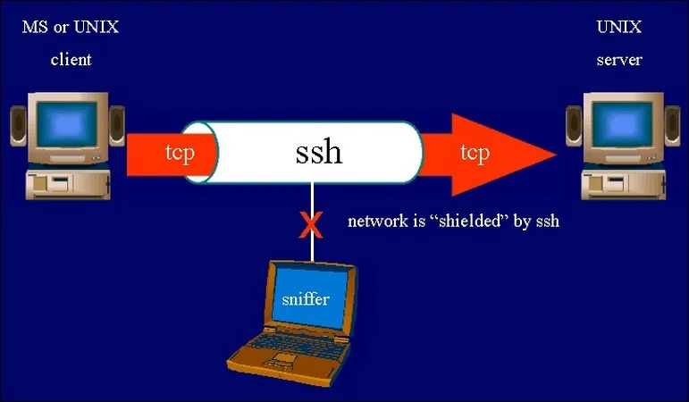
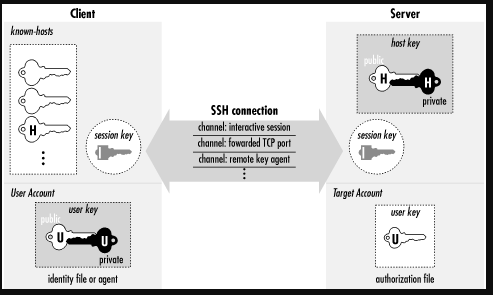
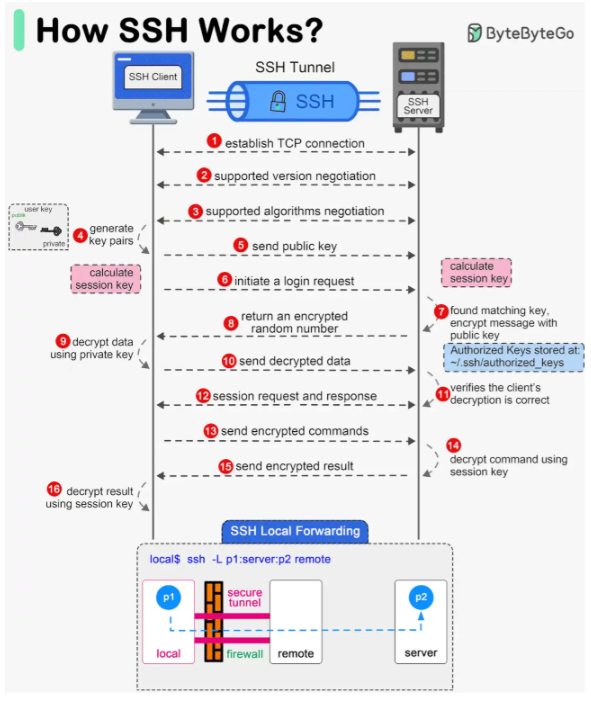
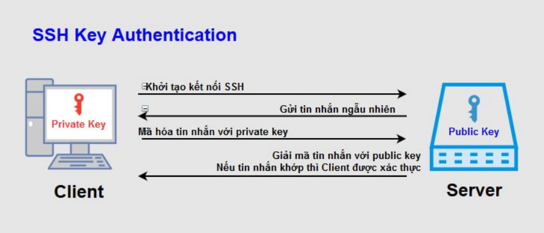

# 1. Khái niệm SSH
- SSH (viết tắt của Secure Shell) là một giao thức bảo mật dùng để điều khiển máy tính từ xa qua dòng lệnh 
- Giao thức điều khiển cho phép người dùng kiểm soát và chỉnh sửa server từ xa qua Internet. 

- Nó xác thực người dùng từ xa, truyền dữ liệu input từ client tới host, và relay kết quả trả về tới khách hàng. Dịch vụ được tạo ra nhằm thay thế cho trình Telnet không có mã hóa và sử dụng kỹ thuật cryptographic dẫn đến dữ liệu dễ bị đánh cắp.

- SSH là một giao thức bảo mật phổ biến trong lĩnh vực CNTT. Nhờ được sử dụng rộng rãi trong việc quản lý từ xa và truyền tải dữ liệu một cách an toàn, SSH đặt ra tiêu chuẩn cao về đảm bảo thông tin, ngăn chặn các rủi ro an ninh mạng.

# 2. Tính năng chính

1. Mã hóa (Encryption)

- Toàn bộ dữ liệu trao đổi giữa client và server được mã hóa, tránh bị nghe lén (sniffing) hoặc đánh cắp thông tin.
- SSH sử dụng các thuật toán mã hóa mạnh như AES, 3DES, Blowfish, ChaCha20, v.v.

2. Xác thực (Authentication)

SSH hỗ trợ nhiều phương thức xác thực để đảm bảo người dùng hợp lệ:
- Xác thực bằng mật khẩu (password-based authentication).
- Xác thực bằng khóa công khai (public key authentication) — an toàn hơn, thường dùng khi quản lý server.
- Ngoài ra có thể dùng xác thực hai yếu tố (2FA) hoặc xác thực qua certificate.

3. Truy cập máy chủ từ xa: Cho phép quản trị viên kết nối và điều khiển máy chủ Linux/Unix từ xa.

4. Truyền tệp an toàn (Secure File Transfer): Cho phép truyền dữ liệu an toàn qua các kết nối không an toàn bằng cách bọc dữ liệu trong đường hầm SSH. Có 2 loại:

  - Local Port Forwarding: Định tuyến lưu lượng từ máy cục bộ qua máy chủ SSH.
  - Remote Port Forwarding: Cho phép máy chủ SSH chuyển tiếp lưu lượng đến một máy khác.

5. Chuyển file an toàn

- SCP :(Secure Copy): Truyền tệp tin giữa client và server an toàn.

- SFTP: (SSH File Transfer Protocol): Giao thức truyền tệp an toàn dựa trên SSH.

6. Tunneling và Port Forwarding
- Cho phép chuyển tiếp cổng (port forwarding) để mã hóa kết nối của các ứng dụng khác (như HTTP, VNC, MySQL...).

- Ví dụ:

      ssh -L 8080:localhost:80 user@server

→ Kết nối cổng 8080 của máy bạn tới cổng 80 của server một cách an toàn.

7. Thực thi lệnh từ xa (Remote Command Execution)

- Có thể chạy một lệnh duy nhất mà không cần mở phiên shell:

      ssh user@server "sudo systemctl restart nginx"

# 3. Các thành phần trong SSH

- Server : Một chương trình cho phép đi vào kết nối SSH với một bộ máy, trình bày xác thực, cấp phép, … Trong hầu hết SSH bổ sung của Unix thì server thường là sshd.
- Client : Một chương trình kết nối đến SSH server và đưa ra yêu cầu như là “log me in” hoặc “copy this file”. Trong SSH1, SSH2 và OpenSSH, client chủ yếu là ssh và scp.
- Session : Một phiên kết nối giữa một client và một server. Nó bắt đầu sau khi client xác thực thành công đến một server và kết thúc khi kết nối chấm dứt. Session có thể được tương tác với nhau hoặc có thể là một chuyến riêng.

# 4.Cách hoạt động của SSH

1. Establish TCP Connection.

- SSH Client mở kết nối **TCP** đến SSH Server (mặc định port 22 hoặc cổng tùy chỉnh).
- Server lắng nghe trên cổng 22 và phản hồi bằng một gói tin SYN-ACK để chấp nhận yêu cầu kết nối.
- Client gửi lại một gói tin ACK để hoàn tất quá trình **bắt tay ba bước (three-way handshake)** của TCP. Lúc này, một kết nối TCP đã được thiết lập giữa client và server.Server lắng nghe trên cổng 22 và phản hồi bằng một gói tin SYN-ACK để chấp nhận yêu cầu kết nối.
- Client gửi lại một gói tin ACK để hoàn tất quá trình bắt tay ba bước (three-way handshake) của TCP. Lúc này, một kết nối TCP đã được thiết lập giữa client và server.

2. Supported Version Negotiation.
- Hai bên trao đổi và xác nhận phiên bản giao thức SSH mà cả hai hỗ trợ (thường là SSH-2).
- Đảm bảo client và server hiểu cùng “ngôn ngữ” SSH.

3. Supported Algorithms Negotiation.
- Hai bên thống nhất thuật toán mã hóa, nén, băm và xác thực sẽ dùng.
- Ví dụ:
  - Mã hóa: AES, ChaCha20
  - Băm: SHA-256
  - Trao đổi khóa: Diffie-Hellman (DH), ECDH

4. Generate Key Pairs.
- Client sinh ra một cặp public key / private key (nếu chưa có).
- Private key được giữ bí mật, public key có thể gửi cho server.

5. Send Public Key.
- Client gửi public key của mình đến SSH Server.
- Server kiểm tra xem khóa này có nằm trong file ``~/.ssh/authorized_keys`` của user không.

6. Initiate a Login Request.
- Client yêu cầu đăng nhập bằng tên người dùng (username).
- Server chuẩn bị xác thực client.

7. Server Found Matching Key.
- Server tìm thấy public key trùng khớp trong ``~/.ssh/authorized_keys``.
- Server gửi một chuỗi ngẫu nhiên (challenge) – có thể là số ngẫu nhiên, session ID, hoặc 1 message do server chọn được mã hóa bằng public key đó đến client.

8. Return an Encrypted Random Number.
- Chuỗi ngẫu nhiên (challenge) này chỉ có private key tương ứng mới giải mã được.
- Mục đích: kiểm tra xem client thực sự sở hữu private key hay không.

9. Client Decrypts Data Using Private Key.
- Client ký số chuỗi đó bằng private key của mình. để giải mã chuỗi random từ server.
- Nếu giải mã thành công → chứng minh client hợp lệ.

10. Send Decrypted Data.
- Client gửi lại kết quả giải mã cho server.

11. Server Verifies.
- Server xác minh kết quả:
  - Server dùng public key (client đã đăng ký trước) để kiểm tra chữ ký.
  - Nếu đúng → xác thực thành công (client. thực sự có private key).
  - Nếu sai → từ chối kết nối.

12. Session Request and Response.
- Sau khi xác thực xong, client và server tạo một session key (khóa phiên).
- Session key này dùng để mã hóa toàn bộ dữ liệu trong suốt phiên làm việc, nhanh hơn vì là mã hóa đối xứng.

13. Send Encrypted Commands.
- Client gửi các lệnh (command) đến server qua đường hầm SSH Tunnel.
- Tất cả được mã hóa bằng session key.

14. Server Decrypts Command.
- Server giải mã lệnh nhận được bằng session key, sau đó thực thi.

15. Send Encrypted Result.
- Kết quả thực thi lệnh (output) được server mã hóa và gửi lại client.

16. Client Decrypts Result
- Client giải mã kết quả bằng cùng session key, hiển thị ra terminal.
- Phiên SSH giờ đã sẵn sàng cho việc điều khiển, truyền file hoặc port forwarding.

# 5. Key

## 5.1. Khái niệm

- Là chuỗi kí tự sử dụng để xác thực.

- Có 2 loại khóa : khóa đối xứng(khóa bí mật) và khóa bất đối xứng(khóa công khai). Một khóa bất đối xứng (khóa công khai) :có 2 thành phần là phần công khai và phần bí mật.

## 5.2. SSH Key

- Khi tạo ra một SSH Key, bạn cần biết sẽ có 3 thành phần quan trọng như sau:

- Public Key (dạng file và string) – Bạn sẽ copy ký tự key này sẽ bỏ vào file `` ~/.ssh/authorized_keys`` trên server của bạn.
- Private Key (dạng file và string) – Bạn sẽ lưu file này vào máy tính, sau đó sẽ thiết lập cho PuTTY, WinSCP, MobaXterm,..để có thể login.
- Keypharse (dạng string, cần ghi nhớ) – Mật khẩu để mở private key, khi đăng nhập vào server nó sẽ hỏi cái này.

# 6. Một số thuật toán sử dụng trong SSH

## 6.1. Thuật toán Public key (khóa công khai)

- RSA (Digital Signature Algorithm): là thuật toán mã hóa bất đối xứng, dùng cho mã hóa và chữ ký
- DSA: dùng chữ ký số
- Thuật toán thỏa thuận Diffie-Hellman: cho phép 2 bên lấy được khóa được chia sẻ trên một kênh mở
## 6.2. Thuật toán Private key (khóa bí mật)

- AES(Advanced Encryption Standard): là một thuật toán mã hóa khối, chiều dài có thể là 128 đến 256bit.
- DES(Data Encryption Standard): là một thuật toán mã hóa bảo mật
- 3DES: cải tiến của DES, tăng độ dài của khóa để đạt độ bảo mật cao hơn
- RC4: Kiểu mã hóa nhanh, nhưng kém bảo mật
- Blowfish: là một thuật toán mã hóa miễn phí, có tốc độ mã hóa nhanh hơn DES, nhưng chậm hơn RC4. Độ dài của key từ 32 đến 448bit.
## 6.3. Hàm băm (HASH)

- CRS-32: Băm dữ liệu nhưng không mã hóa. Chỉ sử dụng để kiểm tra tính toàn vẹn của gói tin, tránh thay đổi thông tin trên đường truyền
- MD5: Hàm băm có độ an toàn cao vì được mã hóa dữ liệu, với chiều dài là 128bit.
- SHA-1: Một cải tiến của MD5, với chiều dài là 160bit

