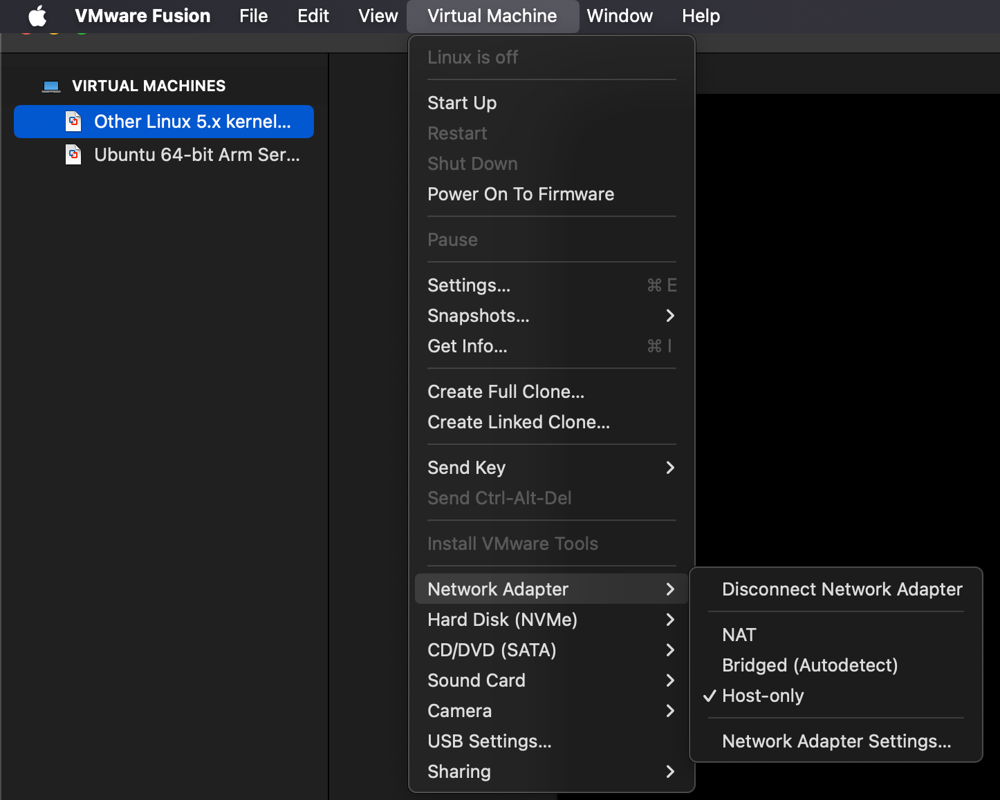

# 1. Bridged Networking
- Cách hoạt động: Máy ảo (VM) sẽ kết nối trực tiếp vào mạng vật lý (LAN) thông qua card mạng của máy thật (host).
- Máy ảo giống như một máy tính thật trong mạng LAN. Nó sẽ nhận IP từ DHCP của router/switch trong mạng thật hoặc bạn có thể gán IP thủ công.

Ví dụ: Nếu mạng LAN bạn có dải 192.168.1.0/24 thì máy ảo cũng nhận IP như 192.168.1.50 và có thể ping trực tiếp với các máy khác trong LAN.

Ứng dụng:
- **Dùng khi cần máy ảo tham gia trực tiếp vào mạng thật.**

Ví dụ: chạy server trên máy ảo để các máy khác trong LAN truy cập.


Virtual Ethernet adapter trên VM sẽ kết nối đến VMnet0 switch và thông qua Virtual bridge để kết nối đến Host Ethernet adapter. Vậy nên trong trường hợp này bạn sẽ không thấy có VMnet Card nào được tạo thêm. Lúc này VM và Host sẽ cùng chung đường mạng và VM có thể nhận IP tự động từ DHCP server hoặc thiết lập thủ công. Như vậy trên đường mạng này, tương tác của máy ảo và các thành phần khác sẽ có tính 2 chiều giống như Host.

# 2. NAT (Network Address Translation)
- Cách hoạt động: Máy ảo sẽ chia sẻ IP với máy thật. VMware sẽ tạo một bộ định tuyến ảo (VMware NAT Device), cho máy ảo 1 IP riêng (mạng ảo, ví dụ 192.168.200.0/24), nhưng khi ra ngoài internet nó dùng chung IP của host.
- Máy ảo có thể ra Internet thông qua IP của host, nhưng từ mạng ngoài (LAN hoặc Internet) sẽ không truy cập trực tiếp được vào VM (trừ khi cấu hình port forwarding).

Ví dụ: Host có IP LAN là 192.168.1.10, máy ảo có IP 192.168.200.5 (mạng ảo riêng). Khi VM truy cập web, bên ngoài chỉ thấy IP 192.168.1.10.

Ứng dụng:
- **Dùng khi muốn máy ảo ra Internet nhưng không cần truy cập từ ngoài vào.**

An toàn hơn so với Bridged vì cô lập hơn.


Virtual Ethernet adapter trên VM sẽ kết nối đến VMnet8 switch và nhờ hỗ trợ của NAT device để kết nối đến mạng vật lý bên ngoài (nhưng các thiết bị ngoài mạng vật lý không thể chủ động khởi tạo kết nối đến máy ảo). Lúc này VM và Host sẽ cùng khác đường mạng và VM có thể nhận IP tự động từ DHCP server hoặc thiết lập thủ công. Trong trường hợp này, khi kiểm tra Network Connections trên Host, bạn sẽ thấy có thêm VMware Network Adapter VMnet8 được tạo ra.

# 3. Host-only
- Cách hoạt động: Tạo mạng ảo riêng giữa host và các máy ảo, không kết nối ra mạng thật hoặc Internet.
- VMware sẽ tạo một virtual switch (VMnet1) để kết nối host và VM. VM nhận IP từ DHCP của VMware hoặc tự gán.

Ví dụ: Host có IP 192.168.56.1 (VMware Host Adapter), VM có IP 192.168.56.101. Chúng ping nhau được, nhưng VM không truy cập Internet.

Ứng dụng:
- **Dùng khi cần môi trường test cô lập hoàn toàn (lab, mô phỏng mạng).**
- Tránh ảnh hưởng đến mạng thật.


Virtual Ethernet adapter trên VM và Host Ethernet adapter sẽ cùng kết nối đến VMnet1 switch để tạo thành một mạng cô lập (chỉ có VM và Host giao lưu phối hợp với nhau và VM không có kết nối đến mạng vật lý bên ngoài). Lúc này VM và Host sẽ cùng chung đường mạng và VM có thể nhận IP tự động từ DHCP server hoặc thiết lập thủ công. Trong trường hợp này, khi kiểm tra Network Connections trên Host, bạn sẽ thấy có thêm VMware Network Adapter VMnet1 được tạo ra.

# 4.Sử dụng chế độ mạng NAT để truy cập Internet

Bước 1: Cấu hình NAT trên VMware Fusion
1. Tắt máy ảo
2. Chọn máy ảo CentOS 9 trong VMware Fusion


3. Chọn Setting → Chọn Share with my Mac (NAT).
- Chế độ này sẽ cho phép máy ảo dùng IP nội bộ và truy cập Internet thông qua IP của máy Mac.

Bước 2: Kiểm tra và kết nối internet
1. Ping kiểm tra kết nối internet
```plaintext 
ping 8.8.8.8 
```

Nếu nhận được phản hồi, máy ảo đã kết nối internet thành công.


# 5.Sử dụng chế độ card Host-only để 2 máy ảo kết nối với nhau
Bước 1: Cấu hình card mạng Host-Only trên VMware

1. virtual machine → Chọn Network Adapter → Tích chọn Host-Only 


2. Lặp lại các bước trên Unbuntu Server.

3. Kiểm tra kết nối giữa 2 máy ảo:

Từ CentOS 9 ping tới Ubuntu Server:
```plaintext 
ping 8.8.8.8
```

kết quả ping thành công:


Từ Ubuntu Server ping tới CentOS 9:

```plaintext 
ping 8.8.8.8
```

Kết quả ping thành công:


# 6.Sử dụng 1 card Bridged để từ máy ảo ping ra máy laptop cá nhân
CentOS 9:

Bước 1: Cài đặt card mạng ở chế độ Bridged

- Tắt máy ảo (Nếu đang chạy).
- Chọn máy ảo (CentOS 9 hoặc Ubuntu Server) →  virtual machine 
- Chọn Network Adapter: Chọn Bridged (Directly connect to the physical network) 


Bước 2:máy ảo ping ra máy laptop cá nhân


**ping từ laptop vào máy ảo tương tự**

1. mở terminal:

2. kiểm tra địa chỉ ip trên laptop

```plaintext 
ifconfig

```

3. Từ Mac ping thử máy ảo:
```plaintext 
ping 192.168.3.180
```


terminal hiện vậy là ping được


# 7.SNAT và DNAT
1. SNAT (Source Network Address Translation)
- Ý nghĩa: Dịch địa chỉ nguồn trong gói tin.
- Mục đích: Giúp nhiều máy trong mạng LAN (IP private) có thể truy cập Internet thông qua 1 địa chỉ IP public duy nhất.
- Cách hoạt động:

Máy trong LAN gửi gói tin ra ngoài, gói tin có địa chỉ nguồn là IP private.

Router/Firewall thực hiện SNAT, thay địa chỉ nguồn thành IP public.

Khi gói tin quay trở lại, thiết bị NAT dịch ngược địa chỉ đích từ IP public → IP private để chuyển đến đúng máy trong LAN.

- Ví dụ:

Máy trong LAN: 192.168.1.10 → gửi ra Internet.
SNAT đổi src=192.168.1.10 thành src=203.0.113.5 (IP public).

2. DNAT (Destination Network Address Translation)
- Ý nghĩa: Dịch địa chỉ đích trong gói tin.
- Mục đích: Cho phép các máy bên ngoài Internet truy cập vào dịch vụ trong LAN (server nằm sau NAT).
- Cách hoạt động:

Gói tin từ Internet có đích là IP public của router/firewall.

Router/Firewall thực hiện DNAT, đổi địa chỉ đích thành IP private của server trong LAN.

Server trả lời, thiết bị NAT dịch ngược địa chỉ nguồn để gói tin đi ra ngoài đúng với IP public.
-  Ví dụ:

Người dùng ngoài Internet muốn truy cập Web server trong LAN.

Họ gõ 203.0.113.5:80.

DNAT đổi dst=203.0.113.5 thành dst=192.168.1.100 (server web trong LAN).

3. So sánh SNAT và DNAT

| Tiêu chí        | **SNAT** (Source NAT)       | **DNAT** (Destination NAT)             |
| --------------- | --------------------------- | -------------------------------------- |
| Dịch địa chỉ    | Nguồn (Source)              | Đích (Destination)                     |
| Ứng dụng chính  | LAN truy cập Internet       | Internet truy cập vào server trong LAN |
| Ví dụ điển hình | Máy tính → Web              | Web server trong LAN ← Internet        |
| Vị trí dùng     | Outbound traffic (ra ngoài) | Inbound traffic (từ ngoài vào)         |

Tóm lại:
- SNAT: LAN đi ra ngoài → đổi địa chỉ nguồn.
- DNAT: Internet đi vào trong → đổi địa chỉ đích.

