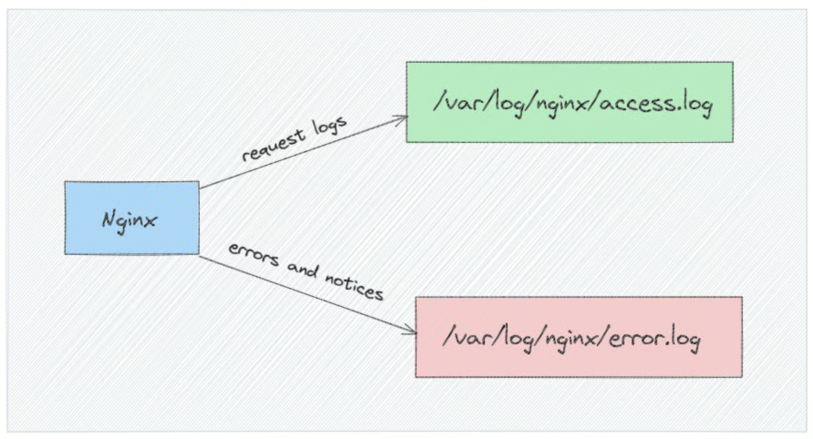
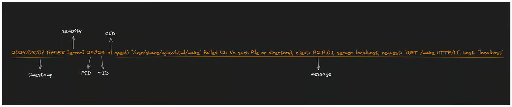

# File log

Log của Nginx đóng vai trò quan trọng trong việc giám sát hiệu suất máy chủ, chẩn đoán sự cố và tăng cường bảo mật ứng dụng web. Việc cấu hình đúng log Nginx cho phép bạn thu thập thông tin chi tiết về hoạt động của máy chủ, hỗ trợ khắc phục sự cố và tối ưu hóa hệ thống.

## Tại Sao Log Nginx Quan Trọng?

Log của Nginx rất quan trọng trong việc quản lý máy chủ, cung cấp thông tin chi tiết về hành vi của máy chủ, bao gồm các yêu cầu từ phía client, tương tác và các lỗi xảy ra. Một số lợi ích chính của việc cấu hình log Nginx tốt bao gồm:

- Chẩn đoán sự cố nhanh chóng : Xác định lỗi và các nút thắt cổ chai về hiệu suất.
- Giám sát lưu lượng : Hiểu hành vi người dùng và lưu lượng truy cập.
- Đảm bảo bảo mật : Phát hiện và ứng phó với các hoạt động đáng ngờ.

NGINX viết hai loại nhật ký cụ thể: Error.log và Access.log.

## Vị trí nhật ký và cấu hình

Giống như hầu hết các máy chủ web, Nginx ghi lại các hoạt động của mình một cách tỉ mỉ trong hai tệp nhật ký riêng biệt:

- Nhật ký truy cập : Tệp này ghi lại từng yêu cầu đến, ghi lại các chi tiết quan trọng như địa chỉ IP của máy khách, dấu thời gian của yêu cầu, tài nguyên được yêu cầu (URI), mã trạng thái HTTP của phản hồi và tác nhân người dùng của máy khách (trình duyệt và hệ điều hành).

- Nhật ký lỗi : Tệp này đóng vai trò như một công cụ chẩn đoán, ghi lại các lỗi và sự cố gặp phải trong quá trình xử lý yêu cầu và các hoạt động khác của Nginx. Tệp này ghi lại thông tin như dấu thời gian, mức độ lỗi, thông báo lỗi và bất kỳ ngữ cảnh liên quan nào để hỗ trợ khắc phục sự cố.

## Cấu Hình Log Trong File Cấu Hình Nginx

Để tùy chỉnh cấu hình log, chỉnh sửa file cấu hình Nginx. Mở file bằng trình chỉnh sửa yêu thích:

    sudo vi /etc/nginx/nginx.conf

By default, all access logs have a standard format are set in the `nginx.conf` file with the access_log directive. The format looks like this:

`access_log` `log_file` `log_format`

     error_log /var/log/nginx/error.log

     http {
      . . .
     access_log  /var/log/nginx/access.log;
      . . .
    }

Theo mặc định, Nginx áp dụng `error_log` chỉ thị trên toàn cầu, trong khi chỉ thị `access_log` thường được đặt trong `http` khối.

Bạn có thể sử dụng `tail` lệnh để xem nội dung của các tệp này theo thời gian thực:

     sudo tail -f /var/log/nginx/access.log

     sudo tail -f /var/log/nginx/error.log

## Cấu trúc file log của Nginx

### 1. Cấu trúc access log (định dạng combined mặc định)

Theo cấu hình mặc định, Nginx sử dụng định dạng combined cho access log, được định nghĩa như sau:

    log_format combined '$remote_addr - $remote_user [$time_local] '
                        '"$request" $status $body_bytes_sent '
                        '"$http_referer" "$http_user_agent"';

Trong đó:

| Biến               | Ý nghĩa                                                                                                 |
| ------------------ | ------------------------------------------------------------------------------------------------------- |
| `$remote_addr`     | Địa chỉ IP của client (người gửi yêu cầu)                                                               |
| `$remote_user`     | Tên đăng nhập của client (nếu có xác thực), nếu không có sẽ hiển thị `-`.                               |
| `$time_local`      | Thời gian cục bộ (theo múi giờ máy chủ) khi nhận được yêu cầu (định dạng `dd/MMM/YYYY:HH:MM:SS +zzzz`). |
| `$request`         | Dòng yêu cầu HTTP đầy đủ gồm phương thức, URI và giao thức (ví dụ `"GET /index.html HTTP/1.1"`).        |
| `$status`          | Mã trạng thái HTTP mà máy chủ trả về (ví dụ 200, 404, 500, ...).                                        |
| `$body_bytes_sent` | Số byte của phần thân (body) phản hồi đã gửi tới client (không bao gồm headers).                        |
| `$http_referer`    | URL của trang giới thiệu (referrer) – trang chứa liên kết đến tài nguyên được yêu cầu.                  |
| `$http_user_agent` | Chuỗi User-Agent của client (tương ứng thông tin trình duyệt hoặc bot của client).                      |

Trong ví dụ trên, `$remote_user` thường là `-` nếu không bật cơ chế xác thực trên Nginx. Tổng thể, một dòng trong access log theo **Combined format** thường có dạng:

    <IP> - <user> [<time_local>] "<method> <uri> <protocol>" <status> <bytes_sent> "<referrer>" "<user_agent>"

Ví dụ: 

Chúng ta hãy phân tích ý nghĩa của từng mã thông báo trong nhật ký:

- `172.17.0.1`: Địa chỉ IP của máy khách đã đưa ra yêu cầu.
- `-`: Nếu sử dụng xác thực, đây là tên người dùng đã được xác thực; nếu không, đây là dấu gạch nối (-).
- `[27/May/2025:16:37:59 +0000]`: Giờ địa phương khi yêu cầu được xử lý.
- `"GET / HTTP/1.1"`: Phương thức yêu cầu, đường dẫn và phiên bản giao thức HTTP.
- `200`: Mã trạng thái HTTP trả về cho máy khách.
- `615`: Kích thước của nội dung phản hồi tính bằng byte.
- `"-"`: URL của trang giới thiệu (nếu có).
- `"Mozilla/5.0 (X11; Linux x86_64; rv:128.0) Gecko/20100101 Firefox/128.0"`- Thông tin về trình duyệt và hệ điều hành do khách hàng cung cấp.
- `"-"`: Nếu yêu cầu được chuyển qua proxy, biến này sẽ chứa địa chỉ IP gốc của máy khách.

### 2. Cấu hình nhật ký lỗi Nginx

Error log của Nginx lưu các thông báo về sự cố và thông tin vận hành ở các mức độ khác nhau. 

The error_log directive controls Nginx's error logging behavior. It accepts two parameters: the path of the log file, and the minimum severity level of the log.

      error_log /var/log/nginx/error.log <severity_level>;

Nginx phân loại các thông báo nhật ký lỗi thành các cấp độ sau, từ mức độ nghiêm trọng thấp nhất đến cao nhất:

- `debug`: Các thông báo có độ chi tiết cao chủ yếu được sử dụng để khắc phục sự cố và phát triển.
- `info`: Thông báo thông tin chung về hoạt động của máy chủ.
- `notice`: Những sự kiện đáng chú ý không nhất thiết là lỗi.
- `warn`: Những sự việc bất ngờ có thể báo hiệu những vấn đề tiềm ẩn.
- `error`: Lỗi thực tế gặp phải trong quá trình xử lý.
- `crit`: Các tình trạng quan trọng cần được chú ý.
- `alert`: Những lỗi cần phải xử lý ngay lập tức.
- `emerg`: Lỗi nghiêm trọng khiến hệ thống không sử dụng được.

#### 1. Định dạng nhật ký lỗi Nginx

Nhật ký lỗi Nginx tuân theo định dạng được thiết kế để người dùng dễ đọc và các công cụ có thể phân tích cú pháp dễ dàng. Định dạng chung là:

    <ngày giờ> [<level>] <pid>#<tid>: *<cid> <thông điệp lỗi>, client: <client_IP>, server: <server_name>, request: "<method> <uri> <protocol>", host: "<host>"

Trong đó:
- `<ngày giờ>`: Thời điểm xảy ra sự kiện (mặc định dạng dd/Mon/YYYY:HH:MM:SS hoặc YYYY/MM/DD HH:MM:SS). Ví dụ: 20/Nov/2024:14:00:00.
- `[<level>]`: Mức độ nghiêm trọng của thông báo. Nginx hỗ trợ các mức sau (từ chi tiết nhất đến nghiêm trọng nhất): `debug`, `info`, `notice`, `warn`, `error`, `crit`, `alert`, `emerg`. Ví dụ `[error]`, `[warn]`…; mỗi mức sẽ bao gồm tất cả thông báo ở mức cao hơn.
- `<pid>#<tid>`: Mã tiến trình (PID) và luồng (thread) xử lý yêu cầu. Ví dụ 1234#0.
-`*<cid>` (nếu có): Mã tham chiếu kết nối (connection ID) cho biết yêu cầu hiện tại (ví dụ `*10` trong ví dụ dưới).
- **Thông điệp lỗi**: Văn bản mô tả sự cố cụ thể, thường bao gồm tên hàm hệ thống và mô tả lỗi. Ví dụ: `open() "/var/www/html/test-page.html" failed (2: No such file or directory)` – nghĩa là không tìm thấy file test-page.html.
- Sau phần thông điệp lỗi, có thể xuất hiện các trường thông tin `client: <IP>`, `server: <tên server>`, `request: "<METHOD URI HTTP/VERSION>"`, `host: "<Host_header>"` để cung cấp ngữ cảnh về client và yêu cầu. Ví dụ: `client: 127.0.0.1, server: my-local-server.com, request: "GET /test-page.html HTTP/1.1", host: "example.com"`

#### 2. Ghi lỗi vào nhiều tệp

Tương tự như nhật ký truy cập, bạn có thể cấu hình Nginx để ghi lỗi vào nhiều tệp, ngay cả với các mức độ nghiêm trọng khác nhau:

     error_log /var/log/nginx/error.log info;
     error_log /var/log/nginx/emerg_error.log emerg;

Trong thiết lập này, tất cả các sự kiện ngoại trừ thông báo cấp gỡ lỗi sẽ được ghi vào `error.log`, trong khi các sự kiện khẩn cấp sẽ được ghi vào một tệp riêng có tên `emerg_error.log`.

#### 3.TẮT ERROR LOG

Đôi khi hệ thống hoạt động ổn định, cảm thấy việc ghi log không cần thiết để giảm tiêu tốn tài nguyên bạn có thể Disable Error Log đi, bạn sửa lại chỉ thị error_log như sau:

     error_log /dev/null error;

Chỉ thị trên có nghĩa toàn bộ log lỗi sẽ được đưa vào. /dev/null`.

`/dev/null` là gì ? Đây là một loại file rất đặc biệt trên linux bạn cần chú ý. `/dev/null` nó giống như kiểu hố đen vũ trụ nó nuốt tất cả mọi thứ và không trả lại bất kỳ cái gì.

Trong công tác bảo mật hạn chế tấn công DDOS nó đóng vai trò rất quan trọng. Những request vi phạm chính sách bảo mật sẽ đưa vào `/dev/null` hệ thống sẽ không ghi nhận lỗi gì. Mục đích giảm tải cho CPU, bởi kể cả việc ghi log ít nhiều cũng tiêu tôn tài nguyên. Khi dùng `/dev/null`, thậm chí dữ liệu ghi vào nhiều đến đâu đi chăng nữa dung lượng ổ cứng của bạn cũng không tăng lên chút nào.

## Kiểm Tra và Reload Nginx
Sau khi chỉnh sửa, kiểm tra cấu hình để phát hiện lỗi:

     sudo nginx -t

Nếu không có lỗi, reload Nginx:

    sudo systemctl reload nginx

### Log Format Trong Nginx

Log format xác định cấu trúc của các dòng log, cho phép bạn thu thập dữ liệu cụ thể về yêu cầu và phản hồi của máy chủ.
Mặc định, Nginx sư dụng log format đơn giản để ghi lại các thông tin cơ bản trong tệp access.log.
Bạn có thể tuỳ chỉnh log format để bao gồm các thông tin chi tiết chi cần.

1. Log Format Mặc Định

Log format mặc định của Nginx là combined, bao gồm các chi tiết cơ bản về yêu cầu và phản hồi:

    log_format combined '$remote_addr - $remote_user [$time_local] '
                    '"$request" $status $body_bytes_sent '
                    '"$http_referer" "$http_user_agent"';

2. Log Format Mặc Định Sample

       146.70.46.34 - - [20/Dec/2024:10:18:42 +0000] "GET /index.php HTTP/1.1" 304 0 "-" "Mozilla/5.0 (Macintosh; Intel Mac OS X 10_15_7) AppleWebKit/537.36 (KHTML, like Gecko) Chrome/131.0.0.0 Safari/537.36" "-"

3. Tùy Chỉnh Log Format

Bạn có thể định nghĩa các log format tùy chỉnh để thu thập thêm dữ liệu hoặc đơn giản hóa các dòng log. Sử dụng directive log_format để tạo format và gán tên cho nó.

#### Ví Dụ 1: Log Format Tối Giản
Format nhẹ nhàng để giám sát hiệu suất:

      log_format minimal '$remote_addr. - $status [$time_local]. "$request"';

     access_log /var/log/nginx/access_minimal.log minimal;

#### Ví Dụ 2: Log Format Chi Tiết
Thu thập dữ liệu đầy đủ để phân tích chi tiết:

     log_format detailed  '$remote_addr - $remote_user [$time_local] "$request" '
                      '$status $body_bytes_sent "$http_referer" '
                      '"$http_user_agent" "$http_x_forwarded_for"'
                      '$request_time $upstream_response_time';

     access_log /var/log/nginx/access_detailed.log detailed;

- $http_x_forwarded_for: Trong Nginx, biến $http_x_forwarded_for có thể được sử dụng để truy cập giá trị của header X-Forwarded-For. Thông thường, nó được dùng để:
  - Ghi log địa chỉ IP thật của client trong file log truy cập (access.log).
  - Kiểm tra và chặn các IP cụ thể khi yêu cầu đi qua proxy.
  - Dùng khi thông qua Proxy hoặc Load balancer
- $request_time: tổng thời gian theo đơn vị giây(s) mà Nginx sử dụng để xử lý một yêu cầu HTTP, tính từ lúc nhận được yêu cầu từ client cho đến khi phản hồi được gửi xong
  - Bao gồm: Thời gian nhận dữ liệu yêu cầu từ client, Thời gian xử lý yêu cầu trong Nginx (bao gồm truy vấn upstream nếu có), Thời gian gửi phản hồi đến client
  - Nếu `$request_time = 0.5`, điều này có nghĩa là Nginx mất tổng cộng 0.5 giây để hoàn tất yêu cầu từ client.
- $upstream_response_time: Đây là thời gian theo đơn vị giây(s) mà Nginx chờ đợi và nhận phản hồi từ upstream server (như PHP-FPM, một API server hoặc một máy chủ back-end khác).
   - Bao gồm: Thời gian bắt đầu kết nối với upstream, Thời gian để upstream xử lý và gửi dữ liệu phản hồi đầu tiên.

**Kết quả ví dụ log chi tiết:**

     118.70.241.180 - - [26/Nov/2025:06:20:21 +0000] "GET / HTTP/1.1" 200 34130 "-" "Mozilla/5.0 (Macintosh; Intel Mac OS X 10_15_7) AppleWebKit/537.36 (KHTML, like Gecko) Chrome/142.0.0.0 Safari/537.36" "-" 0.073 0.073

#### Ví Dụ 3: Log Format JSON
Định dạng log dưới dạng JSON để dễ dàng tích hợp với các hệ thống phân tích log
.Thay vì ghi kiểu truyền thống.
Nó sẽ ghi theo định dạng JSON, dễ đưa vào ELK, Loki, Splunk, Datadog.

Thêm cấu hình sau trong block `http`:

✅ Lợi ích:

- `escape=json` → log ra JSON, dễ parse, dễ gửi vào ELK/Loki/Fluentd.
- Có cả `$remote_addr` + `$http_x_forwarded_for` → biết IP thật ngay cả khi có proxy.
- Có thông tin request, user agent, referrer → hữu ích cho phân tích traffic & debug.
- Ghi request time và upstream time → monitor performance.

**Kết quả ví dụ log JSON:**

Thực tế trên Server, Log sẽ không có xuống dòng như trên mà sẽ là **1 dòng dài**.

    {"time":"2025-12-04T14:02:01+07:00","remote":"127.0.0.1","method":"GET","uri":"/","status":200,"body_bytes":612}

Thêm cấu hình sau trong block `http`:

**Lưu ý**

Mỗi khi. thay đổi cấu hình log, hãy kiểm tra cấu hình Nginx và reload dịch vụ để áp dụng thay đổi.

     sudo nginx -t

     sudo systemctl reload nginx
     # Hoặc
     sudo service nginx reload

## Nhật ký NGINX theo tên miền

Theo mặc định, NGINX sẽ lưu trữ tất cả nhật ký dưới dạng một mục nhật ký trên máy chủ, nhưng nếu bạn triển khai nhiều tên miền trên cùng một máy chủ thì điều này rất bất tiện. Đó là lý do tại sao bạn có tùy chọn cấu hình nhật ký cho từng tên miền (cả nhật ký truy cập và nhật ký lỗi) và bạn thực hiện việc này thông qua tệp VirtualHosts trên máy chủ.

Sử dụng các ví dụ và định dạng được cung cấp ở trên, tệp máy chủ ảo của bạn sẽ trông như thế này cho các tên miền duy nhất:

Trong ví dụ trên, bạn thấy domain1 và domain2 đều có nhật ký truy cập và lỗi riêng. Bạn cũng nhận thấy rằng bạn có tùy chọn thiết lập mức độ nghiêm trọng cho từng miền (ví dụ: cảnh báo, gỡ lỗi).

tham khảo:

https://betterstack.com/community/guides/logging/how-to-view-and-configure-nginx-access-and-error-logs/?_gl=1*1gjor4w*_gcl_au*MTcwOTg0MjI0MS4xNzY0ODMyODA2*_ga*Mzk3NjEyODU4LjE3NjQ4MzI4MDY.*_ga_9FLKD0MQYY*czE3NjQ4NDA0MDAkbzIkZzAkdDE3NjQ4NDA0MDAkajYwJGwwJGgw#disabling-the-error-log

