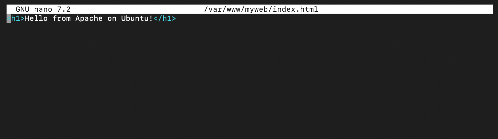
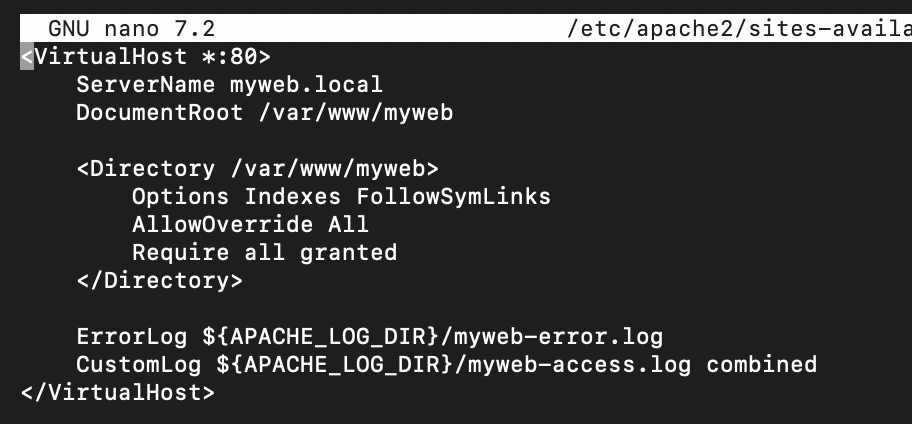
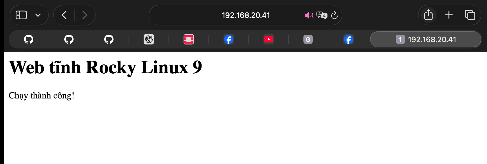
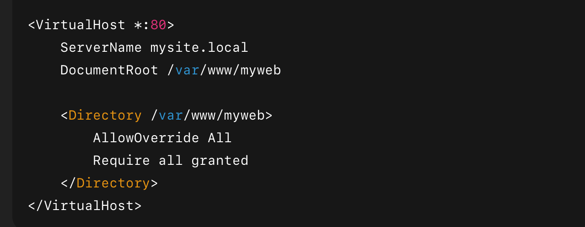
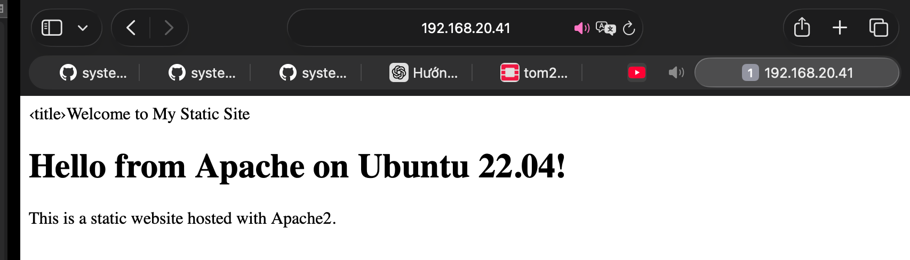

Mặc định, Apache sử dụng thư mục `/var/www/html/` để lưu trữ website. Có thể tạo một trang web tĩnh trong thư mục này hoặc cấu hình thư mục riêng.

Thông thường, website sẽ ưu tiên chạy vào file có trên index (ví dụ: index.html, index.css, index.js)

VD: Trong folder html có 3 file html như: dashboard.html, card.html, index.html thì khi đứng tại thư mục dashboard trên trình duyệt, file index.html sẽ được hiển thị.

# Cấu hình một web tĩnh với Apache

## Ubuntu

1. Cài Apache

     
       sudo apt update
       sudo apt install apache2 -y

Kiểm tra Apache chạy:

     systemctl status apache2

Nếu chưa start:

     sudo systemctl start apache2
     sudo systemctl enable apache2

2. Tạo thư mục web tĩnh

Ví dụ tạo website myweb:

    sudo mkdir -p /var/www/myweb

Set quyền:

    sudo chown -R $TOM:$TOM /var/www/myweb

Tạo file index:

    nano /var/www/myweb/index.html

Dán vào:

3. Tạo Virtual Host

Tạo file cấu hình cho site:

    sudo nano /etc/apache2/sites-available/myweb.conf

Dán nội dung:

Bước 6: Kích hoạt website mywebsite và tắt site mặc định

    sudo a2ensite mywebsite.conf
    sudo a2dissite 000-default.conf
    sudo systemctl reload apache2

Bước 7: Kiểm tra cấu hình trước khi khởi động lại

     sudo apache2ctl configtest

Nếu hiển thị `Syntax OK` ->Cấu hình hợp lệ.

Bước 8: Check Firewall (UFW) có mở không thì phải mở port 80

Bước 9: Kiểm tra hoạt động

Mở trình duyệt hoặc dùng lệnh Curl:

    http://localhost
      # hoặc
    http://<địa_chỉ_IP_server>

Nếu thấy nội dung trang HTML bạn tạo ->Thành công

Bước 10: (Khuyến nghị)Cấu hình Website theo cấu trúc thư mục chuẩn cho web tĩnh

      /var/www/mywebsite/
       ├── index.html
       ├── css/
       │   └── style.css
       ├── js/
       │    └── script.js
       └── images/
             └── logo.png

## Rocky 9

### 1. Cấu hình Web tĩnh với Apache trên Rocky 9

Bước 1: Cài Apache

     sudo dnf install httpd -y

Bước 2: Start + Enable service

     sudo systemctl start httpd
     sudo systemctl enable httpd
     sudo systemctl status httpd

Bước 4: Tạo thư mục chứa web tĩnh
Thư mục mặc định:

`/var/www/html`

Bạn có thể đưa file:

`/var/www/html/index.html`

Ví dụ:

    sudo tee /var/www/html/index.html <<EOF
    <h1>Web tĩnh Rocky Linux 9</h1>
    
Chạy thành công!

    EOF

Bước 5: Phân quyền

    sudo chown -R apache:apache /var/www/html
    sudo chmod -R 755 /var/www/html

Bước 6: Kiểm tra

Mở trình duyệt và truy cập:

      http://<server-ip>

### 2. Cấu hình Web tĩnh bằng VirtualHost (nếu có nhiều website)

Tạo file cấu hình:

     sudo vi /etc/httpd/conf.d/myweb.conf

Nội dung:

Tạo thư mục chứa web:

     sudo mkdir -p /var/www/myweb
     sudo vi /var/www/myweb/index.html

Restart lại Apache:

     sudo systemctl restart httpd

Mở trình duyệt và truy cập:

      http://<server-ip>

