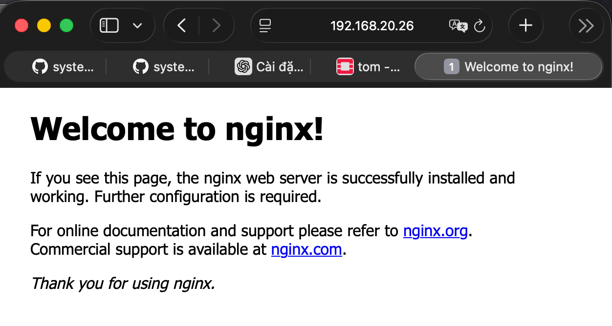

# Ubuntu
1. Cập nhật hệ thống

       sudo apt update && sudo apt upgrade -y

2. Cài đặt Nginx

       sudo apt install nginx -y

3. Khởi động và bật Nginx chạy cùng hệ thống

       sudo systemctl start nginx
       sudo systemctl enable nginx

4. Kiểm tra trạng thái Nginx

       sudo systemctl status nginx

Nếu thấy `active (running)` là ok.

5. Mở port trên firewall (nếu dùng UFW)

Cho phép HTTP và HTTPS:

    sudo ufw allow 'Nginx Full'
    sudo ufw reload

6. Kiểm tra Nginx hoạt động chưa

Truy cập trình duyệt:

       http://IP-server

# ROCKY LINUX

Bật EPEL repo (bắt buộc để có Nginx mới)

    sudo dnf install epel-release -y

2. Cài Nginx

       sudo dnf install nginx -y

3. Bật Nginx và chạy

       sudo systemctl enable --now nginx

4. Kiểm tra trạng thái

     sudo systemctl status nginx

Phải thấy:`active (running)`

5.  Mở firewall cho HTTP/HTTPS (nếu bạn bật firewalld)

        sudo firewall-cmd --add-service=http --permanent
        sudo firewall-cmd --add-service=https --permanent
        sudo firewall-cmd --reload

Hoặc mở port riêng:

    sudo firewall-cmd --add-port=8080/tcp --permanent
    sudo firewall-cmd --reload

6. Truy cập kiểm tra

Mở trình duyệt:

       http://IP-server