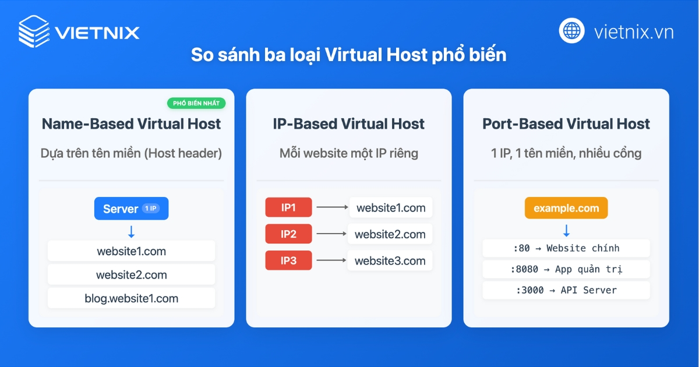
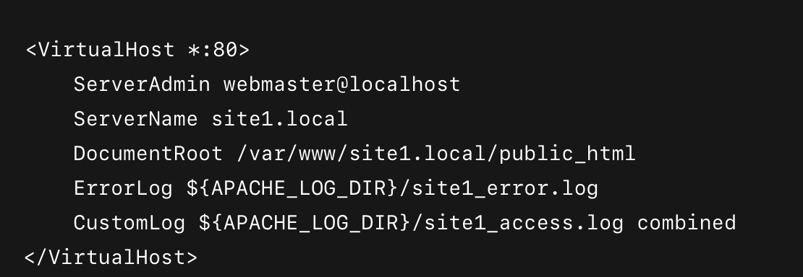
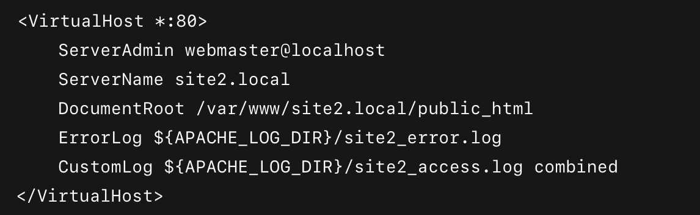
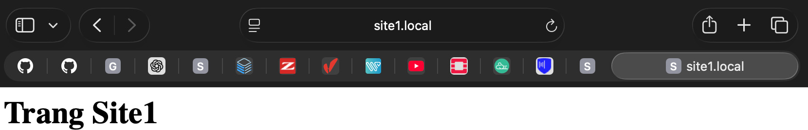
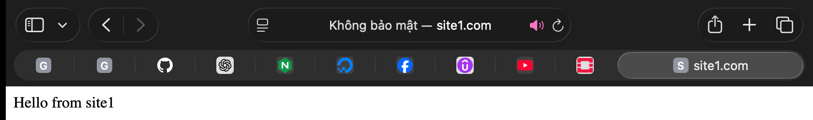
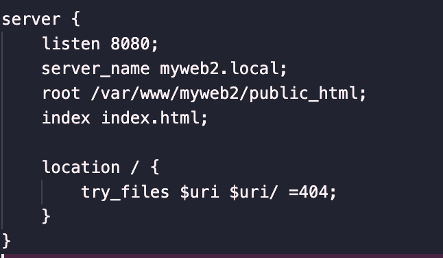
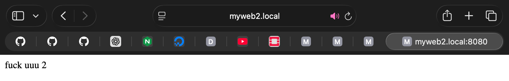
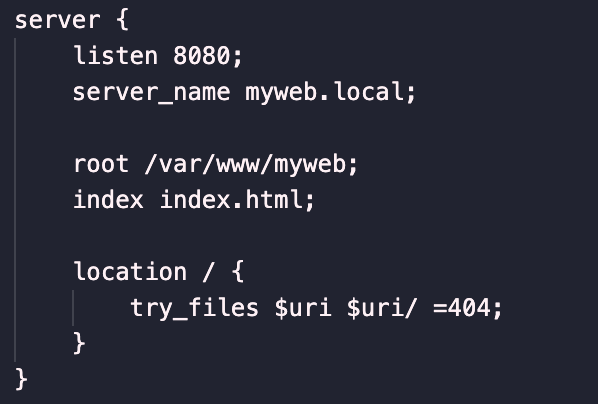
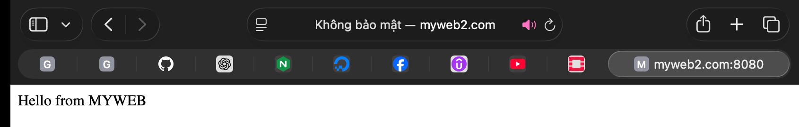

# Virtual Host trong Apache
## 1. Giới thiệu Virtual Host (Mục đích, lợi ích)

Có nghĩa là bạn không cần một server riêng cho mỗi website.

Chức năng chính của Virtual Hosts:

- **Phân biệt và định tuyến yêu cầu**: Dựa vào tên miền, địa chỉ IP hoặc cổng trong yêu cầu truy cập từ người dùng (client), web server sẽ xác định Virtual Host nào chịu trách nhiệm xử lý và trả về nội dung website tương ứng.
- **Quản lý tài nguyên**: Cho phép chia sẻ tài nguyên của server (CPU, RAM, băng thông) một cách hiệu quả cho nhiều website.
- **Phục vụ nội dung độc lập**: Mỗi Virtual Host có thể có thư mục chứa mã nguồn (document root), file log và các thiết lập cấu hình riêng biệt.

## 2. Các loại Virtual Host

Apache hỗ trợ ba hình thức Virtual Host chính: Name-based, IP-based, và Port-based. Sự khác biệt nằm ở cách Apache phân biệt các website:
- **Name-based Virtual Host**: Apache sử dụng header “Host” trong HTTP để xác định trang web. Nhiều tên miền (ví dụ `www.foo.com`, `www.bar.com`) cùng trỏ về một địa chỉ IP và cùng cổng (thường là 80), Apache sẽ dựa vào giá trị `ServerName/ServerAlias` để phân phối nội dung. Ưu điểm là dễ cấu hình và tiết kiệm địa chỉ IP, vì nhiều trang dùng chung một IP. **Đây là hình thức phổ biến nhất hiện nay.**
- **IP-based Virtual Host**: Mỗi website được gán một địa chỉ IP riêng trên máy chủ. Apache sẽ dựa vào địa chỉ IP của request để chọn trang web. Phương án này ít dùng do thiếu IP (đặc biệt với IPv4), chỉ cần thiết khi không thể dùng Name-based (ví dụ một số thiết bị cũ không hỗ trợ SNI cho HTTPS).
- **Port-based Virtual Host**: Sử dụng các cổng khác nhau trên cùng một IP để phân biệt website. Ví dụ, một site chạy trên port 80, site khác trên port 8080 hoặc 443. Ưu điểm là không cần thêm IP hay tên miền, nhưng người dùng phải chỉ định cổng khi truy cập (ví dụ `http://mysite.local:8080`), điều này có thể gây phiền hà và ít được dùng trên môi trường sản xuất. Port-based thường dùng cho phát triển hoặc khi thực sự cần tách dịch vụ trên cổng khác.

## 3.Chi tiết về Cách thức vận hành của Virtual Host

Cách thức vận hành của Virtual Hosts phụ thuộc vào loại máy chủ web và hệ thống quản lý máy chủ bạn đang sử dụng. Dưới đây là một phương pháp chung để cấu hình và vận hành Virtual Hosts trên một máy chủ web.

- Cấu hình DNS: Đầu tiên, bạn cần cấu hình DNS (Domain Name System) để định tuyến các tên miền cụ thể đến địa chỉ IP của máy chủ web. Bạn có thể thêm các bản ghi DNS A hoặc CNAME cho từng tên miền mà bạn muốn định tuyến đến máy chủ.
- Cấu hình máy chủ web: Tiếp theo, bạn cần cấu hình máy chủ web của mình để nhận và phản hồi đúng với các yêu cầu từ các tên miền khác nhau. Tùy thuộc vào máy chủ web bạn đang sử dụng, cấu hình này có thể được thực hiện trong các tập tin cấu hình như Apache's httpd.conf hoặc Nginx's nginx.conf.
- Xác định Virtual Hosts: Trong tập tin cấu hình của máy chủ web, bạn sẽ xác định các Virtual Hosts bằng cách định nghĩa các khối cấu hình cho mỗi tên miền. Mỗi Virtual Host bao gồm thông tin như tên miền, địa chỉ IP, thư mục gốc của trang web và các thiết lập bảo mật.
- Khai báo các thiết lập: Trong mỗi khối cấu hình Virtual Host, bạn có thể thực hiện các thiết lập cụ thể cho trang web đó. Điều này có thể bao gồm cấu hình SSL/TLS, thiết lập bảo mật, xác thực người dùng, quản lý phiên, và nhiều thiết lập khác tùy thuộc vào yêu cầu của ứng dụng web của bạn.
- Khởi động lại máy chủ web: Sau khi bạn đã hoàn tất cấu hình Virtual Hosts, bạn cần khởi động lại máy chủ web để áp dụng các thay đổi. Các yêu cầu truy cập đến tên miền đã cấu hình sẽ được định tuyến đúng Virtual Host tương ứng và trả về nội dung của trang web đó.

Quá trình cấu hình và vận hành Virtual Hosts có thể thay đổi tùy thuộc vào nền tảng máy chủ web bạn sử dụng. Một số máy chủ web phổ biến khác nhau bao gồm Apache, Nginx, Microsoft IIS, và Caddy. Bạn nên tham khảo tài liệu và hướng dẫn cụ thể của máy chủ web bạn để biết thêm chi tiết về cách thức cấu hình Virtual Hosts trên nền tảng đó.

## Cấu hình Virtual Host trong Apache (Cấu hình nhiều website trên 1 webserver)

### Ubuntu

✅ Mục tiêu
Thiết lập 2 website giả lập:
- site1.local
- site2.local

Cùng chạy trên máy chủ Apache Ubuntu.

Bước 1: Tạo thư mục cho từng website

     sudo mkdir -p /var/www/site1.local/public_html
     sudo mkdir -p /var/www/site2.local/public_html

Tạo trang index cho mỗi site:

     echo "<h1>Trang Site1</h1>" | sudo tee /var/www/site1.local/public_html/index.html
     echo "<h1>Trang Site2</h1>" | sudo tee /var/www/site2.local/public_html/index.html

Bước 2: Cấp quyền sở hữu thư mục

    sudo chown -R $USER:$USER /var/www/site1.local
    sudo chown -R $USER:$USER /var/www/site2.local

Đặt quyền đọc:

    sudo chmod -R 755 /var/www

Bước 3: Tạo file Virtual Host cho từng website

Tạo file cấu hình mới:

    sudo nano /etc/apache2/sites-available/site1.local.conf

Nội dung:

Tương tự với site2.local:

    sudo nano /etc/apache2/sites-available/site2.local.conf

Bước 4: Kích hoạt Virtual Host

    sudo a2ensite site1.local.conf
    sudo a2ensite site2.local.conf

Tùy chọn: tắt site mặc định nếu không cần:

     sudo a2dissite 000-default.conf

Bước 5: Kiểm tra cấu hình Apache

    sudo apache2ctl configtest

Nếu hiển thị Syntax OK, tiếp tục bước sau.

Bước 6: Reload Apache

    sudo systemctl reload apache2

Bước 7: Thêm domain vào file hosts

Mở file hosts:

     sudo nano /etc/hosts

Thêm dòng:

     ip của máy ảo   site1.local
     ip của máy ảo   site2.local

Bước 8:

Cấu hình file hosts (Trên máy cục bộ vì truy cập website tại đó)

Trên máy cục bộ:
Mở Terminal → chạy:

    sudo nano /etc/hosts

Thêm dòng:

     ip của máy ảo   site1.local
     ip của máy ảo   site2.local

Bước 9: Truy cập và kiểm tra

Mở trình duyệt và vào:

`http://site1.local`
`http://site2.local`

Bạn sẽ thấy nội dung HTML tương ứng từng site.

### Rocky9

1. Tạo thư mục website

Ví dụ bạn có 2 web: `site1.com` và `site2.com`
Tạo thư mục:

    sudo mkdir -p /var/www/site1
    sudo mkdir -p /var/www/site2

Thêm file index thử:

    echo "Hello from site1" | sudo tee /var/www/site1/index.html
    echo "Hello from site2" | sudo tee /var/www/site2/index.html

Phân quyền:

    sudo chown -R $USER:$USER /var/www/site1
    sudo chown -R $USER:$USER /var/www/site2

2. Tạo Virtual Host cho từng site

Tạo file cho site1

    sudo vi /etc/httpd/conf.d/site1.conf

Thêm nội dung:

Tạo file cho site2

    sudo nano /etc/httpd/conf.d/site2.conf

3. Kiểm tra cấu hình Apache

       sudo apachectl configtest

Nếu hiện:
`Syntax OK`
→ Là đúng.

4. Restart Apache

     sudo systemctl restart httpd

5. Trỏ domain (hoặc local test)

Nếu test trên máy local:

Sửa file hosts:

    sudo nano /etc/hosts

Thêm:
    
    ip rocky   site1.com
    ip rocky   site2.com

Xong! Truy cập thử:

`http://site1.com` → hiện Hello from site1
`http://site2.com` → hiện Hello from site2

# Virtual Host trong Nginx

VirtualHost là kỹ thuật cho phép một máy chủ web phục vụ nhiều tên miền khác nhau trên cùng một địa chỉ IP. Trong Nginx, khái niệm này được thực hiện qua **server block** (khối `server` trong cấu hình), tương đương với VirtualHost của Apache
. Mỗi server block định nghĩa một tên miền (hoặc nhiều tên) qua chỉ thị `server_name` và cổng nghe (`listen`), cùng với các thiết lập riêng (như đường dẫn gốc tài liệu, log, v.v.). Khi Nginx nhận một yêu cầu, nó sẽ so khớp trường Host trong HTTP với `server_name` của các server block để xác định khối xử lý phù hợp
. Nếu không có khối nào trùng tên, server block đánh dấu `default_server` (khối ngầm định) sẽ được dùng làm dự phòng

Hiểu đơn giản: Tưởng tượng một máy chủ vật lý như một tòa nhà văn phòng lớn. Mỗi Virtual Host là một "văn phòng" riêng biệt bên trong tòa nhà đó. Mỗi "văn phòng" có địa chỉ riêng (tên miền) và có thể chứa một website hoàn toàn khác biệt.

## Cách hoạt động của VirtualHost (Server Blocks)
Mỗi server block khai báo `listen` (ví dụ `listen 80;`) và server_name (ví dụ `example.com www.example.com;`). Nginx chọn khối phù hợp dựa trên sự kết hợp của địa chỉ IP:cổng (`listen`) và tên máy chủ (`server_name`) của yêu cầu
. Có thể dùng ký tự đại diện hoặc biểu thức chính quy trong server_name để bắt nhiều tên miền/phân trang. Trong mỗi cặp IP:cổng chỉ có một server block được đánh dấu `default_server` – khối này phục vụ nếu không có tên nào khớp
. Ví dụ trong cấu hình mặc định trên Ubuntu, server block duy nhất sử dụng `/var/www/html` là “default” (địa chỉ IP mặc định và cổng 80), còn các site khác phải khai báo `server_name` cụ thể. Trường hợp đặt nhầm `default_server` ở hai nơi sẽ gây lỗi trùng lặp (Nginx báo “duplicate default server”)
. Nói chung, thứ tự ưu tiên khi chọn server block là: khớp chính xác, khớp đại diện dài nhất, rồi đến khớp regex (theo thứ tự trong file)

## Cấu hình VirtualHost cho nhiều website

Tạo thư mục cho từng website

Tạo thư mục chứa mã nguồn của `myweb.local` và `myweb2.local`:

    sudo mkdir -p /var/www/myweb.local/public_html
    sudo mkdir -p /var/www/myweb2.local/public_html

Tạo file index.html cho từng website:

    echo "<h1>fuckk uuu</h1>" | sudo tee /var/www/myweb.local/public_html/index.html

    echo "<h1>fuckk uu 2</h1>" | sudo tee /var/www/myweb2.local/public_html/index.html

Cấp quyền cho thư mục:

    sudo chown -R www-data:www-data /var/www/myweb.local
    sudo chown -R www-data:www-data /var/www/myweb2.local
    sudo chmod -R 755 /var/www

- `chown -R www-data:www-data`: Gán quyền sở hữu thư mục cho user www-data (user mặc định của Nginx).
- `chmod -R 755 /var/www`: Cấp quyền đọc và thực thi cho mọi user, nhưng chỉ user sở hữu mới có quyền ghi.

Bước 4: Cấu hình VirtualHost cho từng website

Tạo file cấu hình cho myweb.local:

    sudo vi /etc/nginx/sites-available/myweb.local
Thêm nội dung sau:

Tạo file cấu hình cho myweb2.local:

    sudo vi /etc/nginx/sites-available/myweb2.local
Thêm nội dung sau:

Bước 5: Kích hoạt VirtualHost

Tạo liên kết sites-available sang sites-enabled

     sudo ln -s /etc/nginx/sites-available/myweb.local /etc/nginx/sites-enabled/
     sudo ln -s /etc/nginx/sites-available/myweb2.local /etc/nginx/sites-enabled/

Bước 6:Kiểm tra và restart Nginx

Chạy lệnh kiểm tra cấu hình:

     sudo nginx -t

nếu kết quả OK, khởi động lại Nginx:

    sudo systemctl restart nginx

Bước 7: Cấu hình file hosts trên máy tính cá nhân (Mac) và máy ảo

Mở terminal  và vào file `hosts`(mac) trên máy ảo tương tự

    sudo nano /etc/hosts

. Sau đó thêm vào cuối file:

     ip máy ảo myweb.local
     ip máy ảo myweb2.local

**Lưu ý**: safari phải có .local mới vào web đc

Lưu và đóng 

Bước 8: Kiểm tra website trên trình duyệt.

Lưu ý: Vì đã cấu hình virtualhost ở `Bước 4` với cổng 8080 nên khi truy cập, cần thêm :8080 đằng sau URL:

### Rocky9

`Bước 1` — Tạo thư mục cho từng website

    sudo mkdir -p /var/www/myweb
    sudo mkdir -p /var/www/myweb2

Tạo file index:

    echo "Hello from MYWEB" | sudo tee /var/www/myweb/index.html
    echo "Hello from MYWEB2" | sudo tee /var/www/myweb2/index.html

Phân quyền:

    sudo chown -R nginx:nginx /var/www/myweb
    sudo chown -R nginx:nginx /var/www/myweb2

`Bước 2` — Tạo Virtual Host cho từng domain

File 1: myweb.local

     sudo vi /etc/nginx/conf.d/myweb.conf

Dán nội dung:

Fille 2: myweb2.local

    sudo vi /etc/nginx/conf.d/myweb2.conf

Dán:

`Bước 3`— Kiểm tra cấu hình và restart Nginx

    sudo nginx -t
    sudo systemctl restart nginx

Nếu OK → Nginx đã nhận 2 Virtual Host.

`Bước 4` — Thêm hosts trên máy client (Mac của bạn)

Mở file hosts:

    sudo nano /etc/hosts

Thêm:

    IP máy Rocky bạn   myweb.com
    IP máy Rocky bạn   myweb2.com

Test

    http://myweb.local:8080
    http://myweb2.local:8080

Cả 2 web sẽ chạy độc lập.

**tài liệu tham khảo:**

https://vietnix.vn/virtual-hosts/