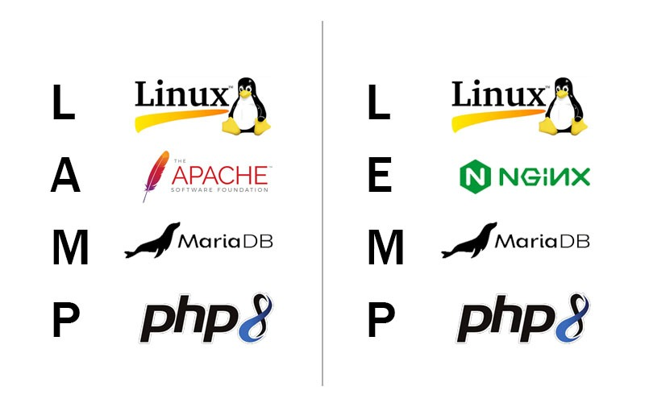

# Giới thiệu WordPress
WordPress là một hệ quản trị nội dung (CMS) mã nguồn mở, miễn phí, được xây dựng trên PHP và cơ sở dữ liệu MySQL. Ban đầu WordPress ra đời để tạo blog, nhưng hiện nay có thể dùng để tạo mọi loại website (blog cá nhân, trang doanh nghiệp, cửa hàng trực tuyến, diễn đàn, v.v.). Nó có giao diện quản trị thân thiện, hỗ trợ nhiều ngôn ngữ và có cộng đồng lớn nên rất được ưa chuộng.

WordPress phân phối theo giấy phép GPLv2 nên có thể tự do sử dụng, chỉnh sửa, và phân phối.

# Phân loại WordPress

Có hai “phiên bản” WordPress thường nhắc đến: **WordPress.com** và **WordPress.org**. Điểm khác biệt chính như sau:

- WordPress.com là dịch vụ hosting do Automattic (công ty đằng sau WordPress) cung cấp. Bạn chỉ cần đăng ký tài khoản là có thể tạo blog/website. Máy chủ, cập nhật, bảo trì… đều do họ lo. Có gói miễn phí (được dùng tên miền phụ như `tênbạn.wordpress.com`, bị giới hạn tính năng, có quảng cáo của WordPress.com) và các gói trả phí (không quảng cáo, nhiều tính năng hơn).
- WordPress.org là mã nguồn WordPress tự do tải về và cài đặt trên máy chủ của bạn. Bạn phải tự lo tên miền, hosting (có thể mua riêng hoặc dùng VPS miễn phí), và tự quản lý cập nhật, bảo mật. Ưu điểm là bạn có toàn quyền kiểm soát và có thể cài bất kỳ theme/plugin nào.

| Tiêu chí              | WordPress.org (self-hosted)                                                 | WordPress.com (hosting)                                                                                         |
| --------------------- | --------------------------------------------------------------------------- | --------------------------------------------------------------------------------------------------------------- |
| **Hosting**           | Bạn tự thuê hoặc dùng hosting riêng để cài WP.                              | Được WordPress.com cung cấp sẵn (gói free có giới hạn, gói trả phí được nhiều tính năng).                       |
| **Tên miền**          | Bạn mua tên miền riêng (ví dụ .com, .vn) hoặc dùng miễn phí (subdomain).    | Gói free chỉ được dùng tên miền phụ của WordPress.com, gói trả phí mới dùng được tên miền riêng.                |
| **Quyền kiểm soát**   | Toàn quyền thay đổi mã nguồn, giao diện, plugin….                           | Hạn chế hơn: plugin/theme chỉ dùng trong danh sách cho phép; không sửa được mã nguồn gốc.                       |
| **Plugin/Theme**      | Tự do cài đặt bất kỳ plugin hoặc theme nào (kể cả trả phí).                 | Chỉ dùng được plugin/theme giới hạn (chỉ gói Business mới cài được plugin ngoài).                               |
| **Chi phí**           | Mã nguồn miễn phí, bạn chỉ trả phí cho hosting và tên miền.                 | Có gói miễn phí cơ bản (kèm quảng cáo); gói trả phí (Premium/Business) tính phí hàng năm để nâng cấp chức năng. |
| **Quảng cáo**         | Không có quảng cáo bắt buộc.                                                | Gói miễn phí hiển thị quảng cáo của WordPress.com; muốn gỡ quảng cáo phải trả phí.                              |
| **Đối tượng phù hợp** | Những ai muốn kiểm soát hoàn toàn trang web và không ngại quản lý kỹ thuật. | Người mới hoặc ít quan tâm đến kỹ thuật, chỉ cần giải pháp dễ dùng, ít tùy chỉnh.                               |

Ví dụ:

# Các thành phần chính của WordPress

Một website WordPress cơ bản gồm ba thành phần chính:
- Source Code: Gồm WordPress Core (nhân WP), Theme (giao diện) và Plugin (tính năng mở rộng). Core là “cỗ máy” quản lý bài viết, người dùng, giao diện…; Theme điều khiển phần trình bày (màu sắc, bố cục, hiển thị nội dung) tại front-end; Plugin bổ sung tính năng (ví dụ giỏ hàng, liên hệ, SEO…).

- Cơ sở dữ liệu (Database): WordPress dùng MySQL (hoặc MariaDB) để lưu trữ dữ liệu văn bản như bài viết, trang, người dùng, cấu hình, v.v..Ví dụ các bài viết được lưu trong bảng `wp_posts`, bình luận trong `wp_comments`…
- Dữ liệu (Data): Gồm nội dung (text, bài viết) và Media (hình ảnh, video, file upload). Văn bản được lưu trong database, còn tệp media (ảnh, video, PDF…) được lưu trong thư mục `wp-content/uploads`.

Ngoài ra, WordPress sử dụng ngôn ngữ lập trình PHP và file cấu hình wp-config.php để kết nối và xử lý với CSDL. Khi cần mở rộng chức năng, thay vì sửa code lõi (core), ta thường cài thêm plugin hoặc chỉnh theme để dễ dàng nâng cấp.

# Quy trình hoạt động của một website WordPress

Bước 1: Người dùng gửi yêu cầu (HTTP Request)

- Người dùng truy cập URL.

- Trình duyệt gửi HTTP Request đến web server, kèm thông tin như cookies, headers, query string.

Bước 2: Web server xử lý và chuyển đến index.php

- Web server (Apache/Nginx) nhận yêu cầu và sử dụng `.htaccess` với `mod_rewrite`(Apache) hoặc rewrite rule trong cấu hình server block (Nginx) để định tuyến đến file `index.php` – điểm vào của WordPress.

Bước 3: Khởi động WordPress (Bootstrap)

- `index.php` gọi `wp-blog-header.php`, sau đó gọi `wp-load.php`.

- `wp-load.php` nạp file `wp-config.php` để kết nối cơ sở dữ liệu và tải hệ thống lõi WordPress (core files trong `wp-includes/`).

      index.php
      → wp-blog-header.php
        → wp-load.php
          → wp-config.php
            → wp-settings.php

Vai trò:

`wp-config.php`: chứa thông tin database
`wp-settings.php`: load toàn bộ hệ thống
👉 Tại đây WordPress:
- Load core
- Kết nối database
- Chuẩn bị môi trường runtime

Bước 4: Nạp plugin, theme và hooks ban đầu

- WordPress Load các plugin đã active `(/wp-content/plugins)`.

- Nạp theme hiện tại `(/wp-content/themes/...)`và file `functions.php` của theme.

Sau đó chạy các hook hệ thống đầu tiên:

| Hook           | Mục đích               |
| -------------- | ---------------------- |
| plugins_loaded | Plugin đã sẵn sàng     |
| init           | Đăng ký CPT, taxonomy  |
| wp_loaded      | WordPress đã load xong |

👉 Đây là nơi plugin & custom code "chèn" logic của mình.

Bước 5: Phân tích URL (Rewrite & Routing)

- WordPress so khớp URL với rewrite rules và xác định nội dung cần hiển thị (bài viết, trang, danh mục, custom post type, ...).

Bước 6: Truy vấn cơ sở dữ liệu (WP_Query)

- WordPress tạo đối tượng WP_Query để truy vấn cơ sở dữ liệu (từ các bảng như wp_posts, wp_postmeta, wp_terms,wp_term_relationships).

- Lấy dữ liệu phù hợp với yêu cầu (nội dung bài viết, trang, sản phẩm, ...).

👉Kết quả được lưu trong `$wp_query->posts`

Bước 7: Chọn giao diện (Template Hierarchy)

- WordPress xác định file giao diện dựa trên Template Hierarchy.

Ví dụ: Trang sản phẩm -> `single-product.php `-> nếu không có thì dùng `single.php` -> cuối cùng là `index.php`.

- Gọi các file như header.php, footer.php, content.php.

Bước 8: Tạo HTML (Render nội dung)

- WordPress kết hợp dữ liệu từ cơ sở dữ liệu với giao diện theme để tạo HTML hoàn chỉnh.

- Nội dung được xử lý qua các hook (actions/filters) để tùy chỉnh thêm.

Bước 9: Web server gửi HTTP Response

- Web server gửi HTML, CSS, JavaScript, hình ảnh, v.v., về trình duyệt dưới dạng HTTP Response.

Bước 10: Trình duyệt hiển thị trang

- Trình duyệt nhận và render HTML, tải thêm tài nguyên (CSS, JS, hình ảnh).

- Trang web hoàn chỉnh hiển thị cho người dùng.

# Ưu điểm và nhược điểm của WordPress

1. Ưu điểm

- Đơn giản và dễ sử dụng: WordPress cung cấp môi trường dễ dàng để tạo và quản lý trang web một cách nhanh chóng. Giao diện thân thiện và tích hợp nhiều tính năng giúp người dùng mới bắt đầu cũng có thể sử dụng WordPress một cách dễ dàng.

- Quản lý tiện lợi: Hệ thống quản trị được sắp xếp một cách khoa học và thân thiện, cho phép người dùng quản lý nội dung, giao diện và cài đặt trang web một cách dễ dàng và hiệu quả.

- Tối ưu SEO: WordPress tích hợp các công cụ mạnh mẽ giúp tối ưu hóa trang web cho công cụ tìm kiếm, giúp trang web dễ dàng được tìm thấy và cải thiện thứ hạng được nâng cao trên kết quả tìm kiếm.

- Thân thiện với thiết bị di động: WordPress được tối ưu hóa để hiển thị một cách thân thiện trên các thiết bị di động, giúp cải thiện trải nghiệm người dùng trên tất cả các thiết bị di động.

- Tiết kiệm chi phí: Với nhiều theme và plugin miễn phí, người dùng có thể thiết kế trang web của mình mà không cần phải tốn nhiều chi phí.

- Đa dạng thiết kế website: Có hàng ngàn theme và plugin khác nhau cho phép người dùng thiết kế trang web theo ý thích và đáp ứng nhu cầu của họ.

- Hỗ trợ đa ngôn ngữ: WordPress hỗ trợ nhiều ngôn ngữ khác nhau, bao gồm cả tiếng Việt, giúp người dùng có thể tạo và quản lý trang web bằng nhiều ngôn ngữ khác nhau.

- Cộng đồng mạnh mẽ: WordPress có một cộng đồng lớn và sáng tạo, người dùng có thể chia sẻ kinh nghiệm, giải đáp thắc mắc và học hỏi từ nhau thông qua các cuộc họp WordPress và WordCamp.

2. Nhược điểm

- WordPress được đánh giá có tính bảo mật cao và hỗ trợ nhiều plugin bảo mật phong phú. Tuy nhiên, do là mã nguồn mở, WordPress cũng có thể bị mục tiêu xâm nhập. Để giải quyết vấn đề này, nhà phát triển cốt lõi WordPress và các plugin liên tục cập nhật phiên bản mới để bảo mật hơn.

- Trong việc quản lý người dùng và phân chia vai trò, WordPress vẫn có một số hạn chế. Tuy nhiên, có thể nâng cao khả năng quản lý bằng cách sử dụng các plugin đa trang web WordPress (WordPress multisite) và plugin phân quyền quản lý.

- Về hiệu suất, WordPress có thể gặp khó khăn khi xử lý dữ liệu lớn hoặc trong môi trường đa trang web. Việc tối ưu hóa hiệu suất có thể được thực hiện thông qua các biện pháp tối ưu hóa mã nguồn, sử dụng plugin tối ưu và tăng cường cơ sở hạ tầng máy chủ.

# Các thành phần để xây dựng 1 website bằng wordpress

Để dựng một website WordPress hoàn chỉnh, bạn cần chuẩn bị:

- Tên miền (domain): Địa chỉ website (ví dụ example.com) để người dùng truy cập. Tên miền bạn có thể mua từ các nhà cung cấp hoặc dùng tên miền cấp 2/.VN miễn phí.
- Hosting / Máy chủ web: Một máy chủ chạy web server (như Apache hoặc Nginx) có hỗ trợ PHP và MySQL/MariaDB. WordPress khuyến nghị máy chủ có PHP 8.3 trở lên và MySQL 8.0 trở lên (hoặc MariaDB 10.6+). Phần lớn hosting hiện nay đều đáp ứng được. Nên bật HTTPS (SSL) để bảo mật.
- Mã nguồn WordPress: Tải từ trang chính chủ (wordpress.org) gói mã nguồn mới nhất, hoặc cài tự động qua một số control panel. Mã nguồn này bao gồm thư mục `wp-content` (themes/plugins), file core, v.v.
- Cơ sở dữ liệu: Bạn cần một database (MySQL/MariaDB) trống để cài WordPress. Trong quá trình cài đặt, WordPress sẽ yêu cầu thông tin kết nối (tên DB, user và mật khẩu) để lưu dữ liệu. Có thể dùng phpMyAdmin hoặc dòng lệnh SQL để tạo database và user trước khi cài.
- Các thành phần bổ trợ: Thông thường WordPress yêu cầu các extension PHP cơ bản (ví dụ php-mysql, php-gd, php-xml, v.v.). Hosting quản lý thường đã cài sẵn. Bạn có thể dùng thư viện Composer hoặc WP-CLI để quản lý nâng cao.

# LAMP, LEMP

1. LAMP

LAMP là viết tắt của Linux, Apache, MySQL và PHP. Các thành phần này, được sắp xếp theo các lớp hỗ trợ lẫn nhau, tạo thành các stack phần mềm. Các website và ứng dụng web chạy trên nền tảng của các stack cơ bản này.

Linux: là lớp đầu tiên trong stack. Hệ điều hành này là cơ sở nền tảng cho các lớp phần mềm khác.

Apache: Lớp thứ hai bao gồm phần mềm web server, thường là Apache Web (HTTP) Server. Lớp này nằm trên lớp Linux. Web server chịu trách nhiệm chuyển đổi các web browser sang các website chính xác của chúng. Apache đã (và vẫn) là ứng dụng web server phổ biến nhất trên public Internet hiện nay. Trên thực tế, Apache được ghi nhận là đóng một vai trò quan trọng trong sự phát triển ban đầu của World Wide Web.

MySQL: Lớp thứ ba là nơi cơ sở dữ liệu database được lưu trữ. MySQL lưu trữ các chi tiết có thể được truy vấn bằng script để xây dựng một website. MySQL thường nằm trên Linux và cùng với Apache / lớp 2. Trong cấu hình highend, MySQL có thể được off load xuống 1 máy chủ lưu trữ riêng biệt.

PHP: là lớp trên cùng của stack. Lớp script bao gồm PHP và / hoặc các ngôn ngữ lập trình web tương tự khác. Các website và ứng dụng web chạy trong lớp này.

Cơ chế hoạt động:

Trình duyệt web gửi yêu cầu HTTP đến máy chủ Apache.

Apache xử lý yêu cầu, đọc và phân tích mã PHP/Python/Perl.

MySQL cung cấp dữ liệu cần thiết cho ứng dụng web.

PHP/Python/Perl sử dụng dữ liệu từ cơ sở dữ liệu để tạo ra nội dung động.

Apache chuyển đổi nội dung động thành trang web HTML, CSS và JavaScript để trình duyệt có thể hiển thị.

Trình duyệt nhận được trang web và hiển thị nội dung cho người dùng.

2. LEMP

Các thành phần cấu thành LEMP stack cũng gần tương tự với LAMP, chỉ khác là Apache sẽ được thay thế bởi nginx (Engine-x).

Cơ chế hoạt động:

Trình duyệt web gửi yêu cầu HTTP đến máy chủ Nginx.

Nginx xử lý yêu cầu và chuyển đến PHP-FPM.

MySQL cung cấp dữ liệu cần thiết cho ứng dụng web.

PHP sử dụng dữ liệu từ cơ sở dữ liệu để tạo nội dung động.

Nginx chuyển đổi nội dung động thành trang web HTML, CSS và JavaScript.

Trình duyệt nhận được trang web và hiển thị nội dung cho người dùng.