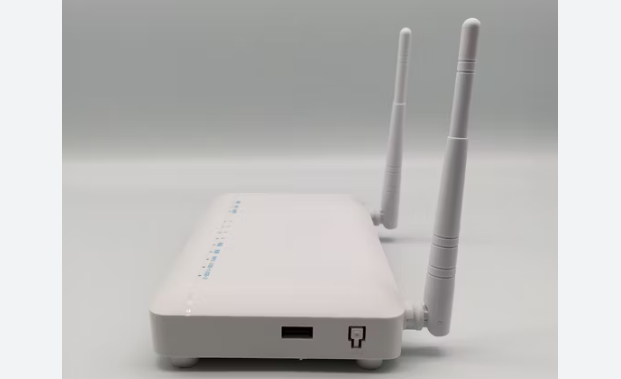
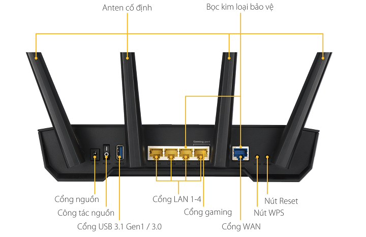
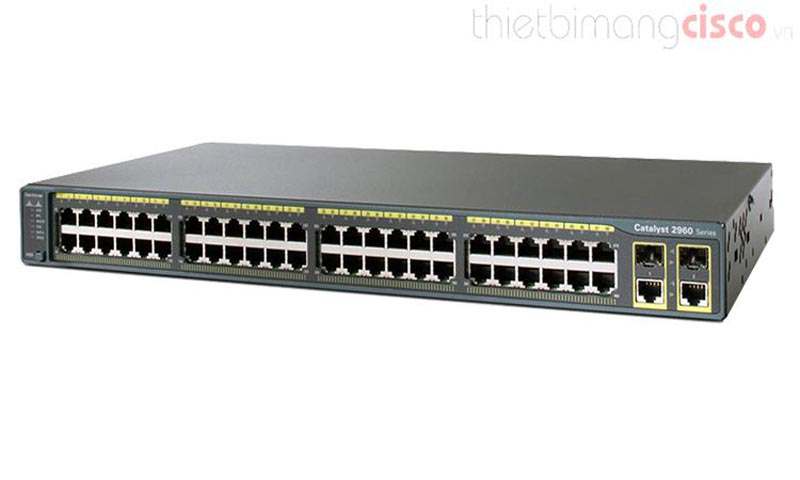
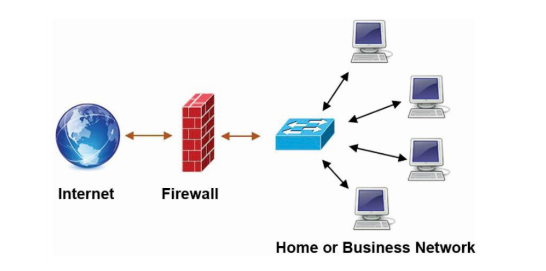
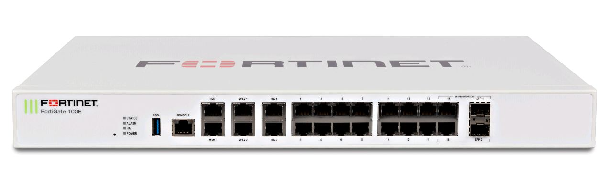
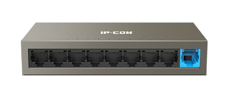

# 1. Modem

Khái niệm: Modem (Modulator - Demodulator) là một thiết bị mạng dùng để kết nối với nhà cung cấp dịch vụ Internet (ISP), giúp chuyển đổi tín hiệu số thành tín hiệu analog (hoặc ngược lại) để truyền dữ liệu qua các phương tiện truyền dẫn như cáp quang, ADSL, cáp đồng trục hoặc 4G/5G.

Chức năng:

Điều chế & giải điều chế tín hiệu: Chuyển đổi tín hiệu số ↔ analog để truyền trên đường dây điện thoại, cáp quang, sóng vô tuyến.
Kết nối Internet: Nhận tín hiệu từ ISP và cung cấp kết nối cho các thiết bị trong mạng.

## 2.Router (Bộ định tuyến)

Khái niệm: Router là thiết bị mạng hoạt động ở Layer 3 (Network Layer) của mô hình OSI. Nó chịu trách nhiệm định tuyến gói tin giữa các mạng khác nhau.

Chức năng chính:

Định tuyến: Xác định đường đi tối ưu cho các gói tin dựa trên địa chỉ IP. Định tuyến gói tin từ nguồn đến đích bằng cách sử dụng bảng định tuyến (Routing Table).
Kết nối nhiều mạng khác nhau (LAN → WAN, LAN → Internet).
Chuyển đổi địa chỉ IP (NAT) để cho phép nhiều thiết bị trong mạng nội bộ truy cập Internet.
Quản lý lưu lượng: Kiểm soát và quản lý lưu lượng mạng.
Bảo mật: Cung cấp các tính năng bảo mật như firewall, VPN.

### 3.Switch (L2 & L3)

Khái niệm: Switch là một thiết bị mạng hoạt động chủ yếu ở Layer 2 (Data Link Layer) nhưng cũng có Switch Layer 3 có thể hoạt động ở Layer 3 (Network Layer). Switch có chức năng chính là chuyển mạch (switching) các gói tin trong cùng một mạng LAN.

Switch Layer 2 (L2 Switch):

Kết nối các thiết bị trong cùng một mạng LAN.
Dùng địa chỉ MAC để chuyển tiếp gói tin.
Hỗ trợ VLAN để phân chia mạng thành nhiều nhóm logic.
Các tính năng cơ bản: STP (Spanning Tree Protocol), VLAN Trunking, MAC Address Table.
Switch Layer 3 (L3 Switch):

Kết hợp chức năng của Switch L2 + Router.
Có thể định tuyến giữa các VLAN (Inter-VLAN Routing) mà không cần router.
Hỗ trợ giao thức định tuyến: OSPF, EIGRP, RIP.
Tốc độ nhanh hơn router vì xử lý ở phần cứng thay vì phần mềm.
Switch L2: Chuyển mạch dựa trên địa chỉ MAC, dùng trong mạng LAN. Switch L3: Có thể định tuyến giữa các VLAN, thay thế router trong một số trường hợp.

#### 4.Firewall (Tường lửa)

Khái niệm: Firewall là một thiết bị hoặc phần mềm bảo mật mạng hoạt động chủ yếu ở Layer 3 & 4 (Network & Transport Layer) nhưng cũng có thể kiểm soát Layer 7 (Application Layer), có chức năng kiểm soát lưu lượng mạng dựa trên các quy tắc được định nghĩa.

Chức năng chính:

Kiểm soát truy cập: Cho phép hoặc chặn lưu lượng dựa trên địa chỉ IP, cổng, giao thức.
Ngăn chặn tấn công: Phát hiện và ngăn chặn các tấn công từ bên ngoài.
Bảo vệ dữ liệu: Bảo vệ dữ liệu khỏi các truy cập trái phép.
##### 5.Hub (Bộ tập trung)

Khái niệm: Hub là một thiết bị mạng đơn giản, hoạt động ở Layer 1 (Physical Layer), có chức năng chia sẻ kết nối mạng.

Chức năng:

Chia sẻ kết nối: Mở rộng mạng bằng cách chia sẻ một cổng mạng thành nhiều cổng.
Broadcast: Gửi dữ liệu đến tất cả các cổng.
Nhược điểm:

Khi nhận được dữ liệu, Hub phát (broadcast) ra tất cả các cổng, gây xung đột dữ liệu và giảm hiệu suất mạng.
Bảo mật kém: Dữ liệu có thể bị nghe lén.
Không thể học địa chỉ MAC như Switch.

