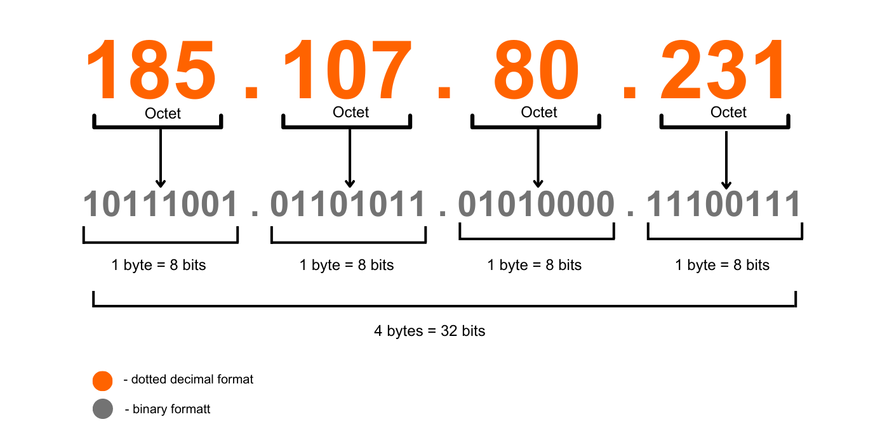
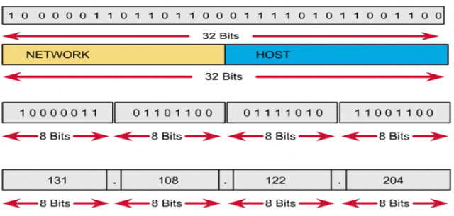
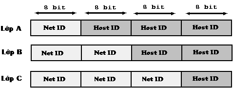
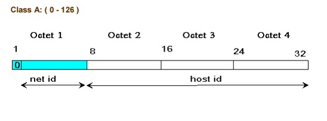
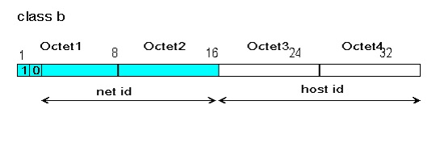
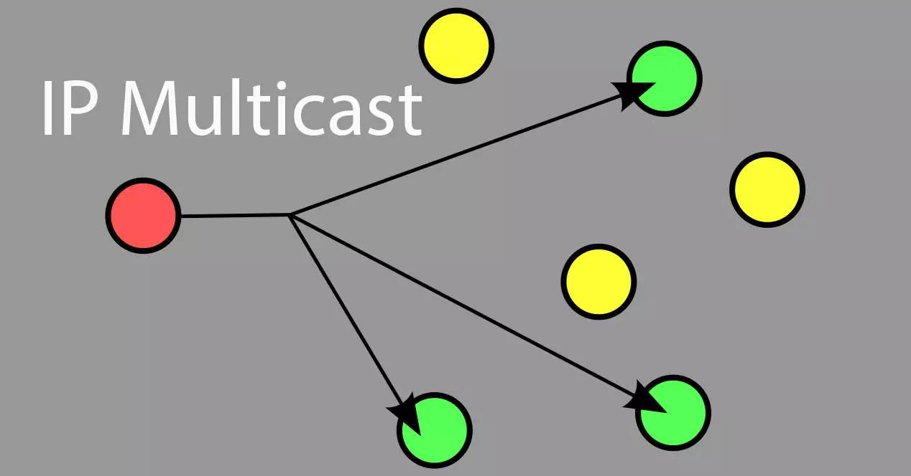

# 1.IPv4 là gì ?
IPv4 - Internet Protocal version 4 là giao thức kết nối Internet bản thứ tư , được định nghĩa là 1 giao thức hướng dữ liệu được sử dụng bởi các máy chủ nguồn và đích để truyền tải dữ liệu trong một liên mạng chuyển mạch gói . Trong quá trình phát triển thì đây là bản được sử dụng nhiều nhất.

Giao thức IPv4 không quan tâm đến thứ tự truyền gói tin , không đảm bảo gói tin sẽ đến đích cũng như xảy ra tình trạng lặp gói tin ở đích đến ,nó chỉ đảm bảo tính nguyên vẹn của gói tin được truyền đi bằng việc sử dụng những gói kiểm tra được thiết lập đi kèm với nó

IPv4 sử dụng 32 bit và chia ra làm 4 octet(mỗi octet có 8 bit = 1 byte), giữa các octet ngăn cách nhau bằng dấu chấm

*Ví dụ : 185.107.80.231*

Dải số này có thể được dùng để đặt tên cho 1 địa chỉ Ipv4 nào đó. Có thể thấy địa chỉ Ipv4 có tổng cộng 4 số và mỗi số phải nằm trong giới hạn từ 0-255.

# 2.Tại sao lại không có IPv1,v2,v3,v5
## IPv1,v2,v3
IPv1,v2,v3 là các bản thử nghiệm của giao thức Internet chưa bao giờ được triển khai rộng rãi
- IPv1 là phiên bản đầu tiên của giao thức và chỉ được sử dụng cho mục đích nghiên cứu . Nó có chức năng hạn chế và không được thiết kế để sử dụng với quy mô lớn
- IPv2 là phiên bản thử nghiệm được thiết kế để hỗ trợ các mạng chuyển mạch gói nhưng gặp nhiều vấn đề như không gian địa chỉ hạn chế hay khả năng mở rộng kém
-IPv3 là phiên bản tiếp theo tuy nhiên cũng gặp vấn đề như phiên bản trước đó nên không được triển khai 
## IPv5
IPv5 là một giao thức thử nghiệm được phát triển bởi Internet Engineering Task Force (IETF) từ 1990 nhưng chưa bao giờ được triển khai rộng rãi . Tên "IPv5" được sử dụng cho một giao thức thử nghiệm dựa trên Giao thức luồng Internet (ST2) và nhằm hỗ trợ các ứng dụng đa phương tiện thời gian thực. Tuy nhiên, giao thức này sau đó đã được đổi tên và trở thành Giao thức Internet phiên bản 6 (IPv6).
Ngày nay, IPv6 là phiên bản mới nhất của Giao thức Internet và nó được thiết kế để giải quyết một số hạn chế của IPv4, chẳng hạn như số lượng địa chỉ IP có sẵn hạn chế. IPv6 sử dụng lược đồ địa chỉ 128 bit, cung cấp số lượng địa chỉ khả dụng lớn hơn nhiều so với IPv4.
# 3.Cấu trúc IPv4
Bất kỳ gói tin nào cũng đều bao gồm 2 phần là IP Header(thông tin quản lý gói tin) và Data(dữ liệu gói tin). Các gói dữ liệu xuất phát từ tầng Application, đến tầng Network được thêm vào một cấu trúc IP Header. Gói dữ liệu sau khi được thêm vào cấu trúc IP Header thì được gọi là IP Diagram (Packet).
## 3.1 Cấu trúc IP Header
IP Header Version 4 (tiêu đề gói tin IPv4) gồm 12 trường bắt buộc với tổng chiều dài là 20 byte (không tính các trường Options và Data). Cấu trúc của IP Header Version 4 như hình sau

Theo cấu trúc trên ta thấy được 
- Version: Cho biết địa chỉ IP đang chạy là phiên bản mấy
- IHL(IP Header Length): Chỉ ra chiều dài của header
- Service Type: Chỉ ra cách thức xử lý gói dữ liệu, có độ ưu tiên hay không, độ trễ cho phép của gói dữ liệu. Trường này thường được dùng để thực hiện quản lý chất lượng dịch vụ mạng.
- Total Length: Chỉ ra chiều dài của toàn bộ IP Datagram tính theo byte, bao gồm data và phần header.
- Identification: Chỉ mã số của  1 IP Datagram , giúp bên nhận có thể ghép các mảnh của 1 IP Datagram lại với nhau vì IP Datagram phân thành các mảnh và  các mảnh thuộc cùng  1 IP  Datagram sẽ có cùng Identification.
- Flag: Bit 0: không dùng, Bit 1: cho biết gói có phân mảnh hay không, Bit 2: nếu gói IP Datagram bị phân mảnh thì mảnh này cho biết mảnh này có phải là mảnh cuối không.
- Fragment Offset: Báo bên nhận vị trí offset của các mảnh so với gói IP datagram gốc  để có thể ghép lại thành IP datagram gốc
- Time To Live: Chỉ ra số bước nhảy (hop) mà một gói có thể đi qua. Con số này sẽ giảm đi 1, khi gói tin đi qua 1 router. Khi router nào nhận gói tin thấy  TTL đạt tới 0 gói này sẽ bị loại. Đây là giải pháp nhằm ngăn chặn tình trạng lặp vòng vô hạn của gói tin trên mạng.
- Protocol: Cho biết phần dữ liệu đằng sau của giao thức nào lớp trên đang được đóng gói 
- Header CheckSum: Dùng để kiểm tra lỗi cho toàn bộ header của giao thức IP
- Source IP Address: Chỉ ra địa chỉ của thiết bị truyền IP
- Destination IP Address: Chỉ ra địa chỉ của thiết bị nhận IP
- IP Option: Là phần để nhà sản xuât bổ sung tính năng 
- Padding: Phần bổ sung để đảm bảo 32 bit

## 3.2 Cấu trúc địa chỉ IP
IPv4 là một chuỗi nhị phân 32 bit và chia thành 4 cụm,mỗi cụm như vậy sẽ gọi là octet, mỗi octet sẽ là 8 bit và chúng được ngăn cách bằng dấu chấm .IP được chia ra làm 2 phần là phần mạng và phần host. Phần mạng dùng để định danh cho cả 1 mạng máy tính , phần host định danh cho từng host cụ thể trong mạng máy tính

***QUY TẮC ĐÁNH ĐỊA CHỈ IP***
- Các bit phần network không được phép đồng thời bằng 0
- Nếu đặt tất cả các bit ở phần host bằng 0 thì số cuối cùng của địa chỉ IP sẽ bằng 0. Khi đó địa chỉ đó là một địa chỉ mạng, không thể dùng làm host. Ví dụ: 191.168.10.0 là một địa chỉ mạng.
- Nếu đặt tất cả các bit ở phần host là 1 thì số cuối cùng của địa chỉ IP là 255. Khi đó địa chỉ này sẽ là một địa chỉ broadcast của mạng đó. Ví dụ: 192.168.10.255 là một địa chỉ broadcast.

***CÁC LỚP ĐỊA CHỈ IP KHẢ DỤNG CHO HOST***

Địa chỉ IP được chia ra làm 3 lớp A, B, C

Địa chỉ lớp A có octet đầu là phần mạng 3 octet sau là host

Địa chỉ lớp B có 2 octet đầu là phần mạng 2 octet sau là host

Địa chỉ lớp C có 3 octet đầu là phần mạng 1 octet sau là host

### Địa chỉ lớp A
Địa chỉ lớp A có phần mạng là 8 bit đầu và phần host là 24 bit sau. Bit đầu tiên của phần mạng luôn là 0.

Lớp A sẽ có các địa chỉ mạng từ 1.0.0.0 đến 126.0.0.0 và mỗi mạng sẽ có 224 địa chỉ host (loại trừ địa chỉ mạng và địa chỉ broadcast).

Mạng loopback sẽ là 127.0.0.0.

### Địa chỉ lớp B
Địa chỉ lớp B có phần mạng là 16 bit đầu và phần host là 16 bit sau. 2 bit đầu tiên của phần mạng luôn là 1.0.

Lớp B sẽ có các địa chỉ mạng từ 128.0.0.0 đến 191.255.0.0 và mỗi mạng sẽ có 214 địa chỉ host (loại trừ địa chỉ mạng và địa chỉ broadcast).

### Địa chỉ lớp C
Địa chỉ lớp C có phần mạng là 24 bit đầu và phần host là 8 bit sau. 3 bit đầu tiên của phần mạng luôn là 1.1.0.

Lớp C sẽ có các địa chỉ mạng từ 192.0.0.0 đến 223.255.255.0 và mỗi mạng sẽ có 26 địa chỉ host (loại trừ địa chỉ mạng và địa chỉ broadcast).

***CÁC LỚP ĐỊA CHỈ IP KHÔNG KHẢ DỤNG CHO HOST***

### Địa chỉ lớp D

Lớp D được sử dụng làm các địa chỉ multicast và dải địa chỉ lớp D từ 224.0.0.0 -> 239.255.255.255. 

Lấy ví dụ như Ví dụ: 224.0.0.5 dùng cho OSPF; 224.0.0.9 dùng cho RIPv2.

### Địa chỉ lớp E

Các địa chỉ trong lớp E có vai trò dùng để dự phòng, bao gồm những địa chỉ từ 240.0.0.0 trở đi.

*Các host chỉ có thể sử dụng địa chỉ IP trong 3 lớp A, B, C. Để biết địa chỉ nằm trong lớp nào, ta sẽ xem số đầu tiên trong địa chỉ IP để biết dựa vào các khoảng sau:*

Lớp A từ 1 đến 126.
Lớp B từ 128 đến 191.
Lớp C từ 192 đến 223.
Lớp D từ 224 đến 239.
Lớp E từ 240 đến 255.

# 4. Phân biệt địa chỉ IP Public và IP Private
Địa chỉ IP Private là địa chỉ sử dụng trong nội bộ mạng LAN và có thể sử dụng đi sử dụng lại từ mạng LAN này qua mạng LAN khác như mạng tại gia đình ,công ty , trường học... .Còn địa chỉ IP Public là địa chỉ sử dụng trong môi trường Internet toàn cầu

## 4.1 IP Private
Địa chỉ IP Private được người điều hành gán cho mỗi máy tính trong mạng riêng của mình và có quyền gán bất kỳ IP nào tùy thích miễn là trong dãy IP được quy định cho sẵn trong mạng riêng 

Dải địa chỉ Private

10.0.0.0 – 10.255.255.255 (Có tổng cộng 16,777,216 địa chỉ)

172.16.0.0 – 172.31.255.255 (Có tổng cộng 1,048,576 địa chỉ)

192.168.0.0 – 192.168.255.255 (Có tổng cộng 65,536 địa chỉ)

## 4.2 IP Public
IP Public là địa chỉ dùng để xác định máy tính của bạn trên Internet và địa chỉ này là duy nhất , nghĩa là không thể có 2 máy có cùng IP Public trên Internet

IP Public chia ra làm 2 loại là IP tĩnh (Static IP) và IP động (Dynamic IP)

Địa chỉ Tĩnh là địa chỉ không thay đổi kể cả khi bạn ngắt kết nối và kết nối lại vào Internet, nó thường được dùng cho các dịch vụ trên Internet như Hosting

Địa chỉ động là địa chỉ thay đổi mỗi lần truy cập Internet. Thường thì tất cả người dùng Internet đều có địa chỉ động do ISP cung cấp để liên kết vào Internet, khi ngắt kết nối địa chỉ này sẽ được dùng cho người dùng Internet khác và khi bạn kết nối lại bạn sẽ được cung cấp 1 địa chỉ IP mới

# 5. Cách chia địa chỉ IPv4
## Subnet mask
Subnet mask là một dải 32 bit nhị phân đi kèm với một địa chỉ IP, được các host sử dụng để xác định địa chỉ mạng của địa chỉ IP này. Để làm được điều đó, host sẽ đem địa chỉ IP thực hiện phép tính AND từng bit một của địa chỉ với subnet mask của nó, kết quả host sẽ thu được địa chỉ mạng tương ứng của địa chỉ IP.

Ví dụ: Xét địa chỉ 192.168.1.1 với subnet mask tương ứng là 255.255.255.0
|...| Dạng thập phân | Dạng nhị phân|
|---|----------------|--------------|
|Địa chỉ IP|192.168.1.1|11000000.10101000.00000001.00000001|
|Subnet mask|255.255.255.0|11111111.11111111.11111111.00000000|
|Địa chỉ mạng|192.168.1.0|11000000.10101000.00000001.00000000|

*Subnet mask tương ứng với các lớp*
Lớp A: 255.0.0.0
Lớp B: 255.255.0.0
Lớp C: 255.255.255.0
# 6 Phân biệt Multicast và Broadcast  
## Broadcast   
Broadcast được sử dụng trong mạng máy tính để mô tả cách thức truyền tin từ 1 điểm đến tất cả các điểm khác trong cùng một mạng . Một gói broadcast chuyển đến tất cả các thiết bị tham gia trong mạng cục bộ , mà không phải quy định rõ ràng như một máy nhận . 
Một địa chỉ broadcast sẽ đại diện cho tất cả các thiết bị kết nối cùng mạng. Do đó khi một gói tin được gửi đến địa chỉ broadcast , tất cả các thiết bị trong mạng đều nhận được 
Có 2 loại broadcast  
- Direct broadcast 
- Local broadcast 

## Multicast
Multicast được sử dụng trong mạng máy tính để mô tả cách thức truyền tin từ 1 điểm đến 1 nhóm các điểm khác trong cùng một mạng , đặc điểm khác so với broadcast là có tính chọn lọc cao hơn  
- 
## Subnetmask
Subnet mask là một dạng số nhị phân 32bit, cho phép người sử dụng phân tách địa chỉ IP thành địa chỉ mạng và địa chỉ host. Các địa chỉ theo dạng số học sẽ không được sử dụng cho máy chủ.
## Số Prefix
Subnet mask được sử dụng kèm với địa chỉ IP để một host 
có thể căn cứ vào đó xác dịnh được địa chỉ mạng tương ứng của địa chỉ này. Vì vậy, khi khai báo một địa chỉ IP ta luôn phải khai báo kèm theo một subnet mask. Tuy nhiên, subnet mask dù đã được viết dưới dạng số thập phân vẫn khá dài dòng nên để mô tả một địa chỉ IP một cách ngắn gọn hơn, người ta dùng một đại lượng được gọi là số prefix. Số prefix đơn giản chỉ là số bit mạng trong một địa chỉ IP, 
được viết ngay sau địa chỉ IP, và được ngăn cách với địa chỉ này bằng một dấu “/”.

Nguyên lý cơ bản của kỹ thuật chia subnet: Để có thể chia nhỏ một mạng lớn thành nhiều mạng con bằng nhau, người ta thực hiện mượn thêm một số bit bên phần host để làm phần mạng, các bit mượn này được gọi là các bit subnet. Tùy thuộc vào số bit subnet mà ta có được các số lượng các mạng con khác nhau với các kích cỡ khác nhau:

 Tư liệu tham khảo.

 [1] [https://bkhost.vn/blog/ipv4/#:~:text=V%E1%BB%81%20c%E1%BA%A5u%20t%E1%BA%A1o%2C%20%C4%91%E1%BB%8Ba%20ch%E1%BB%89,t%C6%B0%E1%BB%A3ng%20tr%C6%B0ng%20cho%204%20c%E1%BB%A5m.](https://bkhost.vn/blog/ipv4/#:~:text=V%E1%BB%81%20c%E1%BA%A5u%20t%E1%BA%A1o%2C%20%C4%91%E1%BB%8Ba%20ch%E1%BB%89,t%C6%B0%E1%BB%A3ng%20tr%C6%B0ng%20cho%204%20c%E1%BB%A5m.)

 [2] [https://www.youtube.com/playlist?list=PLBOZzuSFDzSL_5CvfuNo7EhFQR1z6hhpo](https://www.youtube.com/playlist?list=PLBOZzuSFDzSL_5CvfuNo7EhFQR1z6hhpo)

 [3] [https://bizflycloud.vn/tin-tuc/ipv4-la-gi-20210607115922143.htm](https://bizflycloud.vn/tin-tuc/ipv4-la-gi-20210607115922143.htm)

 [4] [http://hatangmang.blogspot.com/2014/06/ip-header-va-van-e-inh-tuyen.html](http://hatangmang.blogspot.com/2014/06/ip-header-va-van-e-inh-tuyen.html)

